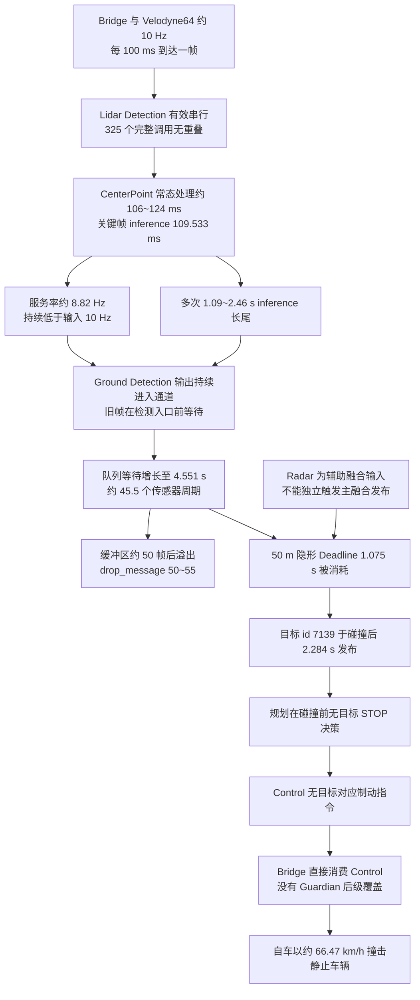

# TC-002_激光雷达检测队列积压导致静态障碍物碰撞案例

## 报告摘要

本次事故发生在 CARLA Town04 闭环仿真环境。测试车辆先后完成三次静态障碍物刹停验证，随后在障碍物移回出生点、车辆绕场一周后的再次接近过程中，于 `2026-07-13 19:29:02.347041+08:00` 与静止车辆发生碰撞。碰撞前一帧自车速度为 `18.349 m/s`（`66.06 km/h`），碰撞事件记录速度为 `18.463 m/s`（`66.47 km/h`）。

现有日志和 Trace 将事故主因收敛到激光雷达目标检测链路的持续吞吐不足。Velodyne64 点云约每 `100 ms` 到达一帧，Lidar Detection 在关键时段保持单帧串行执行；从最近一次队列溢出复位后的首帧到目标关键帧，共 `326` 帧，平均处理耗时 `113.337 ms`，全部超过 `100 ms`，有效处理能力约 `8.82 Hz`。Lidar Detection 入口等待由 `152.8 ms` 增长到 `4551.1 ms`。关键目标帧中，CenterPoint 推理耗时 `109.533 ms`，占检测总处理时间 `121.6 ms` 的主要部分。

日志还记录了 `7` 次 `/perception/lidar/pointcloud_ground_detection` 读取缓冲区溢出，单次落后量为 `50~55` 帧。事故前最近一次溢出发生在 `19:28:26.762934`，记录 `drop_message[50]`；事故后 `19:29:07.354173` 再次记录 `drop_message[50]`。该组证据表明检测消费速率长期低于点云输入速率，队列周期性增长到约 `50` 帧后执行批量丢弃。

自车在 `19:28:59.647504` 进入名义 `50 m` 感知范围，速度为 `53.91 km/h`，按最大规划减速度 `4 m/s²` 和 `6 m` 安全裕量计算，可供端到端链路消耗的隐形 Deadline 为 `1.075 s`。本场景由 Bridge 直接消费 Control 模块指令，端到端链路终点按首个 Control 发布计算。该帧到 Control 首次发布耗时 `4.662 s`，超出 Deadline `3.588 s`。出生点附近的目标首次明确出现在传感器时间 `19:28:59.947392` 对应的融合结果中，融合消息于 `19:29:04.630743` 发布，关联 Control 首次输出于 `19:29:04.670993`，分别晚于碰撞约 `2.284 s` 和 `2.324 s`。规划模块在碰撞前未获得可用于停车的目标，未形成该障碍物的 STOP decision、STOP ST boundary 或停车轨迹，Control 也无法在有效制动窗口内生成相应停车指令。

当前材料已确认的入口等待原因包括：检测回调有效串行、CenterPoint 常态处理时间超过输入周期、推理阶段出现多次秒级长尾、队列容量约 `50` 帧并采用溢出后批量丢弃策略。GPU 利用率、频率、温度、显存压力、CUDA/TensorRT 调度信息未包含在本次采集材料中，底层推理长尾仍需通过资源监控进一步细分。

---

## 1. 案例概况

### 1.1 测试系统基础配置

| 项目 | 具体内容 |
|---|---|
| 自动驾驶软件 | Apollo 自动驾驶系统；当前目录未提供独立版本清单 |
| 仿真平台 | CARLA |
| 仿真地图 | `Carla/Maps/Town04` |
| 自车 | `vehicle.lincoln.mkz_2017`，actor id `147`，role `hero` |
| 静态障碍物 | `vehicle.lincoln.mkz_2017`，actor id `160`，碰撞时速度 `0 m/s` |
| Bridge 步长 | `0.1 s` |
| 控制执行接口 | Bridge 直接消费 Control 模块指令；Guardian 未开启 |
| 激光雷达 | `velodyne64`，融合主传感器，约 `10 Hz` |
| 前向雷达 | `radar_front`，名义感知距离 `50 m`，融合字段 `is_main_sensor=0` |
| 点云主链路 | Preprocess → Map ROI → Ground Detection → Lidar Detection → Filter → Tracking → Fusion |
| 规划硬停减速度口径 | 日志对应上限 `4 m/s²` |
| 停车安全裕量口径 | `PathDecider distance_s=-6`，按 `6 m` 使用 |
| 本次分析材料 | 模块日志、Trace CSV、碰撞事件、碰撞前 actor history |
| 尚未纳入的材料 | record 数据解析结果、GPU/CPU 系统资源时序、CARLA applied-control |

### 1.2 道路、路线与障碍物环境

首次路由从 `road_48_lane_0_3` 出发，经 Town04 多个道路段绕场并返回出生点附近。初始路由起点坐标约为 Apollo 坐标 `(-6.4, 160)`。碰撞记录中，静态障碍车辆位于 CARLA 坐标 `(-6.4, -160)`；CARLA 与 Apollo 的纵向坐标方向转换后，两组位置相互对应。

测试过程包含四段连续场景：

| 场景段 | 场景操作与日志重建 | 最高速度 | 结果 |
|---|---|---:|---|
| E1 | 障碍物位于初始点前方约 `50 m` | `14.62 km/h` | 自车刹停，停止位置 Apollo `y=124.50 m` |
| E2 | 障碍物继续后移约 `50 m` | `40.80 km/h` | 自车刹停，停止位置 Apollo `y=74.23 m` |
| E3 | 第三次位置调整后，障碍物相对 E2 再后移约 `100 m` | `55.64 km/h` | 自车刹停，峰值到停车行程约 `22.23 m` |
| E4 | 障碍物移回出生点，自车绕场一周后再次接近 | 绕场最高 `105.58 km/h`；碰撞前 `66.06 km/h` | 与静态障碍车辆碰撞 |

第三次操作的用户描述包含“车辆后置 100 m”。定位日志在相应窗口内保持连续，未出现自车 `100 m` 瞬时位移；障碍物估计位置由 E2 的 Apollo `y≈51.7 m` 变化到 E3 的 `y≈-48.3 m`。本报告按日志空间关系还原为障碍物继续后移约 `100 m`。

### 1.3 车辆运行状态

1. E1、E2、E3 均形成规划停车决策并完成刹停，说明规划和车辆纵向控制链路具备正常停车能力。
2. E3 峰值速度为 `15.455 m/s`，峰值到静止行程约 `22.23 m`，按运动学反算等效减速度约 `5.37 m/s²`。
3. E4 自车从 `19:25:28` 左右开始绕场，完整行驶一周后沿出生点道路再次接近障碍物。
4. `19:28:59.647504` 时，自车 Apollo `y=210.134 m`，速度 `14.976 m/s`，到障碍物中心的纵向距离约 `50.134 m`。
5. `19:28:59.947392` 时，自车 Apollo `y=205.579 m`，速度 `15.378 m/s`，到障碍物中心约 `45.579 m`。
6. `19:29:02.147266` 时，自车距障碍物中心约 `8.286 m`，速度 `18.349 m/s`。
7. `19:29:02.347041` 发生碰撞，CARLA 记录自车速度 `18.463 m/s`，障碍车辆速度 `0 m/s`。

### 1.4 各模块运行状态

测试窗口内，各模块持续输出消息，重点状态如下：

1. 点云 Preprocess、Map ROI 和 Ground Detection 对关键帧的处理在传感器时间后约 `87 ms` 内完成。
2. Lidar Detection 持续输出 `[LIDAR_DET_QUEUE]`，同时记录入口等待、注入休眠、检测处理和总时延。
3. Lidar Detection 入口等待在多段窗口中增长到 `5 s` 左右，并触发点云 Ground Detection 通道读取缓冲区溢出。
4. Detection Filter、Tracking、Fusion、Prediction、Planning 和 Control 在收到上游结果后继续运行；Control 输出由 Bridge 直接消费。关键目标帧中 Fusion 之后到首个 Control 的耗时约 `40 ms`。
5. 前向雷达持续进入融合组件，融合日志按 `radar_front` 的辅助传感器策略跳过其独立发布触发。
6. 碰撞前的规划日志未形成目标障碍物 STOP 决策，现有停车决策检索结果仅覆盖 E1、E2、E3。

### 1.5 事件发展全过程

1. **低速首轮验证：** 障碍物预先位于道路前方，规划在车辆起步前后持续跟踪障碍物，自车低速接近并停车。
2. **中速第二轮验证：** 障碍物后移约 `50 m`，目标 id `2698` 进入融合与规划，`19:23:31.425` 左右规划输出停车轨迹，自车在障碍物前停车。
3. **高速第三轮验证：** 障碍物再后移约 `100 m`，目标 id `3869` 进入融合与规划，`19:24:39.199` 左右首次形成硬停轨迹，自车从约 `55.6 km/h` 刹停。
4. **绕场阶段：** 障碍物返回出生点，自车完成绕场；激光雷达检测链路在此期间多次出现秒级推理长尾和约 `50` 帧级通道溢出。
5. **最终接近阶段：** 自车进入名义 `50 m` 范围时，Lidar Detection 已积累约 `4.5 s` 入口等待。`50.13 m` 帧的融合结果中没有出生点目标。
6. **目标形成阶段：** 传感器时间 `19:28:59.947392` 的点云首次形成出生点附近车辆目标 id `7139`，融合发布发生在 `19:29:04.630743`。
7. **碰撞阶段：** 自车于 `19:29:02.347041` 与静止车辆碰撞。目标融合消息在碰撞后到达规划链路，制动启动窗口已经关闭。

### 1.6 分析材料范围

本报告使用以下材料：

- `trace/events`、`trace/message_context`、`trace/fusion_inputs`、`trace/trace_anchor`；
- perception、prediction、planning、control、localization、routing、map 日志；
- CARLA 碰撞事件和碰撞前 `18 s` 左右 actor history；
- 已提取的车辆状态、端到端延迟、Deadline 对比和规划停车事件。

本轮未解析 record 文件。报告中的目标几何、制动决策、模块时间和碰撞状态均来自现有日志与 Trace。

---

## 2. 案例分析

### 2.1 顶层时间线

| 时间 | 阶段 | 事实事件 | 安全影响 |
|---|---|---|---|
| `19:23:03~19:23:17` | E1 | 低速接近，规划形成 blocking obstacle STOP | 完成首次刹停 |
| `19:23:31.377~19:23:32.748` | E2 | 融合发布 id `2698`，规划输出 `stop by 2698` | 约 `40.8 km/h` 完成刹停 |
| `19:24:39.159~19:24:41.348` | E3 | 融合发布 id `3869`，规划形成 `4 m/s²` 硬停轨迹 | 约 `55.6 km/h` 完成刹停 |
| `19:25:28` 后 | E4 绕场 | 自车进入整圈运行 | 感知检测负载持续累积 |
| `19:27:16.212` | 秒级推理长尾 | CenterPoint inference `1089.41 ms`，随后通道溢出 `drop_message[55]` | 大批旧帧失去处理机会 |
| `19:27:25.326` | 秒级推理长尾 | inference `1388.53 ms` | 队列快速增长 |
| `19:27:27.795` | 秒级推理长尾 | inference `2461.25 ms`，随后 `drop_message[51]` | 检测链路再次复位 |
| `19:27:57.556` | 队列溢出 | `drop_message[50]` | 批量丢弃落后帧 |
| `19:28:05.286` | 秒级推理长尾 | inference `2159.93 ms` | 新一轮积压加重 |
| `19:28:26.763` | 事故前最近一次溢出 | `drop_message[50]` | 队列等待复位到约 `153 ms` |
| `19:28:59.647` | 进入名义 50 m 范围 | 速度 `53.91 km/h`，检测入口等待 `4494.2 ms` | 隐形 Deadline 已被时延覆盖 |
| `19:28:59.947` | 首个明确目标帧 | 目标 id `7139`，传感器距离约 `45.58 m` | 帧仍在检测入口前等待 |
| `19:29:02.347` | 碰撞 | 自车 `66.47 km/h`，障碍车辆静止 | 碰撞发生 |
| `19:29:04.631` | 迟到融合发布 | id `7139` 发布到融合输出 | 晚于碰撞约 `2.284 s` |
| `19:29:07.354` | 再次队列溢出 | `drop_message[50]` | 持续过载得到再次确认 |

### 2.2 三次刹停与最终碰撞对照

| 案例 | 运行时 D1 代理 | 速度 | 理论 Deadline | Sensor→Control | 余量 | 结果 |
|---|---:|---:|---:|---:|---:|---|
| E2 | `46.66 m` | `33.68 km/h` | `3.176 s` | `1.392 s` | `+1.784 s` | 刹停 |
| E3 | `44.98 m` | `52.52 km/h` | `0.848 s` | `0.659 s` | `+0.189 s` | 刹停 |
| E4 | `50.13 m` | `53.91 km/h` | `1.075 s` | `4.662 s` | `-3.588 s` | 碰撞 |

E3 已接近系统实时性边界，剩余余量仅约 `189 ms`，相当于 `1.9` 个 Bridge 步长。E4 的感知等待增长到秒级后，车辆速度与可用距离形成的制动窗口完全被旧帧排队消耗。

表中 Sensor→Control 以 Control 首次发布为终点。Bridge 接收、协议传递和 CARLA applied-control 时延尚未采集，因此该数值是实际制动执行时延的下界。E4 已出现 `-3.588 s` 负余量，补充执行端时延后只会进一步扩大超期。

### 2.3 关键帧一：名义 50 m 入区帧

传感器时间：`2026-07-13 19:28:59.647504`

| 指标 | 数值 |
|---|---:|
| 自车 Apollo `y` | `210.1338 m` |
| 障碍物 Apollo `y` | 约 `160.0 m` |
| 中心纵向距离 | `50.1338 m` |
| 自车速度 | `14.9761 m/s`（`53.9138 km/h`） |
| Lidar Detection 入口等待 | `4494.2 ms` |
| Lidar Detection 处理 | `116.5 ms` |
| Sensor→Fusion | `4623.2 ms` |
| Sensor→Control | `4662.5 ms` |
| 融合发布时间 | `19:29:04.270` |

该帧的融合输出包含 `4` 个目标，位置分别位于 Apollo `y≈246.18 m`、`229.74 m`、`228.51 m` 和 `244.57 m`；出生点 `(-6.4,160)` 附近没有目标。该帧只能用于确定车辆进入名义雷达范围及端到端时延，无法作为稳定识别障碍物的 D1。

按以下口径计算隐形 Deadline：

```text
D_brake = v² / (2 × a)
        = 14.9761² / (2 × 4)
        = 28.035 m

D_2 = D_brake + D_margin
    = 28.035 + 6
    = 34.035 m

T_deadline = (D_1 - D_2) / v
           = (50.134 - 34.035) / 14.9761
           = 1.075 s
```

实测 Sensor→Control 为 `4.662 s`，超出该时间窗 `3.588 s`。Control 于 `19:29:04.309964` 首次发布，Bridge 在碰撞发生后才可能消费该帧对应的控制结果；该帧融合输出中没有出生点目标。

### 2.4 关键帧二：首个明确目标帧

传感器时间：`2026-07-13 19:28:59.947392`  
Lidar trace id：`72322662239573118`  
Fusion trace id：`17294087637304349554`

该帧最终形成目标 id `7139`：

| 字段 | 数值 |
|---|---:|
| 目标位置 | `x=-6.808 m, y=160.911 m` |
| 目标类型 | `type=5` |
| 检测尺寸 | `3.254 × 1.420 × 1.291 m` |
| 目标速度 | `0 m/s` |
| confidence | `0.1562` |
| measurement_count | `1` |
| 自车到障碍物中心距离 | 约 `45.579 m` |
| 自车速度 | `15.378 m/s`（`55.36 km/h`） |
| 对应 Deadline | `0.652 s` |

同一 trace 的逐阶段时间如下：

| 阶段 | 相对传感器时间 | 阶段耗时 |
|---|---:|---:|
| 点云进入 Preprocess | `+64.793 ms` | - |
| Preprocess | `64.793~72.674 ms` | `7.881 ms` |
| Map ROI | `72.717~78.502 ms` | `5.785 ms` |
| Ground Detection | `78.539~86.703 ms` | `8.164 ms` |
| Ground 输出至 Lidar Detection 入口 | `86.703~4551.054 ms` | **`4464.351 ms`** |
| Lidar Detection | `4551.054~4672.679 ms` | `121.624 ms` |
| Detection Filter | `4672.938~4677.280 ms` | `4.342 ms` |
| Lidar Tracking | `4677.363~4678.753 ms` | `1.391 ms` |
| Multi-Sensor Fusion | `4678.788~4683.566 ms` | `4.778 ms` |
| Fusion 至首个 Control | `4683.566~4723.598 ms` | `40.032 ms` |

感知日志对该帧直接记录：

```text
[LIDAR_DET_QUEUE] msg_time=1783942139.947392
queue_wait_ms=4551.1 inject_sleep_ms=0 proc_ms=121.6 total_ms=4672.6
```

CenterPoint 分阶段耗时为：

```text
down sample: 0.083681 ms
fuse: 5.28703 ms
cloud_to_array: 0.758316 ms
inference: 109.533 ms
postprocess: 0.090881 ms
nms: 5.38584 ms
```

目标于 `19:29:04.630743` 随融合帧发布，关联 Control 于 `19:29:04.670993` 首次输出。碰撞发生在 `19:29:02.347041`，两个时刻分别晚于碰撞约 `2.284 s` 和 `2.324 s`。Bridge 直接消费 Control 指令，因而该目标对应的制动控制结果无法作用于碰撞前车辆。

### 2.5 关键事件：碰撞

碰撞记录：

| 字段 | 数值 |
|---|---|
| 碰撞时间 | `2026-07-13 19:29:02.347041+08:00` |
| CARLA frame | `5630` |
| 自车 actor | id `147`，`vehicle.lincoln.mkz_2017` |
| 障碍 actor | id `160`，`vehicle.lincoln.mkz_2017` |
| 障碍速度 | `0 m/s` |
| 自车位置 | `(-6.085, -166.445)` |
| 障碍位置 | `(-6.400, -160.000)` |
| 自车速度 | `18.463 m/s`（`66.47 km/h`） |
| 冲量模长 | `39034.32` |

碰撞前规划相关事件检索结果中，E1、E2、E3 分别存在目标 STOP decision、STOP ST boundary 和停车轨迹。E4 从 `19:28:55` 到碰撞时刻的检索结果为 `0` 条。规划链路在碰撞前没有获得具备停车意义的目标输入。

---

## 3. 事故原因分析

### 3.1 原因链概述

| 环节 | 结论 | 关键证据 |
|---|---|---|
| 点云输入 | 约 `10 Hz`，平均周期约 `100 ms` | Trace anchor 与连续 `msg_time` |
| 检测执行方式 | Lidar Detection 有效串行 | 事故前复位后到关键帧共 `325` 个完整 Trace，相邻调用重叠次数 `0` |
| 检测吞吐 | 平均 `113.337 ms/帧`，约 `8.82 Hz` | 连续 `326` 帧全部超过 `100 ms` |
| 推理瓶颈 | CenterPoint inference 占主要耗时 | 关键帧 inference `109.533 ms`，检测总处理 `121.6 ms` |
| 长尾放大 | 出现 `1.09~2.46 s` 推理长尾 | `19:27:16`、`19:27:25`、`19:27:27`、`19:28:05` 日志 |
| 队列增长 | 等待从 `152.8 ms` 增长到 `4551.1 ms` | `[LIDAR_DET_QUEUE]` 直接字段 |
| 队列容量与丢帧 | 约 `50` 帧后通道溢出并批量丢弃 | `drop_message[50~55]` 共 `7` 次 |
| 雷达融合策略 | radar 为辅助传感器，不能独立触发主融合输出 | `is_main_sensor=0` 与 `Skip because it is not the main sensor` |
| 控制执行边界 | Bridge 直接消费 Control，链路中没有 Guardian 后级覆盖 | 本场景模块配置与 Bridge 消费关系 |
| 安全结果 | 目标在碰撞后才发布给下游 | id `7139` 融合时间 `19:29:04.631` |

### 3.2 Lidar Detection 排队的直接证据

感知日志为每一帧打印 `[LIDAR_DET_QUEUE]`。关键帧记录 `queue_wait_ms=4551.1`，同帧 Trace 给出 Ground Detection 输出到 Lidar Detection 入口的空档 `4464.351 ms`。两个口径的差值约 `86.7 ms`，对应传感器输入、Preprocess、ROI 和 Ground Detection 已消耗的时间。

队列溢出记录如下：

| 时间 | drop_message | pre_index | current_index | 与事故关系 |
|---|---:|---:|---:|---|
| `19:23:15.039665` | `50` | `1737` | `1787` | 前期过载 |
| `19:27:16.212441` | `55` | `4143` | `4198` | E4 绕场阶段 |
| `19:27:27.795226` | `51` | `4263` | `4314` | E4 绕场阶段 |
| `19:27:57.555881` | `50` | `4562` | `4612` | E4 绕场阶段 |
| `19:28:26.762934` | `50` | `4854` | `4904` | 碰撞前最近一次复位 |
| `19:29:07.354173` | `50` | `5260` | `5310` | 碰撞后再次溢出 |
| `19:30:32.545328` | `50` | `6112` | `6162` | 采集后段持续过载 |

事故前最近一次溢出后，检测从较新的点云重新开始，入口等待降至 `152.8 ms`。随后约 `32.50 s` 内连续处理 `326` 帧，等待增长到 `4551.1 ms`。关键帧到达时，队列落后量约等于 `45.5` 个传感器周期。

### 3.3 输入周期与串行处理吞吐失配

事故前最近一次队列复位后到关键帧的统计：

| 指标 | 数值 |
|---|---:|
| 帧数 | `326` |
| 平均输入周期 | `99.992 ms` |
| 检测处理最小值 | `105.7 ms` |
| 检测处理 P50 | `112.85 ms` |
| 检测处理 P95 | `121.4 ms` |
| 检测处理均值 | `113.337 ms` |
| 检测处理最大值 | `124.6 ms` |
| 超过 `100 ms` 的帧数 | `326/326` |
| 推算服务率 | `8.823 Hz` |
| 等待增长 | `4398.3 ms` |
| 注入休眠非零帧数 | `0` |

Trace 中该窗口有 `325` 个具备完整入口和出口的检测调用，分布在 `7` 个 worker tid 上。相邻检测调用重叠次数为 `0`；上一帧输出到下一帧入口的间隔 P50 为 `0.0959 ms`，检测启动间隔均值为 `113.488 ms`。调度线程发生变化，检测计算仍保持单帧串行。

每帧平均超出输入周期约 `13.34 ms`。在连续输入下，理论累计超时与实测等待增长保持同一量级，能够完整解释事故前的秒级入口等待。

### 3.4 CenterPoint 推理耗时与秒级长尾

关键帧检测处理总时长 `121.6 ms`，其中 CenterPoint inference 为 `109.533 ms`，占比约 `90.1%`。推理阶段已超过完整 Bridge 步长，其他点云转换、融合和 NMS 会继续增加服务时间。

E4 绕场期间还出现以下长尾：

| 日志时间 | inference | Lidar Detection proc | 当帧 queue_wait | 后续影响 |
|---|---:|---:|---:|---|
| `19:27:16.212` | `1089.41 ms` | `1099.0 ms` | `4664.4 ms` | 随后 `drop_message[55]` |
| `19:27:25.326` | `1388.53 ms` | `1396.0 ms` | `1582.2 ms` | 排队快速增加 |
| `19:27:27.795` | `2461.25 ms` | `2468.9 ms` | `2878.6 ms` | 随后 `drop_message[51]` |
| `19:28:05.286` | `2159.93 ms` | `2169.7 ms` | `868.7 ms` | 新一轮积压加重 |

全部 `4141` 条队列记录的 `inject_sleep_ms` 均为 `0`，配置注入休眠未参与本次排队。日志中未发现与上述长尾同步的 CUDA OOM、TensorRT 失败或进程崩溃记录。当前定位边界收敛到 CenterPoint inference 执行时间；GPU 争用、频率变化、温控降频、TensorRT context 等待、CUDA stream 同步和显存压力需要新增资源侧时序后继续区分。

### 3.5 Radar 与 Fusion 的作用边界

前向雷达配置名义感知距离为 `50 m`。Trace 在 `19:28:59.647504` 和 `19:28:59.947392` 两个时间点均记录 radar_detection 输入与输出，`object_count=0`。该字段无法提供目标级位置、距离、置信度和稳定跟踪信息，现有材料无法确认雷达在 `50.13 m` 时已经输出目标。

Fusion 输入配置中，`radar_front` 的 `is_main_sensor=0`，`velodyne64` 的 `is_main_sensor=1`。感知日志持续输出：

```text
Fusion receive from radar_front. Skip because it is not the main sensor.
```

因此，主融合发布节奏由 Lidar 链路驱动。Lidar Detection 积压时，雷达消息无法独立生成规划可用的主融合帧。该策略削弱了雷达对 Lidar 长时延的冗余补偿能力。

### 3.6 车速隐形 Deadline 失守

隐形 Deadline 使用以下定义：

`T_deadline = [D_1 - (v² / (2 × a) + D_margin)] / v`

本案使用 `a=4 m/s²`、`D_margin=6 m`。在名义 `50 m` 帧中，Deadline 为 `1.075 s`；实测 Sensor→Control 时延为 `4.662 s`。检测入口等待本身已达到 `4.494 s`，单个阶段已经超过全部安全时间预算。

首个明确目标帧的距离约 `45.58 m`、速度 `55.36 km/h`，Deadline 缩短到 `0.652 s`。该帧的 Sensor→Fusion 为 `4.684 s`，Sensor→Control 为 `4.724 s`，超期 `4.072 s`。Control 输出前车辆已经碰撞。

### 3.7 最终因果链



**本案主因链：** 10 Hz 点云持续进入单帧串行的 Lidar Detection，CenterPoint 处理均值高于 `100 ms` 并伴随秒级推理长尾，检测消费能力长期低于输入能力；Ground Detection 通道逐渐积累约 `4.5 s` 旧帧并多次达到约 `50` 帧溢出阈值；目标进入制动范围时，感知时延已经超过车速和剩余距离共同形成的隐形 Deadline；目标融合消息在碰撞后发布，规划未能在有效窗口内启动停车；Control 没有生成目标对应的制动指令，Bridge 继续直接消费 Control 输出，链路中没有 Guardian 后级覆盖。

---

## 4. 实时性问题体现

### 4.1 实时性问题一：模块吞吐缺少硬边界

Lidar Detection 的平均处理时间 `113.337 ms` 高于 `100 ms` 输入周期，P95 达到 `121.4 ms`。该关系决定了连续输入必然产生积压。平均耗时、P95、P99 和最坏执行时间均需要被纳入安全设计，且需满足小于输入周期并保留调度裕量的约束。

本场景中，检测服务率约 `8.82 Hz`，输入率约 `10 Hz`。每秒约积累 `1.18` 帧，常态过载持续约 `32.5 s` 后形成 `4.4 s` 等待。秒级推理长尾会在单帧内额外积累 `10~24` 个输入周期。

### 4.2 实时性问题二：旧帧排队与批量丢弃

当前通道允许旧帧持续排队，检测组件仍会处理已经失去安全价值的点云。队列接近约 `50` 帧后触发溢出并一次性丢弃 `50~55` 帧，时延呈现锯齿状：复位后短暂降低，随后继续线性增长。

关键帧在进入 Lidar Detection 时已经陈旧 `4.551 s`。系统缺少基于感知新鲜度和场景 Deadline 的入口丢弃、latest-only 消费、过载降级和安全停车触发。

### 4.3 实时性问题三：辅助传感器无法独立维持安全输出

Radar 被配置为辅助输入，主融合输出由 Lidar 驱动。Lidar 长时延会同步阻塞规划获得新的融合障碍物。前向雷达名义 `50 m` 能力尚未形成独立的 AEB 或最小风险停车通道。

### 4.4 实时性问题四：Deadline 未进入运行时保护

车辆速度升高后，`50 m` 感知距离对应的可用时间快速缩短。约 `54 km/h` 时，本案口径下 Deadline 约 `1.08 s`；约 `55 km/h` 且距离 `45.6 m` 时仅约 `0.65 s`。系统继续处理 `4~5 s` 旧帧，说明感知数据年龄尚未与规划、控制和安全监控形成强约束。

### 4.5 实时性问题五：Control 后级缺少独立安全覆盖

本场景未开启 Guardian，Bridge 直接消费 Control 指令。上游感知目标迟到后，Planning 无法形成停车轨迹，Control 也无法生成目标对应的制动命令。Control 至 Bridge 之间没有基于感知数据年龄、碰撞时间或最小安全距离的独立制动覆盖，单条感知链路的超期会直接传播到车辆执行端。

该问题属于事故后果放大因素。事故触发源位于 Lidar Detection 的持续过载与排队；后级独立安全覆盖可以在感知超期后将车辆引导到降速或最小风险停车状态。

### 4.6 调查边界

现有日志足以确认队列、串行执行、吞吐失配、推理主导和缓冲区溢出。以下底层问题需要补充材料：

1. CenterPoint inference 长尾对应的 GPU 利用率、频率、温度、功耗和显存状态；
2. TensorRT execution context、CUDA stream、同步点和其他 GPU 任务的占用关系；
3. Cyber Reader 队列容量配置、调度策略和丢弃策略来源；
4. Lidar Detection 是否存在全局互斥、单实例 engine 或组件级串行约束；
5. radar 原始目标列表、range、range-rate、confidence 和连续跟踪帧数；
6. `/apollo/control` 制动命令及 CARLA applied-control 的真实执行时间。

---

## 5. 最终结论

### 5.1 本案例结论

本案例的系统级原因是激光雷达检测链路的稳定服务能力低于传感器输入频率。Velodyne64 约每 `100 ms` 提供一帧，Lidar Detection 有效串行执行，事故前关键窗口的平均处理时间为 `113.337 ms`，连续 `326` 帧全部超过输入周期。CenterPoint inference 为主要耗时来源，并出现 `1.09~2.46 s` 长尾。Ground Detection 输出在检测入口前持续积压，队列等待增长到 `4.551 s`，通道多次达到约 `50` 帧并溢出。

车辆在约 `53.91 km/h`、距离障碍物中心约 `50.13 m` 时，理论隐形 Deadline 为 `1.075 s`。当时 Lidar Detection 入口等待已经达到 `4.494 s`，端到端结果在 `4.662 s` 后到达 Control。首个明确出生点目标帧在传感器时间 `19:28:59.947392` 形成，融合消息于 `19:29:04.630743` 发布，关联 Control 于 `19:29:04.670993` 首次输出，碰撞已于 `19:29:02.347041` 发生。

Radar 的辅助传感器配置使其无法独立触发主融合输出，规划在碰撞前未获得目标停车输入。事故由检测吞吐不足、串行处理、推理长尾、旧帧排队、批量溢出丢帧、融合主传感器依赖、运行时 Deadline 保护缺失以及 Control 后级独立安全覆盖缺失共同形成。Bridge 直接消费 Control 指令，使规划与控制未产生停车动作的结果直接进入仿真车辆执行端。

### 5.2 整改建议

| 优先级 | 整改项 | 验收指标 |
|---|---|---|
| P0 | 将 Lidar Detection P99 压缩到输入周期以内并保留调度裕量 | 10 Hz 输入下 P99 `<80 ms`，持续 30 分钟无队列增长 |
| P0 | 将检测输入改为 latest-only 或最大深度 `1~2` 的有界队列 | 数据年龄 `<200 ms`；无 `drop_message[50+]` |
| P0 | 增加感知新鲜度保护 | Lidar 数据年龄超过阈值时立即降速并进入最小风险停车 |
| P0 | 建立独立 Radar AEB 通道或允许可靠 Radar 目标触发安全融合输出 | Lidar 阻塞注入 `5 s` 时仍可对 `50 m` 静态车辆停车 |
| P0 | 在 Control 后级或 Bridge 内建立独立安全监督 | 感知数据年龄或 TTC 越界时覆盖常规 Control 并执行最小风险制动 |
| P0 | 为速度相关 Deadline 建立在线监控 | `sensor_age + remaining_chain_wc <= T_deadline` 持续成立 |
| P1 | 优化 CenterPoint/TensorRT | 评估 FP16/INT8、engine warmup、CUDA graph、stream 优先级和模型裁剪 |
| P1 | 采集 GPU 与调度指标 | 记录利用率、频率、温度、功耗、显存、context 等待、CUDA event |
| P1 | 增加队列可观测性 | 每帧记录 enqueue、dequeue、queue_depth、drop reason、data age |
| P1 | 完善控制闭环取证 | 同步记录 control brake/throttle 与 CARLA applied-control |
| P2 | 建立速度和时延故障注入矩阵 | 覆盖 `30~110 km/h`、`0~5 s` 感知延迟、不同 Bridge 步长 |
| P2 | 增加事故前自动快照 | 保存目标级 Radar/Lidar、队列、GPU、规划和控制最近 `30 s` 环形缓冲 |

建议的安全阈值应通过整车制动试验重新标定。当前 `4 m/s² + 6 m` 口径可作为初始基准；量产或封闭场地测试需加入路面、执行器建立时间、定位误差、障碍物尺寸和离散采样裕量。

### 5.3 可扩展到其他自动驾驶场景的安全隐患

| 场景 | 可能暴露的安全隐患 |
|---|---|
| 高速静态障碍物 | 数据年龄快速耗尽制动 Deadline |
| 行人横穿、非机动车切入 | 秒级旧帧导致目标位置和速度严重失真 |
| 匝道、连续弯道 | 点云密度和目标数量增加后推理长尾放大 |
| 路口多目标 | 串行检测吞吐下降，队列更快到达溢出阈值 |
| 施工区、异形障碍物 | 低置信目标需要连续观测，丢帧会破坏稳定识别 |
| Radar/Lidar 异构融合 | 主传感器阻塞会限制辅助传感器的安全冗余 |
| 仿真步长或频率调整 | 输入周期缩短后，原有模型处理时间立即形成过载 |
| 硬件迁移 | GPU 性能、功耗模式和温控差异会改变推理 WCET |

**总体结论：** 感知安全能力由检测距离、车辆速度、制动能力、传感器输入周期、模型最坏执行时间、队列策略、融合触发策略和异常降级共同决定。名义 `50 m` 感知距离只有在目标能够于车速相关 Deadline 内稳定进入规划闭环时才具备安全意义。

---

## 6. 案例相关材料与证据索引

### 6.1 原始证据

- [CARLA 碰撞事件](D:/data/202607131922/log/carla_collision_events_20260713192902.csv:2)
- [碰撞前 Actor History](D:/data/202607131922/log/carla_collision_actor_history_20260713192902.csv)
- [关键帧 LIDAR_DET_QUEUE 与 CenterPoint 耗时](D:/data/202607131922/log/perception.log.INFO.20260713-192006.389396:233527)
- [关键目标 id 7139 融合输出](D:/data/202607131922/log/perception.log.INFO.20260713-192006.389396:233572)
- [事故前最近一次通道溢出](D:/data/202607131922/log/perception.log.INFO.20260713-192006.389396:213775)
- [2461.25 ms 推理长尾与通道溢出](D:/data/202607131922/log/perception.log.INFO.20260713-192006.389396:183165)
- [Ground Detection Trace](D:/data/202607131922/trace/events/perception.pointcloud_ground_detection.389396.csv:7394)
- [Lidar Detection Trace](D:/data/202607131922/trace/events/perception.lidar_detection.389396.csv:6885)
- [Fusion 主传感器字段](D:/data/202607131922/trace/fusion_inputs/perception.multi_sensor_fusion.389396.csv:6876)

### 6.2 可复算分析结果

- [关键阶段时间轴](D:/data/202607131922/deadline_analysis/critical_stage_timeline.csv:169)
- [逐帧端到端时延](D:/data/202607131922/deadline_analysis/e2e_latency_by_frame.csv)
- [成功与碰撞 Deadline 对比](D:/data/202607131922/deadline_analysis/critical_path_comparison.csv)
- [Lidar Detection 队列逐帧数据](D:/data/202607131922/deadline_analysis/lidar_detection_queue_events.csv)
- [Lidar Detection 队列统计](D:/data/202607131922/deadline_analysis/lidar_detection_queue_summary.csv)
- [Lidar Detection 串行执行统计](D:/data/202607131922/deadline_analysis/lidar_detection_execution_summary.csv)
- [通道溢出事件](D:/data/202607131922/deadline_analysis/lidar_detection_overflow_events.csv)
- [Lidar 队列证据提取脚本](D:/data/202607131922/deadline_analysis/extract_lidar_queue_evidence.py)
