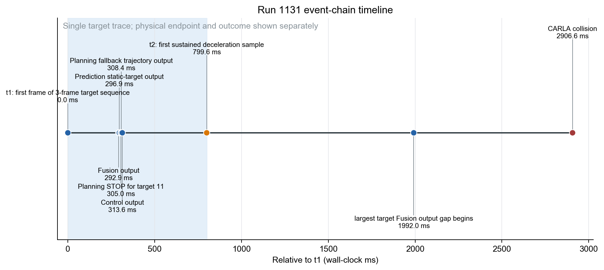
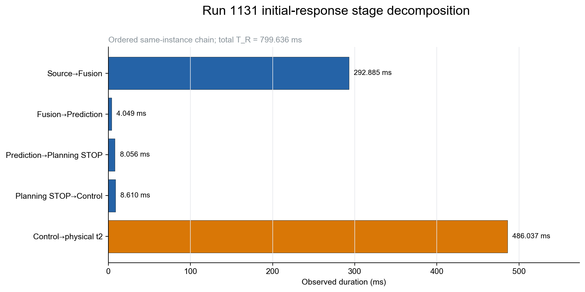
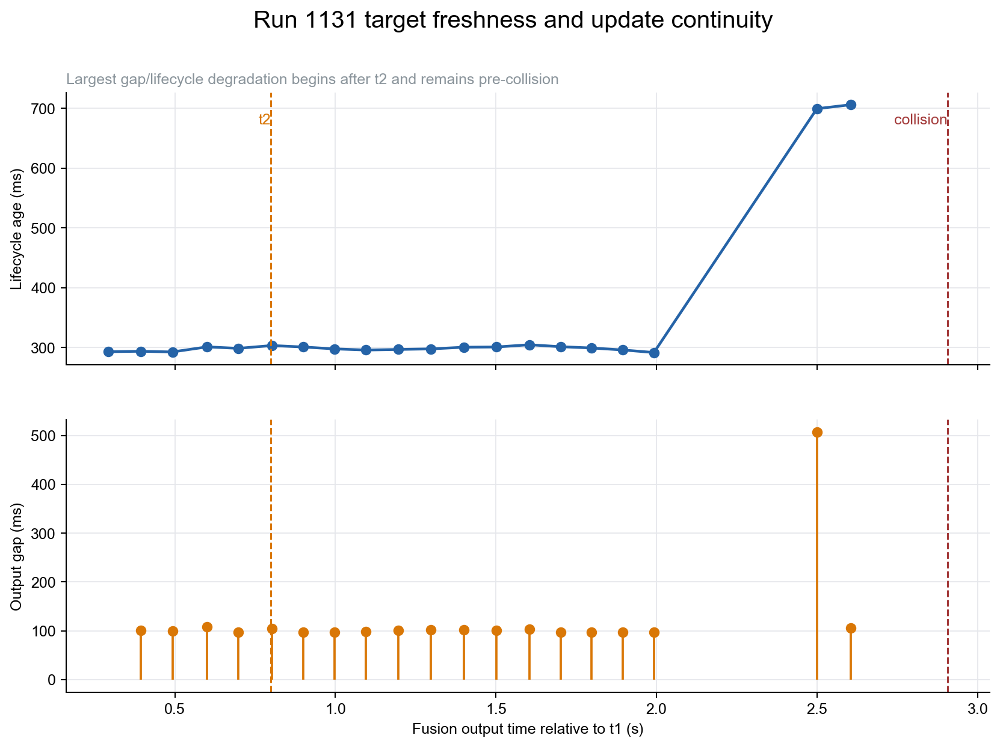

# 第二次实验 1131 run 单次实时性—物理安全双向诊断

**方法：TCPS-PA v3.1 单-run、事件中心、Claim–Evidence 诊断**  
**范围：仅 `202607271131`；未使用其他 run 的基线、制动模型、deadline 或反事实轨迹**

## 结论先行

1131 run 存在清楚的**事件级时间退化现象**：从首个稳定目标源帧 $t_1$ 到首个持续减速采样 $t_2$ 经过 **799.636 ms**，期间车速由 **16.080 m/s** 升至 **17.503 m/s**，按墙钟速度梯形积分前进 **13.432 m**。时间消耗集中在两处：

- source→Fusion 为 **292.885 ms**，占 $T_R$ 的 **36.6%**；
- Control 输出→物理 $t_2$ 为 **486.037 ms**，占 **60.8%**，是最大单段。

本 run 确认 Bridge 的 300 ms 固定延时在 $t_1$ 前约 **25.997 s** 已触发；实现语义是触发后持续延时后续 ControlCommand，但本 run 因 `log_all_delayed_commands=false` 没有事件对应命令的逐条 Bridge apply 记录。因此可将 Bridge 延时定位为**主要事件相关候选因素**，但不能从单 run 证明它导致碰撞。

Planning 对同一目标 11 产生 STOP，但速度优化失败并进入常减速 fallback（首个事件输出 `status_ok=1`、98 轨迹点、`max_abs_decel=4 m/s²`）；加上 Control 载荷和事件级 Bridge apply 证据缺失，`P_FUNC=PARTIAL`。所以不得把此案表述为“功能正确但仅时间错误”。

物理后果是直接观测的：在 $t_1+2.907$ s 与 actor 155 碰撞，冲击速度 **7.988 m/s**，冲量模 **16817.2**。$t_2$到碰撞的墙钟速度积分是 **27.148 m**，但它是碰撞右截尾距离，不是完整制动距离。

最重要的否定性结论是：**本 run 无合格、事前锁定且独立验证的动态物理 deadline**，也无 WCRT/后缀上界。因此 `C4_OBS=NOT_TESTABLE`、`G1_GUARANTEE=NOT_ESTABLISHED`，不存在可报告的“失去时间保证时刻”；主 `D_debt` 也不可用。

## Six-Layer Inference Status Matrix

| 层/主张 | 判定 | 本 run 证据上限 |
|---|---|---|
| L1 / C1 | PASS | 300 ms Bridge 时间干预实际进入系统；不等于 Apollo 内生缺陷 |
| L2 / C2 | PASS | Bridge 局部延时显化；A/G 无独立要求，仅作诊断量 |
| L3 / C3 | PARTIAL_PASS | source→Control 为 Grade A，Control→物理 $t_2$ 为 Grade C |
| L4 / C4 | NOT_TESTABLE | 已观测 $T_R$，但无合格 $\tau_{req}$ |
| L5 / C5 | NOT_TESTABLE | $D_{response}$ 可用；requirement-constrained $D_{debt}$ 不可用 |
| L6 / C6 | PASS | 碰撞、对方 actor、冲击速度和冲量直接观测 |
| Attribution / C7 | UNCERTAIN | 只能报告系统级关联和候选机制，不能定量因果份额 |

v3.1 独立状态：`P_CLOCK=PASS`、`P_TARGET=PASS`、`P_FUNC=PARTIAL`、`P_PHASE=NOT_TESTABLE`、`P_DEADLINE=NOT_TESTABLE`、`G1_GUARANTEE=NOT_ESTABLISHED`、`E1_EMPIRICAL=DESCRIPTIVE_ONLY`。

## 事件和端点定义

| 端点 | 墙钟时间（Asia/Shanghai） | 相对 $t_1$ | 定义 |
|---|---|---:|---|
| fault onset | 2026-07-27T11:31:35.948358+08:00 | -25997.267 ms | SCB 首条有效制动命令 receive/trigger |
| $t_1$ | 2026-07-27T11:32:01.945625+08:00 | 0 ms | 目标 11 三帧稳定序列首帧的 source timestamp |
| Fusion | 2026-07-27T11:32:02.238510+08:00 | 292.885 ms | 同 trace 的稳定 Fusion 输出 |
| Prediction | 2026-07-27T11:32:02.242559+08:00 | 296.934 ms | 同 trace 静态目标预测 |
| Planning STOP | 2026-07-27T11:32:02.250615+08:00 | 304.990 ms | target 11 STOP |
| Control | 2026-07-27T11:32:02.259224+08:00 | 313.599 ms | 同 trace `cmd_write_enter/output_pub` |
| $t_2$ | 2026-07-27T11:32:02.745261+08:00 | 799.636 ms | 首个持续减速采样：连续 2 区间 $a\le-0.5$ m/s² 且 0.3 s 内掉速≥0.3 m/s |
| collision | 2026-07-27T11:32:04.852247+08:00 | 2906.622 ms | CARLA collision event，不使用 history 首帧替代 |

$t_2$ 受约 100 ms Localization 采样粒度，保守采样夹取为 **[699.455, 799.636] ms**；对 raw $v(t)$ 使用 0.3/0.5/1.0 m/s² 门限都得到同一 $t_2$，median-3 平滑则延至 899.502 ms，见 `t2_sensitivity.csv`。



## R/A/G 与时间消耗位置

| 维度 | 观测值 | 事件范围 | 判定 |
|---|---:|---|---|
| Reaction $R$ | 799.636 ms | $t_1\to t_2$ | 可观测；无 deadline，不可判 miss |
| Age $A$ | 400.421 ms | $t_2$ 时最新已 Fusion 目标源数据 | 可观测；无 freshness requirement |
| Gap $G$ | 108.213 ms | $[t_1,t_2]$ 内 5 个目标输出 | 可观测；无 gap requirement |
| 后续 $G_{max}$ | 507.439 ms | $t_2$ 后、碰撞前 | 不能解释首次 $t_2$；可影响持续闭环的候选 |
| 碰撞时目标源数据年龄 | 1006.892 ms | 最后已 Fusion 目标源帧到碰撞 | 后续新鲜度退化的直接诊断量 |

同一 trace 的 source→Fusion 细分中，sensor→Preprocess 入口年龄 **101.614 ms**、Ground 输出→Detection 进入等待 **61.478 ms**、Lidar Detection 处理 **98.163 ms**；三者是 Perception 时间的主要组成。细分和与 trace E2E 差 **0.002144 ms**。



Control→$t_2$ 的 486.037 ms 是最大分段。以已记录的 300.047 ms 注入精度做**非因果算术分解**，剩余 **185.990 ms**；它混合事件命令未记录的排队/释放、CARLA tick、车辆动力学、Localization 采样及持续减速确认窗，不得命名为 Apollo 计算延时。

## 双向定位：哪里、什么性质、为什么

1. **Bridge/SCB（L1）**：直接证据确认的 300.047 ms 外部注入型固定时延；它表明 SUT 在注入干领下的行为，不是 Apollo 内生实时缺陷证明。
2. **Perception 源数据年龄（L2/L3）**：首帧 source→Fusion 为 292.885 ms，主要由 101.614 ms 入口年龄、61.478 ms Detection 前等待和 98.163 ms Detection 处理组成。这是精确段级定位，但缺局部要求/基准，不升格为 violation。
3. **Planning 功能退化（P_FUNC）**：STOP 后在 $t_1+306.759$ ms 出现 speed fallback，后续常减速 fallback 共 20 次。它在首次因果窗内，是事件相关功能候选，但不是引起 486 ms 的处理时间瓶颈。
4. **Control→物理效应（L3）**：486.037 ms 是对初始响应最有关联的位置，但精确命令载荷/apply 不在归档中，全链只能 Grade C。
5. **$t_2$ 后持续闭环（L2/L3）**：507.439 ms 输出缺口与约 700 ms lifecycle 峰值发生在 $t_2$ 之后。它们对“为何首次制动晚”已被时序反证，但对碰撞前持续制动新鲜度仍是未解候选。



## 时间保证与动态契约

本次可以观测 $T_R$，却不能合格构造 $\tau_{req}$，因为缺少：

- $t_1$ 前锁定的 $d_{safe}$ 政策；
- 独立验证的 ego 最小制动能力/响应期加速上界；
- 目标行为与路面条件的有界包络；
- 与评估 run 独立的校准/验证数据。

碰撞已把完整停车轨迹右截尾，同 run 事后制动量不能被反用为本 run 的独立 deadline。因此：

- observed contract verdict：`NOT_TESTABLE`；
- guarantee verdict：`NOT_ESTABLISHED`；
- conditional guarantee-loss point：不可用；
- observed miss time：不可用；
- primary deadline debt：不可用。

300 ms 干预触发时刻是**故障进入时刻**，不是时间保证丧失时刻；799.636 ms 是**观测物理反应端点**，不是未定义 deadline 的 miss 时刻。

## Space budget / 空间预算、物理传播与安全损失


| 量 | data/observed | 含义与边界 |
|---|---:|---|
| $D_1$ Fusion/几何净距 | 38.258 m | Apollo Fusion 目标与校准 offset；对方 CARLA history 未覆盖 $t_1$ |
| $D_{response}$ | **13.432 m** | $\int_{t_1}^{t_2}v(t)dt_{wall}$，主口径 |
| $D_{response}$ 采样下夹取 | 11.671 m | 积分到 $t_2$ 前一 Localization 样本 |
| $D_{brake,truncated}$ | 27.148 m | $t_2$→collision 墙钟速度积分；非完整制动距离 |
| 冲击速度 | **7.988 m/s** | CARLA collision event 直接观测 |
| 冲量模 | 16817.2 | CARLA collision event 直接观测 |
| 主 $D_{debt}$ | 不可用 | 无 qualified $\tau_{req}$ |
| 完整 $D_{brake}$ / $M_0$ | 不可用 | 碰撞右截尾，不以模型值填充 |
| timing 因果物理损失 | 不可定量 | 无 qualified deadline 和事前锁定的现实反事实轨迹 |

几何不确定性不得隐藏：Fusion/计划目标与 CARLA actor 155 的 20 帧匹配中，位置误差中位数 **1.689 m**、P90 **1.847 m**；净距 offset 另有 0.52 m 不确定度。碰撞事件本身作为实际接触的主证据，不由这些距离推导替代。

## 核心问题的最终回答

| 问题 | 1131 run 可支持的回答 |
|---|---|
| 哪里出了实时性问题？ | 观测时间消耗主要在 source→Fusion（292.885 ms）和 Control→物理 $t_2$（486.037 ms）；Bridge 300 ms 注入是后者的主要候选构成，但事件命令未逐条归档。 |
| 它是什么性质？ | 已证明的是外部注入型 Bridge 固定时延 + 事件级时间/新鲜度退化；不是 Apollo 内生实时缺陷的单-run证明。Planning fallback 使它同时是功能/时间多因素候选。 |
| 什么时候失去时间保证？ | 不可判定。没有已建立的合格 deadline/WCRT/suffix bound，因而没有合法的 guarantee-loss 时刻。 |
| 为什么？ | 候选机制依次是持续 300 ms Bridge 延时、Perception 入口/等待/Detection 时间、Planning fallback、Control-to-physical 未分解残差、$t_2$ 后新鲜度空档。仅最后一项已被反证为“首次 $t_2$ 延迟”的原因；其他仍未唯一隔离。 |
| 造成多少物理安全损失？ | 可直接报告 13.432 m 响应距离、27.148 m 碰撞截尾制动距离、7.988 m/s 冲击速度和 16817.2 冲量模。但不能把 13.432 m 写成 deadline debt 或 timing 因果损失；该因果份额在本 run 不可定量。 |

## 验证、方法完备性与复现

- 原始输入库存：`validation/input_inventory.json`，35 个文件、总计 101221115 bytes，保存 SHA-256；原始目录未写入。
- 标准墙钟响应距离由 `velocity_trajectory_observed.csv` 重算，只使用 Localization 速度与墙钟端点。
- data/observed 与 model/predicted 分表；模型表明确写 `NOT_COMPUTED`，没有以模型补观测缺失。
- 方法完备性：见 `tables/method_completeness_matrix.csv`。
- Claim–Evidence–Defeater 帐本：见 `claim_ledger.csv`、`evidence_ledger.csv`、`defeater_ledger.csv`。
- 反向诊断候选及区分检验：见 `diagnosis_hypothesis_ledger.csv`。
- 自动验证结果：见 `validation/validation.json`和 `validation/claim_audit.md`。

复现命令：

```bash
python3 /Users/huangjinhui/Desktop/萨卡班/data/output/second_experiment_1131_tcps_pa_v3_1/scripts/analyze_1131_single_run.py
python3 /Users/huangjinhui/.codex/skills/autonomous-driving-temporal-safety-analysis/scripts/recompute_l5_metrics.py --analysis-dir /Users/huangjinhui/Desktop/萨卡班/data/output/second_experiment_1131_tcps_pa_v3_1
python3 /Users/huangjinhui/.codex/skills/autonomous-driving-temporal-safety-analysis/scripts/validate_analysis_outputs.py --analysis-dir /Users/huangjinhui/Desktop/萨卡班/data/output/second_experiment_1131_tcps_pa_v3_1
```
