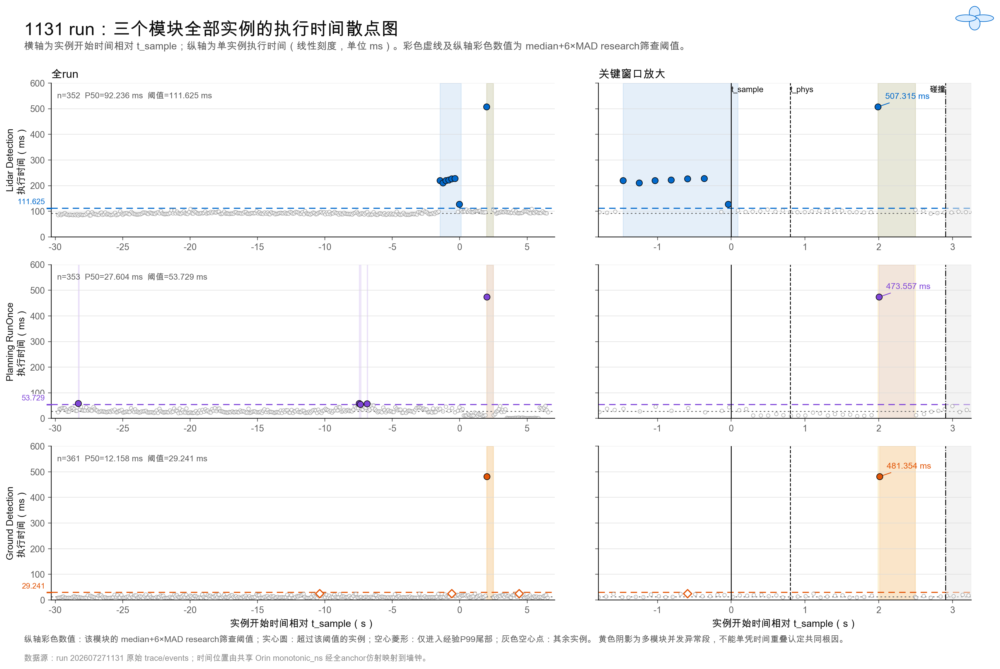

# 1131 run 全实例实时性重新分析（TCPS-PA v4.2）

## 技术结论

重新按“首次因果链 + 全run逐实例 + 独立物理动作episode”分析后，1131的结论比原报告更完整：

1. 首次 `source→Fusion` 的报告值仍为 **292.885 ms**（日志墙钟）；同一实例的trace重算值为 **292.979 ms**，在全部352个可用实例中位于 **92.6%分位**。它不是平均值，也不是最大值，但相对本run中位数 **213.150 ms** 已进入research异常区。
2. 全run存在一个跨越`t_sample`的Lidar异常突发段：相对`t_sample` **[-1.467, 0.088] s**。这说明首次因果链慢并非完全孤立点，而处在一段感知执行时间抬升的尾部。
3. `t_phys`之后出现跨三模块并发异常段：相对`t_sample` **[1.989, 2.496] s**，覆盖Lidar Detection 507.315 ms、Planning RunOnce 473.557 ms和Ground Detection 481.354 ms。三者共同执行重叠约467.161 ms；它们来自相邻trace，不是同一帧。
4. Control共有 **3636** 条输出，但只有 **354** 个唯一trace，单trace最多重复 **40** 次。缺少事件级Bridge apply和payload，不能构造逐物理动作episode的延迟分布；仅首次制动episode可保留Grade C的 **486.037 ms** 上界采样值。
5. 全实例统计强化了L2/L3的定位，但不产生新的独立动态deadline，也不把C4/C5从`NOT_TESTABLE/MODEL_SUPPORTED_ONLY`升级为直接成立。

首次`source→Fusion`虽然超过`median+6×MAD`，但该筛查线在全体352个实例中标记了38个（10.8%）。这更像运行阶段/负载相关的非平稳分布，而不是38个彼此独立的罕见故障；因此报告采用事件窗口分层，并不把该research筛查直接解释为contract violation。

## 明确lineage边的全部实例统计

| 软件链指标 | 可用/期望 | P50 ms | P95 ms | P99 ms | MAX ms | 首次因果值 ms | 首次值分位 |
|---|---:|---:|---:|---:|---:|---:|---:|
| source_to_fusion_output | 352/353 | 213.150 | 298.524 | 398.122 | 705.980 | 292.979 | 92.6% |
| fusion_to_prediction_output | 353/353 | 3.926 | 10.406 | 12.846 | 20.339 | 3.955 | 50.7% |
| prediction_to_planning_output | 353/353 | 28.671 | 45.678 | 57.313 | 480.043 | 13.035 | 9.1% |
| planning_output_to_first_control_output | 353/353 | 8.124 | 13.079 | 14.524 | 20.932 | 3.630 | 8.5% |
| source_to_first_control_output | 352/353 | 254.597 | 333.477 | 467.640 | 783.440 | 313.601 | 90.1% |

其中`source→Fusion`和`source→first Control`各有一个启动期Fusion实例缺少父LiDAR anchor，明确保存为不可用；三个纯monotonic阶段仍保留353/353个实例，没有因为source anchor缺失而错误丢弃。

## 全实例分布

| 指标 | n | mean ms | P50 ms | P95 ms | P99 ms | MAX ms | median+6MAD异常数 |
|---|---:|---:|---:|---:|---:|---:|---:|
| lidar_detection_processing | 352 | 96.397 | 92.236 | 103.019 | 221.203 | 507.315 | 8 |
| planning_runonce | 353 | 29.101 | 27.604 | 43.546 | 56.665 | 473.557 | 5 |
| ground_detection_processing | 361 | 14.581 | 12.158 | 21.638 | 24.931 | 481.354 | 1 |

平均值仅作为完整统计的一部分；实时性判断主要同时查看P95/P99/MAX、MAD/IQR、异常连续段和事件窗口。run内帧是时间样本，不是独立实验重复。

## 异常时间段

| 段 | 起点相对t_sample s | 终点相对t_sample s | 涉及模块 | 实例数 | 分类 |
|---|---:|---:|---|---:|---|
| SEG02 | -28.297 | -28.238 | planning_runonce | 1 | SINGLE_INSTANCE |
| SEG04 | -7.471 | -7.328 | planning_runonce | 2 | SINGLE_COMPONENT_BURST |
| SEG06 | -6.881 | -6.823 | planning_runonce | 1 | SINGLE_INSTANCE |
| SEG08 | -1.467 | 0.088 | lidar_detection_processing | 7 | SINGLE_COMPONENT_BURST |
| SEG10 | 1.989 | 2.496 | ground_detection_processing|lidar_detection_processing|planning_runonce | 3 | MULTI_COMPONENT_CONCURRENT |

异常判据为本run分布的`median+6×MAD`，provenance为`RESEARCH`。它可以定位异常，但不是architectural/calibrated contract，不能据此直接宣称deadline miss。



## 明确trace lineage的全部实例

`all_instance_lineage_timing.csv`以353个主LiDAR Fusion trace为母体，逐实例保存：

- `source→Fusion output`；
- `Fusion→Prediction output`；
- `Prediction→Planning output`；
- `Planning output→first Control output`；
- `source→first Control output`；
- 不可用端点和missing reason。

首次值继续服务于首次障碍响应和物理预算；全体分布用于闭环timing integrity诊断。二者并列，不相互覆盖。

## Control独立动作episode审计

当前数据不能知道每条Control输出的制动/转向payload，也没有逐命令Bridge apply记录；Apollo record同样未录制。因此：

- 软件更新episode候选可以按唯一trace统计；
- 真正的物理动作episode不能从3636条Control发布中可靠分割；
- 将每条Control消息与唯一`t_phys`相减会形成多对一伪重复，禁止作为物理响应时间分布；
- 首次目标制动只支持Control输出到`t_phys`的事件级Grade C关联，采样区间约为 **[385.856, 486.037] ms**。

## 时钟、稳健性与限制

- 实例执行时间直接使用同一Orin `monotonic_ns`相减；不依赖墙钟拟合。
- 散点内部位置使用362个LiDAR source/monotonic anchor拟合，内部P95残差为 **0.001 ms**；这不是跨主机物理事件误差。Apollo/CARLA/Bridge事件比较继续采用原`P_CLOCK`审计的 **0.661 ms** P95界限。两者均不改变约0.5 s尖峰和事件先后排序。
- `t_sample=2026-07-27T11:32:01.945625+08:00`，`t_phys=2026-07-27T11:32:02.745261+08:00`，碰撞=`2026-07-27T11:32:04.852247+08:00`。
- 多模块时间重叠支持共同资源/调度干扰候选，但没有CPU/GPU调度、队列深度和利用率证据，不能证明唯一根因。
- 动态物理deadline仍受原v4.2报告中的独立性、锁时和模型验证限制。

## 后续需要的证据

1. 开启Apollo record，保存Control payload、Planning reuse、Chassis反馈和模块timeline。
2. `log_all_delayed_commands=true`，保存每个Bridge receive/release/apply事件。
3. 记录CPU/GPU利用率、线程调度、GPU kernel和队列深度，以区分共享资源竞争与模块内部执行尾部。
4. 对匹配初始状态进行多run复现；run内帧分布不能替代实验重复。

## 复现

```bash
python3 /Users/huangjinhui/Desktop/萨卡班/data/output/second_experiment_1131_tcps_pa_v4_2_all_instances/scripts/analyze_1131_single_run_v4_2.py
python3 /Users/huangjinhui/Desktop/萨卡班/data/output/second_experiment_1131_tcps_pa_v4_2_all_instances/scripts/analyze_1131_all_instances_v4_2.py
python3 /Users/huangjinhui/.codex/skills/autonomous-driving-temporal-safety-analysis/scripts/recompute_l5_metrics.py --analysis-dir /Users/huangjinhui/Desktop/萨卡班/data/output/second_experiment_1131_tcps_pa_v4_2_all_instances
python3 /Users/huangjinhui/.codex/skills/autonomous-driving-temporal-safety-analysis/scripts/validate_analysis_outputs.py --analysis-dir /Users/huangjinhui/Desktop/萨卡班/data/output/second_experiment_1131_tcps_pa_v4_2_all_instances
```

原始run目录保持只读；所有新增结果写入独立v4.2目录。
