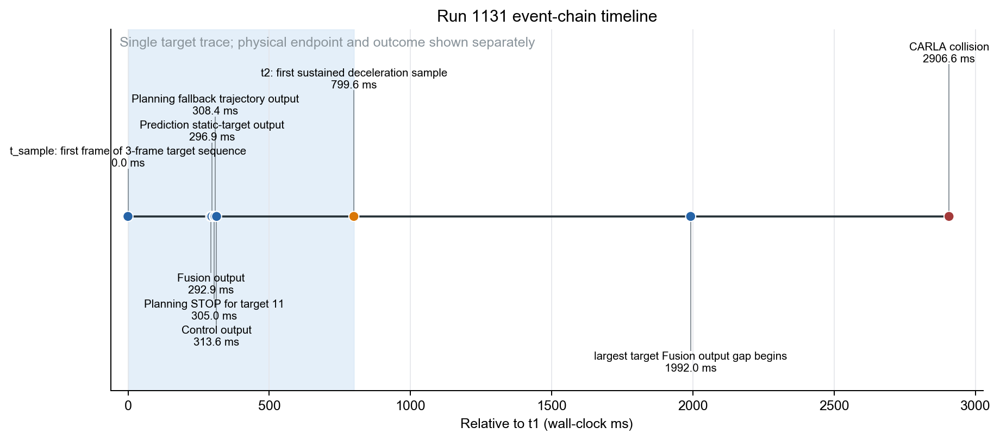
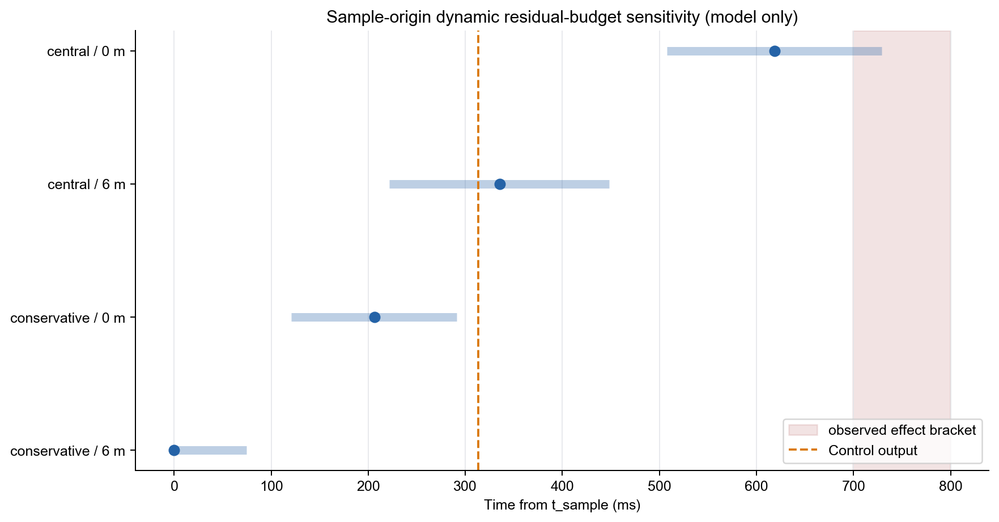
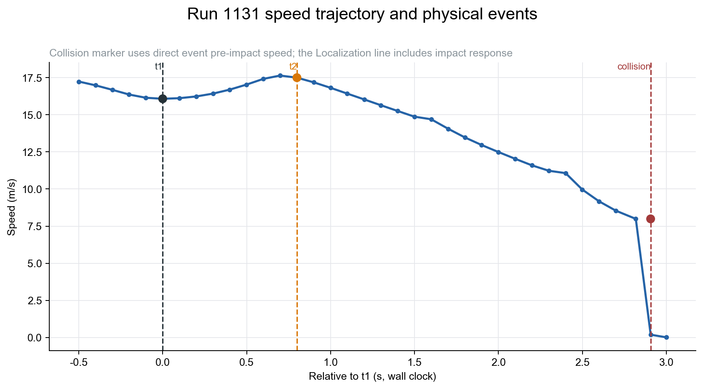

# 第二次实验 1131 run 实时性异常诊断

**方法：TCPS-PA v4.2；单-run observed 诊断 + 独立分表的 baseline model sensitivity**  
**主结果范围：`202607271131`；7 个 baseline 只用于模型参数，不进入 observed 主结果**

## 结论先行

1131 存在明显的**样本到物理效应时间退化**：从目标 11 稳定序列首帧的真实 source epoch $t_{sample}$ 到首个持续减速采样 $t_{phys}$，夹取时间为 **[699.455, 799.636] ms**。上端时车速从 **16.080 m/s** 升至 **17.503 m/s**，墙钟速度梯形积分为 **13.432 m**。这是 sample-relative observed 距离，不是 demand-relative 主反应距离。

首次响应链有两个主要耗时段：

- source→Fusion：**292.885 ms**；其中 Ground→Detection 等待 **61.478 ms**，而同 run 同语义边的中位数为 **0.142 ms**，是清晰的局部 research outlier；
- Control 输出→$t_{phys}$：**486.037 ms**；本 run 已直接确认 300 ms Bridge 时延干预存在，但事件对应命令的 apply 记录缺失，剩余 **185.990 ms** 也混合 CARLA tick、车辆动力学、Localization 采样和 effect hold 确认。

在 $t_{phys}$ 后、碰撞前，trace 还记录到一组同时段的近 0.5 s 尖峰：Lidar Detection **507.315 ms**、Ground Detection **481.354 ms**、Planning RunOnce **473.557 ms**，继而形成 target Fusion 输出缺口 **507.439 ms** 和 lifecycle **705.892 ms**。它不能解释首次制动起效晚，但是碰撞前持续闭环 timing-integrity 退化的高优先级候选。

## Six-Layer Inference Status Matrix

| 层/门/主张 | 判定 | 证据上限 |
|---|---|---|
| P_CLOCK | PASS | 跨域对齐 P95 残差 0.661 ms，不改变事件顺序 |
| P_OBSERVABILITY | NOT_TESTABLE | $t_{sample}$ 可用；$t_{demand}/t_{observable}$ 不可用 |
| P_TARGET | PASS | target 11 与碰撞 actor 155 有 20 帧匹配 |
| P_FUNC | PARTIAL | STOP 存在；Planning fallback、Control payload 与 event-local apply 缺口未闭合 |
| L1 / C1 | PASS | 300.047 ms Bridge stressor 在事件前已进入系统 |
| L2 / C2 | PASS | 局部注入显化；A/G 无合格独立契约 |
| L3 / C3 | PARTIAL_PASS | source→Control 为 Grade A；Control→physical 为 Grade C |
| L4 / C4 | NOT_TESTABLE | demand-origin 主契约不可测；sample-origin 仅 MODEL_SUPPORTED_ONLY |
| L5 / C5 | NOT_TESTABLE | sample-relative 距离可用；主 requirement debt 不可用 |
| L6 / C6 | PASS | 碰撞、actor、冲击速度和冲量直接观测 |
| Attribution / C7 | UNCERTAIN | 可排序候选，不能定量 timing 的现实因果份额 |

## 四时刻与事件端点

| 角色/端点 | 墙钟时间 | 相对 $t_{sample}$ | 证据语义 |
|---|---|---:|---|
| fault onset | 2026-07-27T11:31:35.948358+08:00 | -25997.267 ms | SCB 首条有效制动命令 receive/trigger |
| $t_{world}$ | $\le$ 2026-07-27T11:32:01.945625+08:00 | 左截尾 | 障碍物存在的首次成立时刻未归档 |
| $t_{demand}$ | 不可用 | — | 没有独立 control-demand predicate；不用 Planning STOP/碰撞回填 |
| $t_{observable}$ | 不可用 | — | 缺 FOV/遮挡/距离/分辨率/驻留模型 |
| $t_{sample}$ | 2026-07-27T11:32:01.945625+08:00 | 0 ms | target 11 稳定序列首帧 source epoch；稳定序列是回看发现 |
| Fusion | 2026-07-27T11:32:02.238510+08:00 | 292.885 ms | 同 trace 目标输出 |
| Prediction | 2026-07-27T11:32:02.242559+08:00 | 296.934 ms | 同 trace 静态目标语义 |
| Planning STOP | 2026-07-27T11:32:02.250615+08:00 | 304.990 ms | target 11 STOP；之后 speed fallback |
| Control | 2026-07-27T11:32:02.259224+08:00 | 313.599 ms | 同 trace `cmd_write_enter/output_pub` |
| $t_{phys}$ | 2026-07-27T11:32:02.745261+08:00 | [699.455, 799.636] ms | 首个持续减速采样；raw 门限敏感性一致 |
| collision | 2026-07-27T11:32:04.852247+08:00 | 2906.622 ms | CARLA collision event，不用 actor-history 首帧替代 |



## Component-wise R/A/G/C/L

| component | 观测 | 契约判定 |
|---|---:|---|
| R | sample→physical = [699.455, 799.636] ms | demand-relative `NOT_TESTABLE`；sample-relative model 另列 |
| A | $t_{phys}$ 时 target source age = 400.421 ms | 无兼容 A requirement，`NOT_TESTABLE` |
| G | 初始窗 max = 108.213 ms；后续 max = 507.439 ms | 后续值为 research outlier，不是 architectural/physical miss |
| C | 关键 Fusion 束 LiDAR/Radar raw source skew = 0 ms | induced state error 与安全包络缺失，`NOT_TESTABLE` |
| L | 初始 source→Control 顺序完整；apply/payload/feedback 不完整 | Closed-Loop Timing Integrity `NOT_TESTABLE`；后续 0.5 s 峰值是退化候选 |

raw skew 仅作诊断。没有 induced state-error 模型时，不会因 raw skew 为 0 就宣称 Physical Coherence 通过。

## 异常定位与机制

1. **Bridge/SCB，已直接确认**：请求 300 ms，唯一归档 APPLIED 值 300.047 ms/3 CARLA frames，在 $t_{sample}$ 前 25.997 s 触发。它是外部注入 stressor，在局部配置上反而是 `WITHIN`，不是 Apollo 工程契约超时。
2. **初始 Perception 边等待，已精确定位**：Ground→Detection 等待 61.478 ms，同 run 分布为 median 0.142 ms、MAD 0.051 ms、research 阈值 median+6MAD=0.448 ms，约为中位数的 434 倍。Detection 本身 98.163 ms 属该 run 常见高成本（P95 103.019 ms），对短物理预算仍是重要消耗项。
3. **Planning 功能退化，与时间问题并存**：同一目标 STOP 已形成，随后 speed optimizer 失败并输出 non-empty constant-deceleration fallback，全 run 共 20 次。它使纯时间归因不成立。
4. **Control→physical 段，最大单段但未唯一分解**：486.037 ms 中，300.047 ms 只能做代理算术分解；185.990 ms 不能被直接命名为 Apollo execution delay。
5. **$t_{phys}$ 后 0.5 s 多模块重叠峰值，持续闭环候选**：Lidar/Ground/Planning 峰值在 $t_{sample}+1.99\sim2.50$ s 重叠，并导致 507.439 ms 目标缺口。这个时序已排除它对首次 $t_{phys}$ 的解释；无 CPU/GPU/lock 证据，根因仅能标为 common interference/stall 候选。


## 动态物理 deadline 模型敏感性

正式 demand-origin deadline 不可构造，因为 $t_{demand}$ 未定义。下表是从 $t_{sample}$ 时 $d_0=38.258$ m、$v=16.080$ m/s 出发的 RSS-like **剩余预算 model/predicted**。几何敏感性带为 $d_0\pm(0.52+1.847)$ m；两个动力学参数集来自 7 个不重叠 baseline，但生成时间晚于评估 run，且未验证摩擦/坡度/曲率/载荷/制动建立时间；$d_{safe}=0/6$ m 为 RESEARCH 情景。

| 情景 | $\tau_{residual}$ 中心 / 几何敏感性 | 与 observed effect 比较 | $D_{debt,model}$ 中心 | $\Delta M_{phys,model}$ |
|---|---:|---|---:|---:|
| conservative / 6 m | 0.000 / [0.000, 74.377] ms | clear model miss | [11.671, 13.432] m | 22.940 m |
| conservative / 0 m | 206.359 / [120.716, 290.841] ms | clear model miss | [8.340, 10.101] m | 22.940 m |
| central / 6 m | 335.319 / [221.669, 447.920] ms | clear model miss | [6.228, 7.989] m | 16.817 m |
| central / 0 m | 618.822 / [507.774, 728.892] ms | 中心 miss；边界与 effect 下夹取重叠 | [1.415, 3.176] m | 16.817 m |



conservative/6 m 在样本时刻已越出声明包络；conservative/0 m 中心预算在 $+206.359$ ms 耗尽，当时首帧仍在 Lidar Detection 中；central/6 m 在 $+335.319$ ms 耗尽，central/0 m 在 $+618.822$ ms 耗尽，后两者均位于 Control→physical 段。这些都是 model crossing point，不是 guarantee-loss point。

## 时间保证与物理损失

以下为 Space Budget（空间预算）结果；observed 与 model/predicted 始终分列。

没有 WCRT/path/suffix bound，正式保证自始未建立，所以没有可报告的“首次丧失保证时刻”。300 ms 干预触发是 fault onset，不是 guarantee-loss；模型预算耗尽是敏感性 crossing，也不是已建立保证的丧失。

| 量 | 数值 | 类型与边界 |
|---|---:|---|
| Fusion/几何派生 $D_1$ | 38.258 m | observed-derived；存在关联/几何不确定性 |
| $D_{response,sample}$ | 13.432 m | data/observed，墙钟速度积分 |
| $D_{response,demand}$ | 不可用 | $t_{demand}$ 不可用，不用模型补值 |
| $D_{brake,truncated}$ | 27.148 m | $t_{phys}$→collision；碰撞右截尾 |
| 冲击速度 | 7.988 m/s | CARLA collision event 直接观测 |
| 冲量模 | 16817.2 | CARLA collision event 直接观测 |
| 主 $D_{debt,requirement}$ | 不可用 | 无 qualified demand-origin deadline |
| $D_{debt,model}$ | 1.415–13.432 m | model/predicted；模型情景 + effect 端点夹取，非 observed/非 requirement |
| $\Delta M_{phys,model}$ | 16.817–22.940 m | 相对零响应延迟的模型余量损失 |
| 完整 observed $D_{brake}/M_0$ | 不可用 | collision right-censoring |



## 对核心问题的回答

| 问题 | 1131 可支持的回答 |
|---|---|
| 哪里有实时性异常？ | 初始 Ground→Detection 等待尖峰；486.037 ms Control→physical 段；碰撞前约 0.5 s 的 Perception/Planning 重叠峰值与 507.439 ms 目标缺口。 |
| 它是什么性质？ | 外部注入型 Bridge stressor + 样本后响应退化 + 后续闭环 timing-integrity 候选；Planning fallback 使功能与时间因素并存。 |
| 什么时候失去时间保证？ | 正式保证未建立，无 guarantee-loss timestamp。模型中心 crossing 为 $t_{sample}+0/206/335/619$ ms，但仅是模型敏感性。 |
| 为什么？ | 已观测到初始 Detection 前等待、300 ms Bridge stressor、Planning fallback 和后续 0.5 s 时间爆发。无 event-local apply/payload/资源证据，不能将首次响应唯一归因；后续爆发已被时序排除为首次响应延迟的解释。 |
| 损失多少？ | observed：13.432 m sample-response 距离、27.148 m 碰撞截尾制动距离、7.988 m/s 冲击速度、16817.2 冲量模。model：1.415–13.432 m deadline debt（含 effect 端点夹取）和 16.817–22.940 m 余量损失。timing 的现实世界因果份额不可定量。 |

## 方法完备性、证据边界、验证与复现

- 原始输入 35 个文件、101221115 bytes，SHA-256 保存于 `validation/input_inventory.json`；原始目录未写入。
- `run_level_observed.csv` 与 `run_level_model_predicted.csv` 分开；4 组模型结果没有回填 observed 缺失。
- 完整四时刻、P_OBSERVABILITY、阈值来源、分量契约和 model deadline 见 `event_time_semantics_audit.csv`、`observability_audit.csv`、`threshold_provenance_registry.csv`、`component_contract_evaluation.csv`、`dynamic_contract_construction.csv`。
- 本 run 没有 record，Control payload/消息收发和 event-local Bridge apply 连续性无法审计。
- 自动 Claim–Evidence 验证见 `validation/validation.json`；L5 墙钟积分由独立验证器重算。

复现：

```bash
python3 /Users/huangjinhui/Desktop/萨卡班/data/output/second_experiment_1131_tcps_pa_v4_2_all_instances/scripts/analyze_1131_single_run_v4_2.py
python3 /Users/huangjinhui/.codex/skills/autonomous-driving-temporal-safety-analysis/scripts/recompute_l5_metrics.py --analysis-dir /Users/huangjinhui/Desktop/萨卡班/data/output/second_experiment_1131_tcps_pa_v4_2_all_instances
python3 /Users/huangjinhui/.codex/skills/autonomous-driving-temporal-safety-analysis/scripts/validate_analysis_outputs.py --analysis-dir /Users/huangjinhui/Desktop/萨卡班/data/output/second_experiment_1131_tcps_pa_v4_2_all_instances
```
