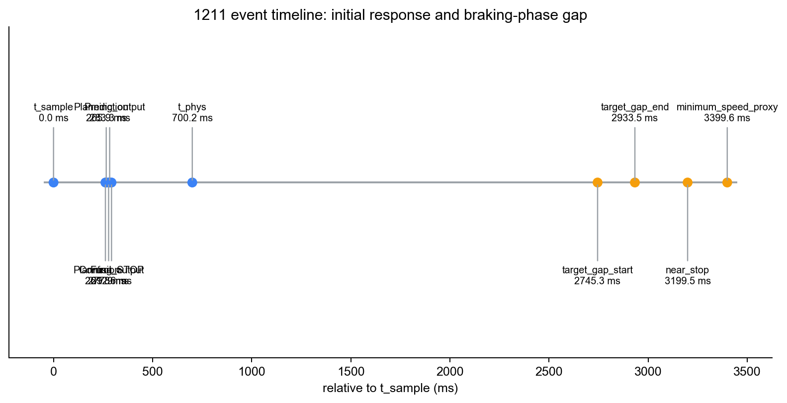
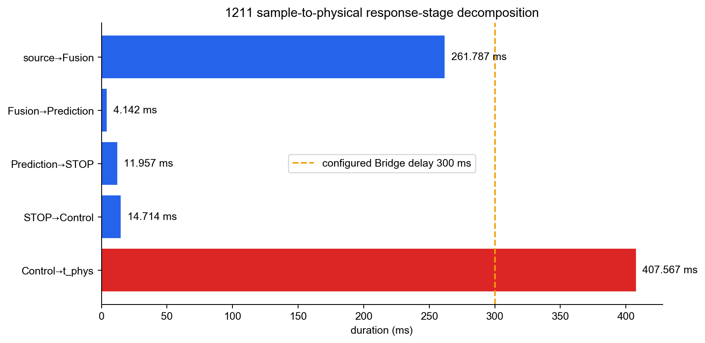
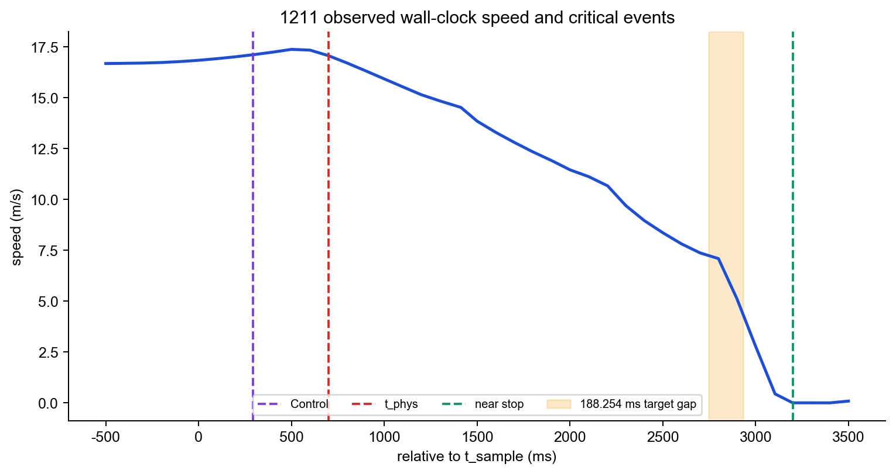

# 第二次实验 1211 run 实时性异常诊断

**方法：TCPS-PA v4.1；范围：单次 run `202607271211`**  
**observed/data 与 model/predicted 分开；7 个 baseline 只进入模型敏感性分支**

## Six-Layer Inference Status Matrix

| 层/主张 | 判定 | 可支持的结论 |
|---|---|---|
| L1 / C1 | PASS | 300 ms Bridge 固定延时确实进入部署命令路径 |
| L2 / C2 | PASS | 局部 Bridge 延时实测为 300.148 ms；A/G 无工程契约 |
| L3 / C3 | PARTIAL_PASS | source→Control 同 trace；Control→physical 缺 event-local apply/跨主机时钟闭环 |
| L4 / C4 | NOT_TESTABLE | 无 qualified demand-origin deadline；仅 sample-origin 模型 crossing |
| L5 / C5 | NOT_TESTABLE | $D_{response}$ 可观测；主 $D_{debt}$ 不可用 |
| L6 / C6 | PARTIAL_PASS | 近零速+约 1 m 投影余量；无直接 CollisionSensor/actor truth |
| Attribution / C7 | UNCERTAIN | 外部时延、局部排队、fallback、物理后缀共存，未唯一隔离 |

## 结论先行

1211 **存在实时性异常，只是没有在当次数据中发展成可直接确认的碰撞**。从 target 12 稳定序列首帧 source epoch $t_{sample}$ 到持续有效减速 $t_{phys}$，端点夹取为 **[601.118, 700.167] ms**；上端前车辆仍从 **16.840 m/s** 升至 **17.064 m/s**，响应阶段墙钟速度梯形积分为 **11.999 m**。

与首次响应直接相关的三个问题是：

1. **Perception 入口/排队异常**：目标链 Ground output→Lidar Detection entry 等待 **38.871 ms**，而同 run 261 个可匹配边的中位数只有 **0.129 ms**，约为中位数的 **302.4倍**，明显超过 research `median+6MAD=0.364 ms`。
2. **Planning 功能退化与时间问题并存**：首个相关目标周期中，Planning 虽然产生 target-12 STOP，但速度优化失败，转入 non-empty constant-deceleration fallback；全 run 计数 **27**。
3. **Control→物理起效段是主要耗时段**：共 **407.567 ms**。其中持续 Bridge 注入器的已归档实测延时为 **300.148 ms**；算术剩余 **107.419 ms** 还混合 CARLA tick、车辆动力学、Localization 采样和 effect hold 确认。由于无合格的该段工程上限，除已知 300 ms 外部注入外，不把总值单独判为某个 Apollo 模块超限。

另外，target Fusion 在 $t_{phys}$ 后制动段出现 **188.254 ms** 更新缺口（run 内目标间隔中位数 96.383 ms）。它会削弱 Closed-Loop Timing Integrity，但它开始于 $t_{sample}+2745.279$ ms，因而**在时间上不能解释首次 $t_{phys}$ 为何为 700.167 ms**。

## 四时刻、P_OBSERVABILITY 与端点

| 角色 | 结果 | 含义 |
|---|---|---|
| $t_{world}$ | $\le 2026-07-27T12:11:49.980791+08:00$ | 左截尾；无 CARLA actor history |
| $t_{demand}$ | 不可用 | 无独立的物理响应需求 predicate |
| $t_{observable}$ | 不可用 | 无 FOV/遮挡/距离/分辨率/驻留模型 |
| $t_{sample}$ | 2026-07-27T12:11:49.980791+08:00 | 稳定 target-12 序列首帧 source epoch，稳定性是事后检测 |
| Fusion | +261.787 ms | 同 trace target 12 输出 |
| Planning STOP | +277.886 ms | STOP 存在，随后 fallback |
| Control | +292.600 ms | 同 trace Control 输出 |
| $t_{phys}$ | +[601.118, 700.167] ms | 首个持续减速样本夹取 |
| near stop | +3199.516 ms | 0.002408 m/s |
| minimum-speed proxy | +3399.589 ms | 0.001335 m/s；非严格 stop-hold |

P_OBSERVABILITY 为 `NOT_TESTABLE`；因此需求到可观测、可观测到采样的暴露不能分摊到软件模块。



## R/A/G/C/L 分量契约集

| 分量 | observed/data | 契约判定 |
|---|---:|---|
| R | sample→physical = [601.118, 700.167] ms | demand-relative `NOT_TESTABLE`；sample 模型另列 |
| A | $t_{phys}$ 的 target source age = 300.471 ms | 无 Architectural A threshold，`NOT_TESTABLE` |
| G | 响应窗 max = 97.664 ms；制动段 max = 188.254 ms | 后者为 RESEARCH outlier，不是工程 deadline miss |
| C | induced state error 不可用 | raw skew 只保留为诊断，Physical Coherence `NOT_TESTABLE` |
| L | source→Control 顺序完整；fallback、后段 gap、apply/feedback 缺失 | Closed-Loop Timing Integrity `PARTIAL_DEGRADED` |

## 异常定位

### 首次目标链

source→Fusion 为 **261.787 ms**，trace 分段求和 **261.857 ms**，与 Fusion E2E 261.860 ms 一致。其中：

| 段 | 时间/ms | 诊断 |
|---|---:|---|
| source→Preprocess entry | 102.635 | 入口数据年龄，不是单模块 execution |
| Preprocess | 3.207 | run 内常规量级 |
| Ground Detection | 10.536 | run 内常规量级 |
| Ground→Lidar Detection wait | **38.871** | 清晰的 run 内 RESEARCH outlier |
| Lidar Detection | 100.329 | 本次目标链未超 research 阈值，但是主要执行成本 |
| Filter+Tracking+Fusion suffix | 1.943 | 较小 |

在 $t_{sample}$ 之前约 0.84–0.15 s，连续三个 Lidar Detection 实例耗时约 226–232 ms，而目标链恢复至 100.329 ms。它与 38.871 ms 等待一起支持“目标采样附近存在 Detection 积压/资源干扰”候选，但无 queue/GPU/scheduler 证据，未能唯一隔离根因。



### Planning、Bridge 与物理后缀

- Planning STOP 与非空 fallback trajectory 表明系统不是“完全没反应”；但 fallback 阻止 P_FUNC 达到 `QUALIFIED_PASS`。
- 归档 APPLIED 行发生在目标事件前 23.021 s，只能证明持续注入器的延时实现。因 `log_all_delayed_commands=false`，本事件命令的 receive/release/apply 无法逐条串起。
- Guardian 不进入实际执行命令链；当前 Bridge 直接读 Control。



## 动态物理 deadline 模型敏感性

正式 demand-origin deadline 不可构造。以 $t_{sample}$ 状态 $d_0=40.202$ m、$v=16.840$ m/s 建立的四组 RSS-like 剩余预算均为 **model/predicted**；几何带仅采用已归档 offset 不确定性 $\pm0.52$ m，没有伪造 actor 关联误差。

| 参数集 | $\tau_{residual}$ 中心 [low,high] /ms | 与 effect 夹取比较 | 中心 $D_{debt,model}$/m | $\Delta M_{phys,model}$/m |
|---|---:|---|---:|---:|
| BASELINE_EMPIRICAL_CENTRAL_DSAFE_0M | 569.395 [546.038, 592.709] | CLEARLY_MISSED_MODEL_SUPPORTED_ONLY | 2.254 | 15.339 |
| BASELINE_EMPIRICAL_CENTRAL_DSAFE_6M | 297.293 [273.436, 321.105] | CLEARLY_MISSED_MODEL_SUPPORTED_ONLY | 6.954 | 15.339 |
| BASELINE_EMPIRICAL_CONSERVATIVE_CANDIDATE_DSAFE_0M | 155.483 [137.445, 173.470] | CLEARLY_MISSED_MODEL_SUPPORTED_ONLY | 9.371 | 20.821 |
| BASELINE_EMPIRICAL_CONSERVATIVE_CANDIDATE_DSAFE_6M | 0.000 [0.000, 0.000] | CLEARLY_MISSED_MODEL_SUPPORTED_ONLY | 11.999 | 20.821 |

四组模型在当前几何与 effect 夹取下都给出 `CLEARLY_MISSED_MODEL_SUPPORTED_ONLY`；最宽松的 central/0 m 上界约 592.709 ms，仍早于 effect 下夹取 601.118 ms。这是模型 crossing，不是已建立时间保证的 loss timestamp。

## Space Budget / 空间预算与物理结果

| 量 | data/observed | 性质 |
|---|---:|---|
| $D_1$ | 40.202 m | Fusion/几何派生，offset 不确定性 0.52 m |
| $D_{response}$ | **11.999 m** | $\int_{t_{sample}}^{t_{phys}}vdt_{wall}$，主响应距离口径 |
| $D_{brake}$ | 27.185 m | t_phys 到 minimum-speed proxy 的 Localization 位移 |
| $D_{brake,wall}$ | 27.270 m | 独立墙钟速度积分诊断量 |
| $M_0=D_1-D_{response}-D_{brake}$ | **1.018 m** | 与旧 observed 结果一致；minimum-speed proxy，非严格 stop-hold |
| final projected clearance | 1.017 m | 直接终点几何诊断 |
| 6 m research margin | -4.982 m | RESEARCH 阈值，不是认证安全要求 |
| 主 $D_{debt}$ | 不可用 | 无 qualified $\tau_{req}$ |

数据中没有 CollisionSensor 事件文件和 actor history。Localization 显示车辆降至 0.001335 m/s，并保留约 1 m 投影净距，所以可写为“近零速低余量停车候选”；**不能仅由缺少碰撞文件就把“无碰撞”提升为直接观测事实**。

## 对核心问题的回答

| 问题 | 1211 可支持的回答 |
|---|---|
| 哪里出了实时性问题？ | 目标链 Ground→Lidar Detection 等待尖峰 38.871 ms；Control→physical 段受 300 ms 外部 Bridge 注入而成为 407.567 ms 主耗时段；制动段 target Fusion gap 188.254 ms。 |
| 它是什么性质？ | 外部 Bridge 固定延时 stressor + Perception 局部排队/资源干扰候选 + Planning fallback + 后段更新连续性退化；不是单 run 能证明的 Apollo 内生根因。 |
| 什么时候失去时间保证？ | 无法确定。正式保证从未建立，因为无 demand-origin qualified deadline/WCRT/suffix bound；模型 crossing 不是 guarantee-loss point。 |
| 为什么？ | 300 ms 注入器是直接观测的主要时间消耗；38.871 ms 等待和采样前 226–232 ms Detection 实例支持积压/干扰候选；fallback 使功能因素不能排除；缺 record/资源/事件命令证据，未能唯一隔离。 |
| 造成多少物理安全损失？ | observed：响应距离 11.999 m，到 minimum-speed proxy 剩余 0 m 余量约 1.018 m，没有直接碰撞严重度证据。model：模型 deadline debt 按场景另列。无 qualified deadline/反事实，timing 的现实因果份额不可定量。 |

## 方法完备性、限制与复现

- 原始输入 32 个文件、77444373 bytes，逐文件 SHA-256 保存于 `validation/input_inventory.json`；原始目录未修改。
- `run_level_observed.csv` 与 `run_level_model_predicted.csv` 分表；模型值未回填 observed 缺失。
- 完整缺失性和阈值来源见 `method_completeness_matrix.csv`、`exclusions_and_missing.csv`和 `threshold_provenance_registry.csv`。
- 自动语义验证见 `validation/validation.json`；L5 由独立验证器从 `velocity_trajectory_observed.csv` 重算。

复现：

```bash
python3 /Users/huangjinhui/Desktop/萨卡班/data/output/second_experiment_1211_tcps_pa_v4_1/scripts/analyze_1211_single_run_v4_1.py
python3 /Users/huangjinhui/.codex/skills/autonomous-driving-temporal-safety-analysis/scripts/recompute_l5_metrics.py --analysis-dir /Users/huangjinhui/Desktop/萨卡班/data/output/second_experiment_1211_tcps_pa_v4_1
python3 /Users/huangjinhui/.codex/skills/autonomous-driving-temporal-safety-analysis/scripts/validate_analysis_outputs.py --analysis-dir /Users/huangjinhui/Desktop/萨卡班/data/output/second_experiment_1211_tcps_pa_v4_1
```
