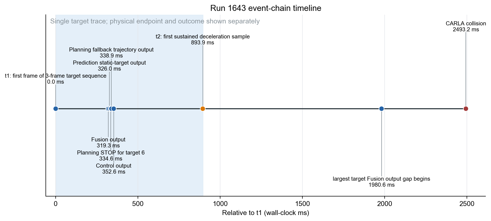
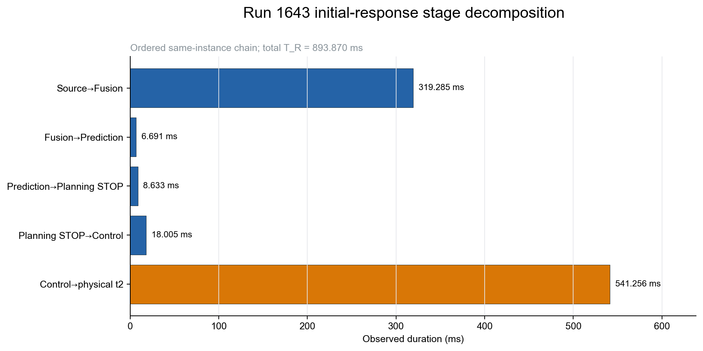
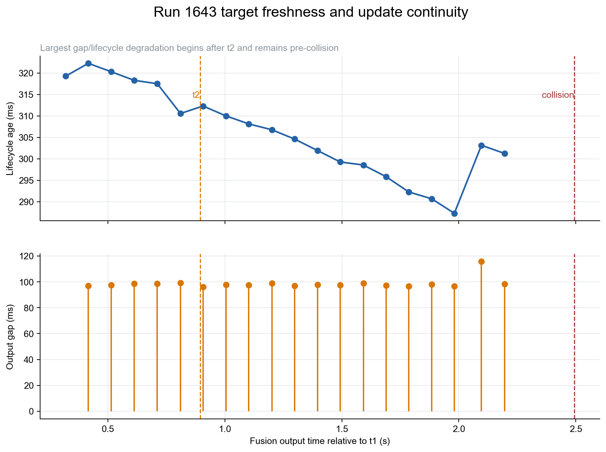
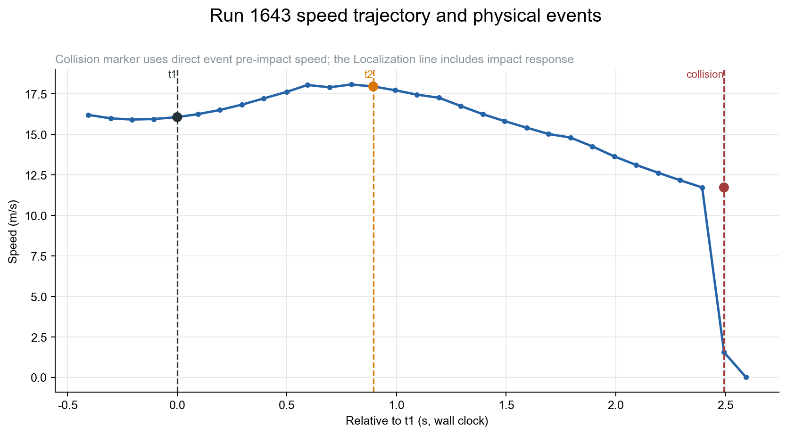

# 第二次实验 1643 run 单次实时性—物理安全双向诊断

**方法：TCPS-PA v3.1 单-run、事件中心、Claim–Evidence 诊断**  
**范围：1643 的 data/observed 仅来自 `202607271643`；7组 baseline 只用于独立分表的 model/predicted deadline，不回填观测结果**

## 结论先行

1643 run 存在清楚的**事件级时间退化现象**：从首个稳定目标源帧 $t_1$ 到首个持续减速采样 $t_2$ 经过 **893.870 ms**，期间车速由 **16.070 m/s** 升至 **17.964 m/s**，按墙钟速度梯形积分前进 **15.451 m**。时间消耗集中在两处：

- source→Fusion 为 **319.285 ms**，占 $T_R$ 的 **35.7%**；
- Control 输出→物理 $t_2$ 为 **541.256 ms**，占 **60.6%**，是最大单段。

本 run 确认 Bridge 的 300 ms 固定延时在 $t_1$ 前约 **22.237 s** 已触发；实现语义是触发后持续延时后续 ControlCommand，但本 run 因 `log_all_delayed_commands=false` 没有事件对应命令的逐条 Bridge apply 记录。因此可将 Bridge 延时定位为**主要事件相关候选因素**，但不能从单 run 证明它导致碰撞。

Planning 对同一目标 6 产生 STOP，但速度优化失败并进入常减速 fallback（首个事件输出 `status_ok=1`、98 轨迹点、`max_abs_decel=4 m/s²`）；加上 Control 载荷和事件级 Bridge apply 证据缺失，`P_FUNC=PARTIAL`。所以不得把此案表述为“功能正确但仅时间错误”。

物理后果是直接观测的：在 $t_1+2.493$ s 与 actor 155 碰撞，冲击速度 **11.728 m/s**，冲量模 **24070.4**。$t_2$到碰撞的墙钟速度积分是 **23.378 m**，但它是碰撞右截尾距离，不是完整制动距离。

最重要的证据边界是：**7组 baseline 能构造模型 deadline，但它没有资格成为主物理 deadline**。因此 `P_DEADLINE=MODEL_SUPPORTED_ONLY`、`C4_OBS=NOT_TESTABLE`、`G1_GUARANTEE=NOT_ESTABLISHED`；可报告模型包络耗尽时刻和模型距离债务，但主 `D_debt` 仍不可用。

## Six-Layer Inference Status Matrix

| 层/主张 | 判定 | 本 run 证据上限 |
|---|---|---|
| L1 / C1 | PASS | 300 ms Bridge 时间干预实际进入系统；不等于 Apollo 内生缺陷 |
| L2 / C2 | PASS | Bridge 局部延时显化；A/G 无独立要求，仅作诊断量 |
| L3 / C3 | PARTIAL_PASS | source→Control 为 Grade A，Control→物理 $t_2$ 为 Grade C |
| L4 / C4 | NOT_TESTABLE | 模型支持miss，但主C4因无合格 $\tau_{req}$ 仍不可检验 |
| L5 / C5 | NOT_TESTABLE | 模型债务单列为MODEL_SUPPORTED_ONLY；主$D_{debt}$不可用 |
| L6 / C6 | PASS | 碰撞、对方 actor、冲击速度和冲量直接观测 |
| Attribution / C7 | UNCERTAIN | 只能报告系统级关联和候选机制，不能定量因果份额 |

v3.1 独立状态：`P_CLOCK=PASS`、`P_TARGET=PASS`、`P_FUNC=PARTIAL`、`P_PHASE=NOT_TESTABLE`、`P_DEADLINE=MODEL_SUPPORTED_ONLY`、`G1_GUARANTEE=NOT_ESTABLISHED`、`E1_EMPIRICAL=DESCRIPTIVE_ONLY`。

## 事件和端点定义

| 端点 | 墙钟时间（Asia/Shanghai） | 相对 $t_1$ | 定义 |
|---|---|---:|---|
| fault onset | 2026-07-27T16:43:46.617723+08:00 | -22236.785 ms | SCB 首条有效制动命令 receive/trigger |
| $t_1$ | 2026-07-27T16:44:08.854508+08:00 | 0 ms | 目标 6 三帧稳定序列首帧的 source timestamp |
| Fusion | 2026-07-27T16:44:09.173793+08:00 | 319.285 ms | 同 trace 的稳定 Fusion 输出 |
| Prediction | 2026-07-27T16:44:09.180484+08:00 | 325.976 ms | 同 trace 静态目标预测 |
| Planning STOP | 2026-07-27T16:44:09.189117+08:00 | 334.609 ms | target 6 STOP |
| Control | 2026-07-27T16:44:09.207122+08:00 | 352.614 ms | 同 trace `cmd_write_enter/output_pub` |
| $t_2$ | 2026-07-27T16:44:09.748378+08:00 | 893.870 ms | 首个持续减速采样：连续 2 区间 $a\le-0.5$ m/s² 且 0.3 s 内掉速≥0.3 m/s |
| collision | 2026-07-27T16:44:11.347757+08:00 | 2493.249 ms | CARLA collision event，不使用 history 首帧替代 |

$t_2$ 受约 100 ms Localization 采样粒度，保守采样夹取为 **[793.594, 893.870] ms**；对 raw $v(t)$ 使用 0.3/0.5/1.0 m/s² 门限都得到同一 $t_2$，median-3 平滑则延至 993.107 ms，见 `t2_sensitivity.csv`。



## R/A/G 与时间消耗位置

| 维度 | 观测值 | 事件范围 | 判定 |
|---|---:|---|---|
| Reaction $R$ | 893.870 ms | $t_1\to t_2$ | 可观测；模型支持miss，但无qualified deadline |
| Age $A$ | 394.220 ms | $t_2$ 时最新已 Fusion 目标源数据 | 可观测；无 freshness requirement |
| Gap $G$ | 99.263 ms | $[t_1,t_2]$ 内 5 个目标输出 | 可观测；无 gap requirement |
| 后续 $G_{max}$ | 115.906 ms | $t_2$ 后、碰撞前 | 不能解释首次 $t_2$；可影响持续闭环的候选 |
| 碰撞时目标源数据年龄 | 599.668 ms | 最后已 Fusion 目标源帧到碰撞 | 后续新鲜度退化的直接诊断量 |

同一 trace 的 source→Fusion 细分中，sensor→Preprocess 入口年龄 **109.791 ms**、Ground 输出→Detection 进入等待 **93.373 ms**、Lidar Detection 处理 **96.037 ms**；三者是 Perception 时间的主要组成。细分和与 trace E2E 差 **0.002432 ms**。



Control→$t_2$ 的 541.256 ms 是最大分段。以已记录的 300.100 ms 注入精度做**非因果算术分解**，剩余 **241.156 ms**；它混合事件命令未记录的排队/释放、CARLA tick、车辆动力学、Localization 采样及持续减速确认窗，不得命名为 Apollo 计算延时。

## 双向定位：哪里、什么性质、为什么

1. **Bridge/SCB（L1）**：直接证据确认的 300.100 ms 外部注入型固定时延；它表明 SUT 在注入干领下的行为，不是 Apollo 内生实时缺陷证明。
2. **Perception 源数据年龄（L2/L3）**：首帧 source→Fusion 为 319.285 ms，主要由 109.791 ms 入口年龄、93.373 ms Detection 前等待和 96.037 ms Detection 处理组成。这是精确段级定位，但缺局部要求/基准，不升格为 violation。
3. **Planning 功能退化（P_FUNC）**：STOP 后在 $t_1+337.026$ ms 出现 speed fallback，后续常减速 fallback 共 21 次。它在首次因果窗内，是事件相关功能候选，但不是引起 541 ms 的处理时间瓶颈。
4. **Control→物理效应（L3）**：541.256 ms 是对初始响应最有关联的位置，但精确命令载荷/apply 不在归档中，全链只能 Grade C。
5. **$t_2$ 后持续闭环（L2/L3）**：最大目标输出间隔仅 115.906 ms、lifecycle 最大 322.269 ms，没有出现1131的507 ms级空档；这不支持把1643碰撞归因于同类持续新鲜度崩塌。



## 时间保证与动态契约

1643 自身在 $t_1$ 可获得的状态为 $d_0=36.651$ m、$v_1=16.070$ m/s；目标按静态障碍物处理。将7组 baseline 事后辨识参数作为**不合格模型**输入，可复算得到：

| 参数情景 | $d_{safe}$ | $\tau_{model}$ | 相对 $T_R$ | $D_{debt,model}$ |
|---|---:|---:|---:|---:|
| baseline中心参数 | 0 m | 545.400 ms | 失约 348.470 ms | 6.270 m |
| baseline保守候选 | 0 m | **149.957 ms** | 模型失约 **743.913 ms** | **13.018 m** |
| baseline中心参数 | 6 m | 260.001 ms | 失约 633.869 ms | 11.196 m |
| baseline保守候选 | 6 m | 0 ms | $t_1$ 时已在模型包络外 | 15.451 m |

若按baseline报告建议把几何净距取保守侧 $d_0-0.52$ m，则保守候选的0 m模型deadline进一步降为 **131.056 ms**，模型债务增为 **13.327 m**。这只是几何敏感性，不是新的主结果。

但这不能升级为 primary deadline：参数是事后小样本校准，只有2/7满足严格停车判据，缺少摩擦、坡度、载荷和执行器退化的ODD边界，也没有独立验证集。更重要的是，1643 响应窗的事后观测正向加速度峰值为 **4.506 m/s²**，超过 baseline 候选 **2.668 m/s²**，直接反证其为有效上包络；碰撞右截尾又使 `b_e` 无法在1643完整验证。

因此主状态仍是 `P_DEADLINE=MODEL_SUPPORTED_ONLY`、`C4_OBS=NOT_TESTABLE`、`C5_PRIMARY=NOT_TESTABLE`。可报告的是“baseline经验模型包络在 $t_1+149.957$ ms 耗尽”，不能把它写成系统已有保证实际丧失的时刻；相应 **13.018 m** 只能叫 `D_debt_model_predicted`。

## Space budget / 空间预算、物理传播与安全损失



| 量 | data/observed | 含义与边界 |
|---|---:|---|
| $D_1$ Fusion/几何净距 | 36.651 m | Apollo Fusion 目标与校准 offset；对方 CARLA history 未覆盖 $t_1$ |
| $D_{response}$ | **15.451 m** | $\int_{t_1}^{t_2}v(t)dt_{wall}$，主口径 |
| $D_{response}$ 采样下夹取 | 13.643 m | 积分到 $t_2$ 前一 Localization 样本 |
| $D_{brake,truncated}$ | 23.378 m | $t_2$→collision 墙钟速度积分；非完整制动距离 |
| 冲击速度 | **11.728 m/s** | CARLA collision event 直接观测 |
| 冲量模 | 24070.4 | CARLA collision event 直接观测 |
| 主 $D_{debt}$ | 不可用 | 无 qualified $\tau_{req}$；保守候选模型债务为 13.018 m，另表保存 |
| 完整 $D_{brake}$ / $M_0$ | 不可用 | 碰撞右截尾，不以模型值填充 |
| timing 因果物理损失 | 主结论不可定量 | baseline保守候选模型给出 13.018 m 债务，但带 `MODEL_TAINT` |

几何不确定性不得隐藏：Fusion/计划目标与 CARLA actor 155 的 20 帧匹配中，位置误差中位数 **1.602 m**、P90 **1.921 m**；净距 offset 另有 0.52 m 不确定度。碰撞事件本身作为实际接触的主证据，不由这些距离推导替代。

## 核心问题的最终回答

| 问题 | 1643 run 可支持的回答 |
|---|---|
| 哪里出了实时性问题？ | 首次响应的主要时间消耗在 source→Fusion（319.285 ms）和 Control→物理 $t_2$（541.256 ms）；300.100 ms Bridge固定延时是后者的主要候选构成。 |
| 它是什么性质？ | 已证明的是外部注入型Bridge固定时延与事件级长响应；Planning常减速fallback使其同时是功能/时间多因素事件，不是Apollo内生实时缺陷的单-run证明。 |
| 什么时候失去时间保证？ | 系统保证的真实丧失时刻仍不可判定；baseline保守候选模型的0 m包络在 $t_1+149.957$ ms 耗尽，但该模型未资格化。 |
| 为什么？ | 候选机制是持续300 ms Bridge延时、Perception入口年龄与Detection前等待、Planning fallback，以及Control→物理未分解残差。1643没有1131式507 ms输出空档，因此持续新鲜度崩塌不是首要解释。 |
| 造成多少物理安全损失？ | 直接观测为15.451 m响应距离、23.378 m碰撞截尾制动距离、11.728 m/s撞击速度和24070.4冲量模。15.451 m不能写成主deadline债务；baseline保守候选模型债务为13.018 m，只是带`MODEL_TAINT`的诊断量。 |

## 验证、方法完备性与复现

- 原始输入库存：`validation/input_inventory.json`，35 个文件、总计 84783254 bytes，保存 SHA-256；原始目录未写入。
- 标准墙钟响应距离由 `velocity_trajectory_observed.csv` 重算，只使用 Localization 速度与墙钟端点。
- data/observed 与 model/predicted 分表；baseline模型只写入 `run_level_model_predicted.csv`，没有以模型补观测缺失。
- 方法完备性：见 `tables/method_completeness_matrix.csv`。
- Claim–Evidence–Defeater 帐本：见 `claim_ledger.csv`、`evidence_ledger.csv`、`defeater_ledger.csv`。
- 反向诊断候选及区分检验：见 `diagnosis_hypothesis_ledger.csv`。
- 自动验证结果：见 `validation/validation.json`和 `validation/claim_audit.md`。

复现命令：

```bash
python3 /Users/huangjinhui/Desktop/萨卡班/data/output/second_experiment_1643_tcps_pa_v3_1/scripts/analyze_1643_single_run.py
python3 /Users/huangjinhui/.codex/skills/autonomous-driving-temporal-safety-analysis/scripts/recompute_l5_metrics.py --analysis-dir /Users/huangjinhui/Desktop/萨卡班/data/output/second_experiment_1643_tcps_pa_v3_1
python3 /Users/huangjinhui/.codex/skills/autonomous-driving-temporal-safety-analysis/scripts/validate_analysis_outputs.py --analysis-dir /Users/huangjinhui/Desktop/萨卡班/data/output/second_experiment_1643_tcps_pa_v3_1
```
