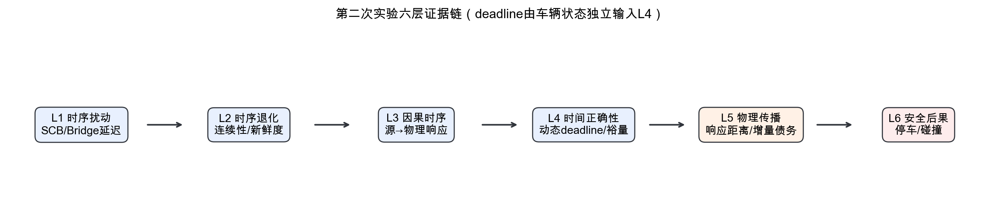
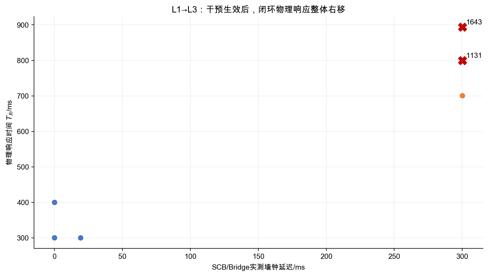
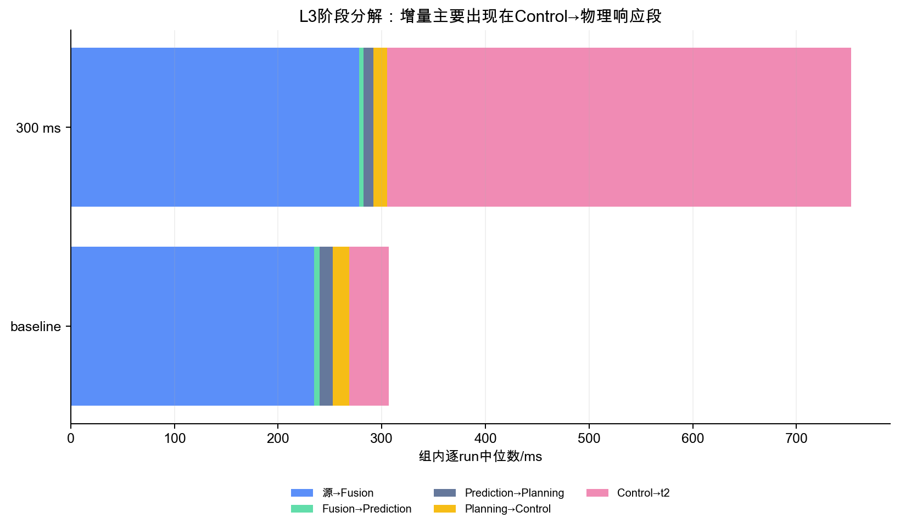
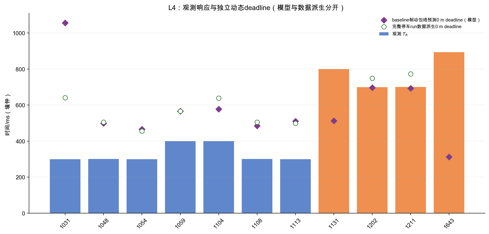
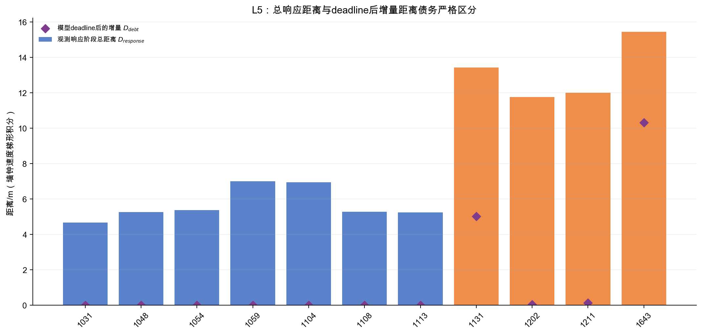
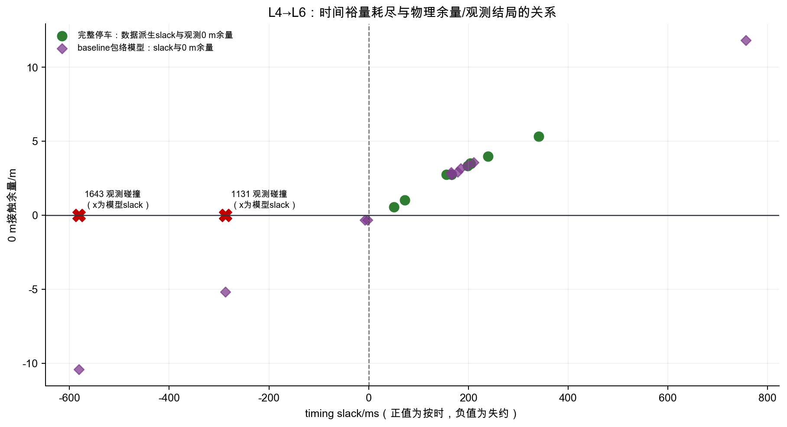

# 第二次实验：自动驾驶时间正确性—物理安全传播六层分析报告

> 生成日期：2026-08-11｜原始数据统一重算｜分析目录与原始 `第二次实验/` 分离

## Executive conclusion（执行结论）

名义 300 ms 的 Bridge/SCB 时序干预被独立日志证实：主分析 300 ms 组实测墙钟延迟中位数为 **300.124 ms**，baseline 为 **0.070 ms**。物理响应时间 `T_R=t2-t1` 的中位数由 **300.358 ms** 增至 **749.901 ms**，增加 **449.543 ms**；墙钟速度梯形积分得到的响应阶段总距离由 **5.284 m** 增至 **12.716 m**，增加 **7.431 m**。有效制动开始时剩余净距中位数减少 **7.143 m**。

11 个可信结局 run 中，baseline 为 0/7 碰撞，300 ms 组为 2/4 碰撞。完整停车 run 的“基于同 run 实测完整制动距离”的 0 m 接触 deadline 均未失约（0/9），但 300 ms 两个可靠停车 run 的接触裕量只剩 0.548 m 和 1.018 m；两个碰撞 run 因轨迹在碰撞处截断，不能伪造完整观测制动距离或数据派生 deadline。独立于实测 `T_R` 的 baseline 制动包络模型预测 `1131`、`1643` 分别失约 **287.366 ms**、**581.076 ms**，deadline 后增量距离债务分别为 **5.018 m**、**10.309 m**。模型结果仅用于物理可行性对照，不回填 observed 表。

本数据最强支持的结论是：**受控命令时序故障在闭环物理响应端被放大，增加响应阶段行驶距离并压缩制动空间，是两起碰撞的重要贡献因素。** `1131` 还伴随 507.439 ms Fusion 输出空档和 705.892 ms 生命周期峰值，可称“实时性主导候选”；`1643` 没有同类长空档，且起始净距更小，必须归为多因素碰撞。小样本、初始净距和制动能力差异阻止“300 ms 是唯一原因”或“700 ms 是普适硬阈值”的表述。

## Scope, architecture, and experiment groups

- 系统：CARLA 0.9.15（服务器）—Apollo 10.0.0（Orin）—Bridge（服务器），经网线闭环。
- 当前 Bridge 直接读取 Control 命令；Apollo 未向 Bridge 发送 Guardian 命令，所以 Guardian 不在主执行链中。
- 样本：baseline 7 个 run，名义 300 ms 组 5 个 run，共 12 个；`202607271206` 因结局证据冲突只保留时序/距离诊断，不进入主结局统计。
- 原始证据：Localization、Perception/Fusion、Prediction、Planning、Control Trace、SCB、CollisionSensor 与 actor history。
- 第二次实验 12 个 run 均无同 run 的 `record/` 解析导出。报告没有把 7 月 9 日其他实验的 record 强行关联进来；record 诊断列明确标为不可用。

## Data inventory, clocks, endpoints, and quality limits

主时钟为 Apollo/Localization wall epoch。`t1` 是连续 3 帧稳定 Fusion 目标序列第一帧的源时间；`t2` 是首次满足持续减速度规则的区间终点；物理 `T_R=(t2-t1)`，不能用 sensor→Control 消息时延替代。主响应距离为：

`D_response = ∫[t1,t2] v(t) dt_wall`

本报告沿用工作区字段 `D_delay_wall_integral_data_observed_m`，但在文字中称“响应阶段总距离”，不把它误称为 deadline 后的增量距离债务。真正的 `D_debt` 定义为 `∫[t_deadline,t2] v(t)dt_wall` 且只在 deadline 被超过时为正。

两个碰撞 run 的 CollisionSensor 和 actor history 可直接证实碰撞；多数停车 run 无 actor history，因此结局置信度为中高，而不是与碰撞 run 相同的完整 CARLA 真值。`1206` 无碰撞事件/actor history，但固定几何推算停车端点发生明显重叠，因此标记 `COLLISION_GEOMETRY_CONFLICT`。完整质量审计见 [data_quality_audit.md](../validation/data_quality_audit.md)。

## L1 Temporal disturbance（时序扰动）

所有 run 均存在 SCB 延迟日志和完整 lifecycle。300 ms 主分析组实测延迟中位数 **300.124 ms**；baseline 中位数 **0.070 ms**，其中 `1031` 首次有效命令为 19.282 ms，其余约 0.067–0.091 ms。干预因此由直接证据确认，而不是从目录名推断。

## L2 Temporal degradation（时序退化）

本层分开检查响应时间尾部、数据新鲜度和更新连续性。`1131` 的目标 Fusion 最大输出间隔 **507.439 ms**、生命周期峰值 **705.892 ms**，显著偏离其同设置安全对照；`1643` 的对应值为 **115.906 ms** 和 **322.269 ms**，未复现 `1131` 的长空档。由此可把 `1131` 定性为连续性/新鲜度退化，而不能把两起碰撞都归为单帧感知计算超时。

record 级 Planning age/reuse、消息 sensor→Control reaction/data age 在本批 run 不可用。现有 Fusion header/source 与 Trace 证据仍支持本层分析，但不能声称已观测 record 内部未归档的通道行为。

## L3 Cause-effect timing（因果时序）

物理 `T_R` 中位数由 **300.358 ms** 增至 **749.901 ms**。sensor→Control 中位数只由 **265.401 ms** 增至 **303.100 ms**，而 Control→`t2` 由 **38.224 ms** 增至 **447.421 ms**，说明增量主要落在干预位置之后的命令等待、车辆执行、动力学和持续减速识别区段。该区段不能全部贴成 Bridge 内部处理时延。

## L4 Temporal correctness and dynamic deadline（时间正确性）

报告同时保存两类 deadline，且都在与 `T_R` 比较前由物理状态导出：

1. `tau_dynamic_data_derived`：仅对完整停车 run，用 `tau=(D1-D_brake_observed)/v1` 计算 0 m 接触 deadline；碰撞 run 不具备完整观测制动距离，保持 NA。
2. `tau_dynamic_model_predicted`：以 baseline 完整停车 run 的等效减速度中位数 **5.102 m/s²** 构造 `D_brake=v2²/(2a)`，再计算 deadline。该模型可覆盖碰撞 run，但属于 predicted/model。

可信完整停车 run 的数据派生 0 m deadline 失约数为 **0/9**；若要求停车后仍保留 6 m，则为 **9/9** 全部失约，说明 6 m 是比“避免接触”更严格的工程要求，baseline 也未满足。模型在 11 个主分析 run 中判为 0 m deadline miss 的有 **4** 个；其中 `1202`、`1211` 仅在模型中略微负裕量而实际停车，暴露模型约数十厘米的边界误差，不能把模型判定冒充观测碰撞。

## L5 Temporal-to-physical propagation（时序到物理传播）

300 ms 组 `D_response` 中位数较 baseline 增加 **7.431 m**，`D2` 中位数减少 **7.143 m**。这是“时间变慢→制动开始位置后移”的直接空间证据。数据派生的 0 m deadline 在完整停车主分析 run 中未被超过，所以相应 `D_debt_data_derived=0`；碰撞 run 的该值不可用。baseline 包络模型则给出碰撞 run 的 post-deadline 增量距离债务：`1131` **5.018 m**、`1643` **10.309 m**。

## L6 Observed physical safety outcomes（观测物理安全后果）

baseline 7/7 完整停车、0/7 碰撞；300 ms 主分析组 2/4 碰撞。可靠非碰撞 delay run `1202` 和 `1211` 的观测 0 m 余量分别为 0.548 m、1.018 m。`1131` 撞击前速度 **7.988 m/s**，`1643` 为 **11.728 m/s**。碰撞 run 的完整 `D_brake`、完整停车余量和数据派生 deadline 均保持 NA，只报告碰撞前截断制动距离和撞击速度。

## Cross-run comparison and causal audit

干预真实性、物理响应变化、墙钟响应距离增加、剩余制动空间减少和观测结局变化五个环节均有证据。竞争解释仍包括 D1 波动、速度波动、Fusion 新鲜度/连续性、当次制动能力与停止端点差异。`1131` 的实时性链最完整，可称“主要支持贡献因素”；`1643` 的更小 D1 与较高撞击速度要求多因素表述。`1206` 的 `T_R=800.753 ms`、`D_response=13.741 m` 可复算，但结局冲突使其不能当作安全对照。

样本不是随机配对设计，不能从 0/7 与 2/4 推出总体碰撞概率，也不能把 700 ms 当普适硬阈值。当前只支持在本次速度、净距和制动条件下存在安全裕量陡峭收缩区。

## Model/predicted comparison（与 observed 分离）

下表仅列模型输出。`D_debt` 是模型 deadline 后到 `t2` 的墙钟速度积分；M0 是模型制动距离下的 0 m接触余量。

| run | tau_model/ms | slack_model/ms | D_debt_model/m | M0_model/m | collision_model | impact_model/(m/s) |
|---|---:|---:|---:|---:|---:|---:|
| 202607271131 | 512.270 | -287.366 | 5.018 | -5.195 | True | 7.281 |
| 202607271202 | 696.802 | -2.353 | 0.040 | -0.318 | True | 1.801 |
| 202607271211 | 692.902 | -7.265 | 0.124 | -0.331 | True | 1.837 |
| 202607271643 | 312.794 | -581.076 | 10.309 | -10.424 | True | 10.314 |

模型对 `1131` 的撞击速度预测为 7.281 m/s，对比观测 7.988 m/s；对 `1643` 预测 10.314 m/s，对比观测 11.728 m/s。误差方向均为低估严重度，且 baseline 校准为描述性、样本内模型，不能替代碰撞 run 的直接结局证据。完整误差字段见 [run_level_model_predicted.csv](../tables/run_level_model_predicted.csv)。

## Limitations and next experiment recommendations

- 所有 run 均应同时归档 `record/`、CollisionSensor、actor history、Control payload 与配置快照，避免时间层证据和物理真值不对称。
- 固定初速度与 D1，在 600–900 ms 区间增加重复，并把 Bridge 延迟和 Fusion gap/data age 分成独立实验因素。
- 预注册 0 m接触边界与 6 m工程安全边界，分别报告；不要用同一“安全”标签混合。
- 使用独立 baseline/训练批次校准制动模型，并留出验证 run，报告 stopping distance 和 impact speed 的 signed/absolute/relative error。
- record 接入必须按同 run 嵌套目录或经 collection window 审计后左连接，绝不按相似时间目录名强行合并。

## Per-run observed results（逐 run 观测主结果）

| run | group | 主分析 | T_R/ms | D1/m | D_response/m | D2/m | D_brake_data/m | M0_data/m | observed outcome |
|---|---|---:|---:|---:|---:|---:|---:|---:|---|
| 202607271031 | baseline | 是 | 299.655 | 39.891 | 4.673 | 35.218 | 29.880 | 5.338 | safe_stop |
| 202607271048 | baseline | 是 | 300.358 | 38.744 | 5.254 | 33.490 | 30.019 | 3.471 | safe_stop |
| 202607271054 | baseline | 是 | 299.977 | 39.632 | 5.367 | 34.264 | 31.525 | 2.740 | safe_stop |
| 202607271059 | baseline | 是 | 399.750 | 40.155 | 7.006 | 33.149 | 30.403 | 2.746 | safe_stop |
| 202607271104 | baseline | 是 | 399.646 | 38.784 | 6.936 | 31.848 | 27.880 | 3.968 | safe_stop |
| 202607271108 | baseline | 是 | 300.641 | 38.759 | 5.284 | 33.475 | 29.963 | 3.512 | safe_stop |
| 202607271113 | baseline | 是 | 299.796 | 38.817 | 5.231 | 33.586 | 30.236 | 3.351 | safe_stop |
| 202607271131 | 300 ms | 是 | 799.636 | 38.258 | 13.432 | 24.826 | NA | NA | collision |
| 202607271202 | 300 ms | 是 | 699.155 | 39.616 | 11.749 | 27.867 | 27.319 | 0.548 | safe_stop |
| 202607271206 | 300 ms | 否 | 800.753 | 39.790 | 13.741 | 26.049 | 27.685 | -1.636 | uncertain_geometry_event_conflict |
| 202607271211 | 300 ms | 是 | 700.167 | 40.202 | 11.999 | 28.203 | 27.185 | 1.018 | safe_stop |
| 202607271643 | 300 ms | 是 | 893.870 | 36.651 | 15.451 | 21.201 | NA | NA | collision |

观测主表：[run_level_observed.csv](../tables/run_level_observed.csv)；模型表：[run_level_model_predicted.csv](../tables/run_level_model_predicted.csv)；六层证据矩阵：[layer_evidence_matrix.csv](../tables/layer_evidence_matrix.csv)；验证结果：[validation.json](../validation/validation.json)。
