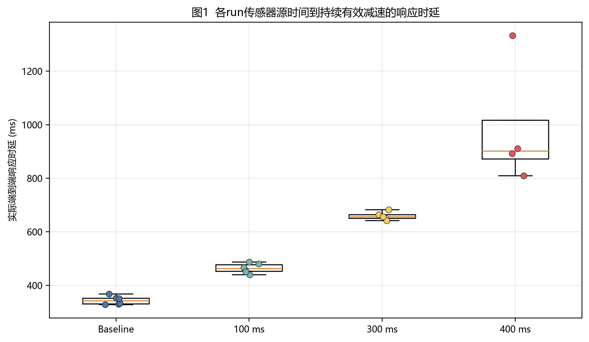
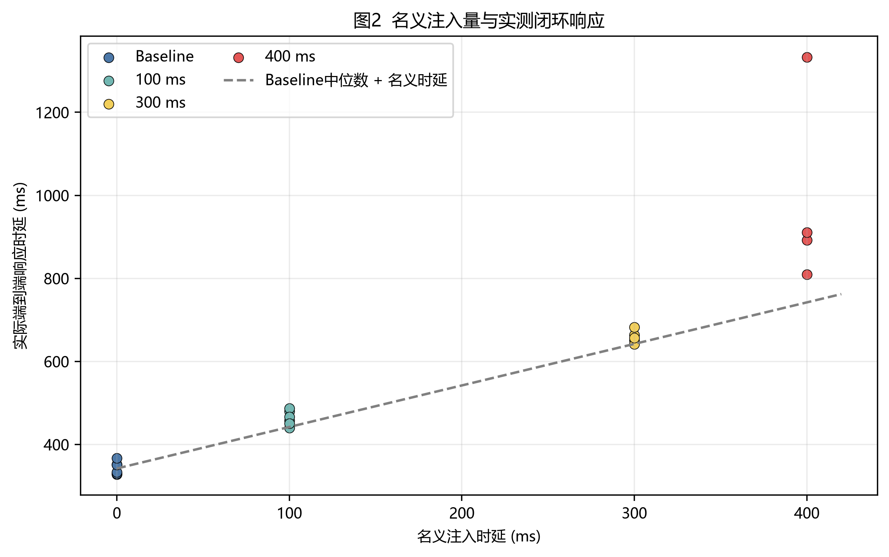
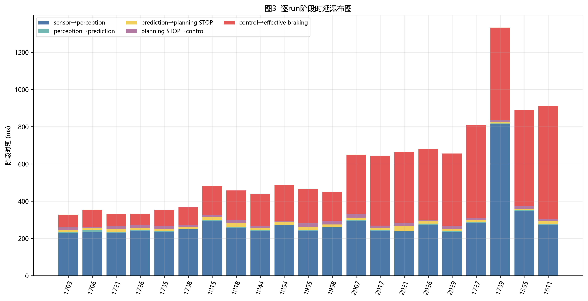
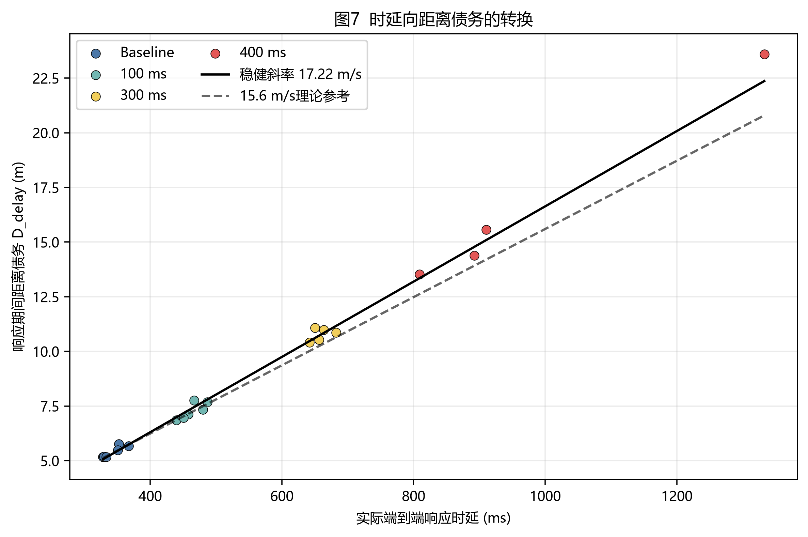
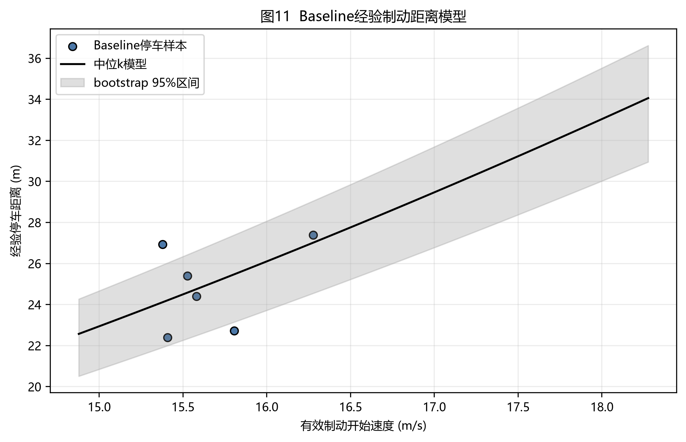
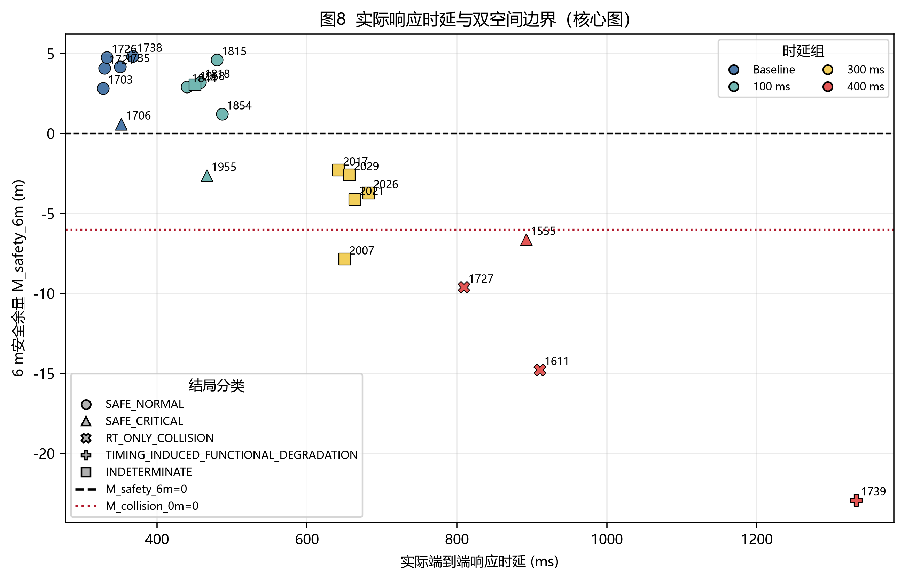
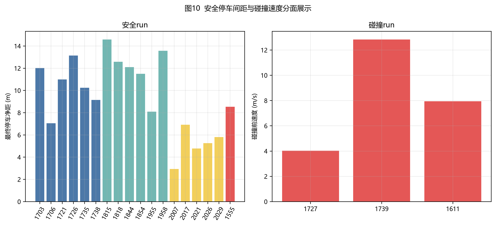
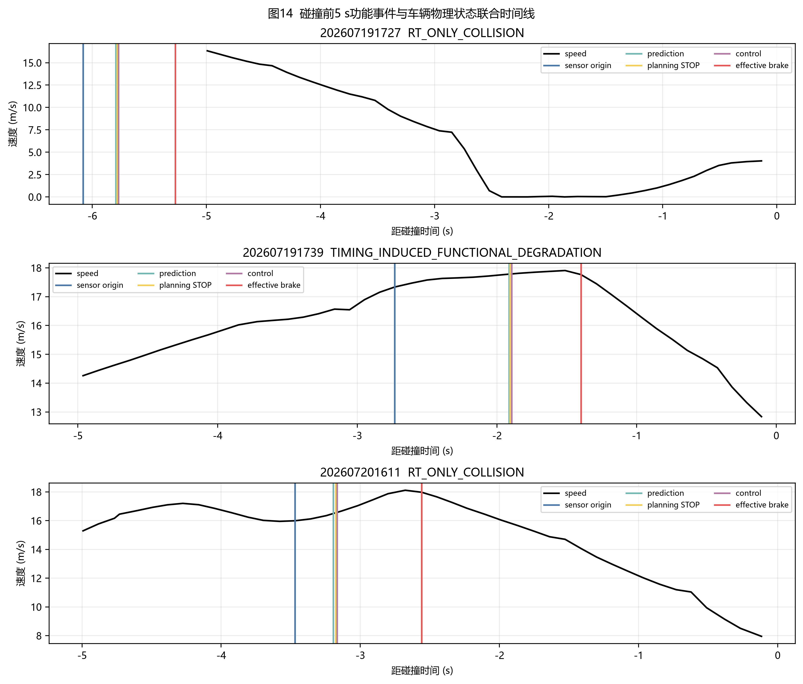
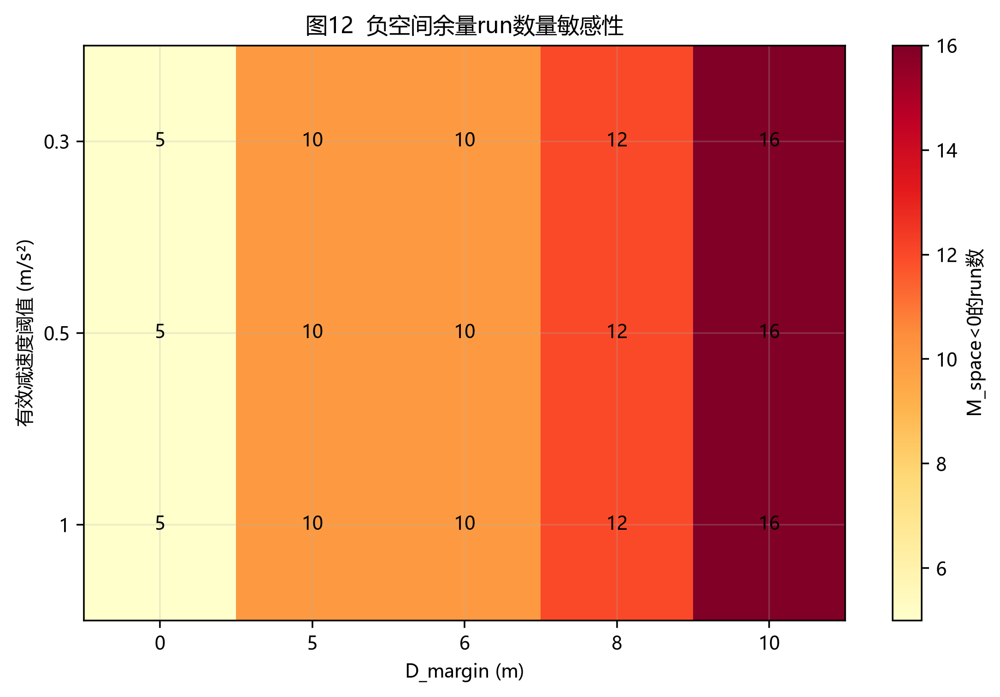

# Apollo + CARLA端到端实时性碰撞实验结果报告

## 摘要

本次分析完整识别23次实验：baseline 6次、100 ms组6次、300 ms组6次、400 ms组5次。固定条件为Town04、CARLA/Bridge同步步长0.1 s、点云配置130万、静止障碍物场景。t1实际速度范围为14.769–17.336 m/s，稳定感知纵向净距范围为38.854–41.579 m。

四组观测闭环响应中位数依次为342.145、462.113、656.455和901.492 ms。相对baseline的中位响应增量依次为119.969、314.310和559.347 ms。400 ms组记录3/5次目标碰撞，其余三组未记录碰撞。

严格因果分类得到RT_ONLY_COLLISION run：202607191727, 202607201611；TIMING_INDUCED_FUNCTIONAL_DEGRADATION run：202607191739；INDETERMINATE run：202607181958, 202607182007, 202607182012, 202607182017, 202607182021, 202607182026, 202607182029, 202607191734。最大安全观测响应为892.358 ms；最小RT-only碰撞响应为809.268 ms。全部目标碰撞中的最小响应为809.268 ms，安全与目标碰撞响应区间重叠。

主要不确定性包括：注入组SCB归档缺失run为202607181958, 202607182007, 202607182017, 202607182021, 202607182026, 202607182029；多数SCB触发早于t1；非碰撞run缺少CARLA actor history；ControlCommand具体brake payload未归档；Localization典型采样周期约110.7 ms。

## 1. 实验目的与假设

- H1：时延注入增加传感器源时间到有效物理减速的响应时延。
- H2：实际响应时延增加会增加响应期间距离债务D_delay。
- H3：D_delay增加会同时降低0 m碰撞余量与6 m安全余量。
- H4：0 m碰撞余量转为负值时，车辆进入经验制动模型无法避免接触的区域。
- H5：纯实时性碰撞run具备完整感知、预测、规划、控制和Bridge执行证据链。

## 2. 实验设计

自车约15–17 m/s行驶，在前方生成静止车辆障碍物。Apollo传感器理论感知范围约50 m，稳定感知净距集中于约40 m。四组名义附加时延为0、100、300和400 ms。Bridge直接订阅`/apollo/control`，Guardian未进入执行链。注入器使用单调墙钟队列延后CARLA `apply_control()`。

归档中的工作区settings快照与实际run参数存在版本差异。实验条件采用用户记录；Town04由3个碰撞event直接验证；0.1 s步长由实验设定及SCB frame/simulation delay交叉检查；130万点云原始计数未保存在run目录。

## 3. 数据处理与指标定义

本章的目的，是把一条run中的日志时间、车辆运动和碰撞结果整理成同一条物理链：障碍物在何时具备稳定感知条件，车辆当时距离障碍物多远，系统经过多久才产生有效减速，响应期间消耗了多少距离，剩余距离能否完成停车。

### 3.1 一条run的处理顺序

每条run按以下顺序处理：

1. 在CARLA与Apollo日志中确定同一个静止障碍物。
2. 找到障碍物连续稳定出现的源点云时刻，记为 $t_1=t_{\mathrm{sensor\_origin}}$。
3. 在 $t_1$ 读取自车速度 $v_1$，并计算车头到障碍物近端的净距 $D_1$。
4. 从Localization速度序列中检测车辆开始持续有效减速的时刻 $t_2$。
5. 用 $t_1$ 到 $t_2$ 的时间差计算端到端响应时延，用同一区间的速度积分计算响应期间行驶距离 $D_{\mathrm{delay}}$。
6. 用baseline停车样本建立经验制动模型，估计车辆从 $t_2$ 开始停车还需要的距离 $D_{\mathrm{brake,required}}$。
7. 从初始净距 $D_1$ 中依次扣除响应期间行驶距离和所需制动距离，得到0 m碰撞余量与6 m安全余量。
8. 对注入组计算“响应恢复到baseline水平”时能够节省的距离，作为反事实结果。

核心变量可按下表理解：

| 字段 | 含义 | 数据来源 |
|---|---|---|
| t1 / t_sensor_origin | 稳定感知序列第一帧的传感器源时间，也是空间计算起点 | Fusion源点云时间 |
| v1 | t1时刻自车速度 | Localization插值 |
| D1 | t1时刻车头到障碍物近端的纵向净距 | Fusion几何与车辆尺寸修正 |
| t2 / t_brake_effective | 车辆首次进入持续有效物理减速状态的时刻 | Localization速度序列 |
| v2 | t2时刻的制动起始速度 | Localization插值 |
| T_e2e | 从稳定感知源帧到有效物理减速的总响应时间 | t2 − t1 |
| D_delay | 响应完成前车辆继续行驶的距离 | t1到t2的速度积分 |
| D_brake_required | 从t2开始降至近零速度所需的经验制动距离 | baseline经验模型 |
| M_collision_0m | 不要求附加安全距离时的碰撞余量 | 空间预算计算 |
| M_safety_6m | 停车后仍要求保留6 m时的安全余量 | 空间预算计算 |

空间预算可以直观写成：

$$
\underbrace{D_1}_{\text{最初可用净距}}
=\underbrace{D_{\mathrm{delay}}}_{\text{响应期间行驶}}
+\underbrace{D_{\mathrm{brake,required}}}_{\text{开始制动后所需距离}}
+\underbrace{M_{\mathrm{collision,0m}}}_{\text{最终剩余量}}.
$$

### 3.2 为什么需要统一时钟

Apollo模块日志、Localization、CARLA仿真时间和服务器墙钟来自不同时间域。直接相减可能把时钟偏移误认为模块时延，因此主分析先把事件放到可比较的时间轴上。

- Apollo内部事件以Apollo/Localization epoch为主时间轴。感知、预测、规划、控制与Localization都在这个时间域中比较。
- 碰撞run保存了CARLA actor history，其中同时包含simulation time和wall time。分析通过

$$
\mathrm{wall\_time}=a\times\mathrm{simulation\_time}+b
$$

将CARLA碰撞时刻映射到墙钟，再与Apollo事件对齐；拟合残差保存在`clock_alignment.csv`。
- 缺少双时钟history的安全run仍可计算Apollo内部的 $t_1$、$t_2$ 和响应时延，但无法对CARLA仿真时刻执行同等级别的跨时钟复核，因此标记为`LIMITED_NO_DUAL_CLOCK_HISTORY`。

该状态表示跨系统时间证据受限，Apollo内部物理响应指标仍然保留。

### 3.3 如何确定障碍物、$t_1$ 和 $D_1$

首先要保证CARLA中发生接触的车辆、Apollo感知到的障碍物、Prediction中的静态目标以及Planning生成STOP决策的目标属于同一物理对象。

- 碰撞run优先使用CARLA CollisionSensor给出的actor ID，再将actor history轨迹变换到Apollo坐标系，与Fusion目标执行多帧位置匹配。
- 安全run没有碰撞actor记录，使用Planning STOP目标ID、Prediction静态语义和Fusion连续轨迹联合确定目标。

单帧检测可能来自瞬时误检或目标ID抖动，因此主定义要求目标连续3个Fusion周期稳定出现。$t_1$ 取这3帧中第一帧的源点云时间。这里采用源时间，可以把感知计算和排队时间完整计入后续响应；2帧和5帧定义进入敏感性分析，用于检查结论是否依赖“三帧”这一选择。

$D_1$ 表示自车前缘到障碍物近端的纵向净距，属于保险杠到保险杠的可用距离。计算形式为

$$
D_1=\Delta s_{\mathrm{center}}-5.3074\,\mathrm{m},
$$

其中 $\Delta s_{\mathrm{center}}$ 是沿自车行驶方向投影后的两车中心间距，$5.3074\,\mathrm{m}$ 是两车半车长之和形成的组合几何偏移。例如中心投影距离为45 m时，净距约为39.69 m。

归档没有保存每条run的CARLA bounding box extent，主分析统一使用该组合偏移。3次真实接触帧显示这一偏移存在约 $\pm0.52\,\mathrm{m}$ 的变化，因此报告将其作为几何不确定性，不把小于该量级的余量差异解释为精确边界。

### 3.4 如何确定 $t_2$、响应时延和两段距离

> **$t_2$（有效物理制动起点）**：车辆已经对本次障碍物响应，并在Localization速度序列中首次进入持续有效减速状态的时刻。$t_2$ 取物理速度开始持续下降的时间，不取Planning生成减速轨迹的时间，也不取Control消息发布的时间。

完整事件顺序为：`障碍物源帧t1 → Perception → Prediction → Planning STOP/减速轨迹 → Control输出 → 车辆有效物理减速t2`。因此，$t_2-t_1$ 覆盖软件计算、消息传递、Bridge等待以及车辆执行响应。

Localization存在采样噪声，单个速度差分为负不足以证明车辆已经进入持续制动。主判据要求相邻速度区间连续两次达到至少 $0.5\,\mathrm{m/s^2}$ 的减速度，并在随后 $0.3\,\mathrm{s}$ 内累计降速至少 $0.3\,\mathrm{m/s}$。相邻区间加速度定义为

$$
a_i=\frac{v_{i+1}-v_i}{t_{i+1}-t_i},
$$

因此连续两次有效减速要求 $a_i\leq-0.5\,\mathrm{m/s^2}$。后续区间和0.3 s累计降速用于确认这次下降具有持续性；确认通过后，$t_2$ 仍记录为第一段合格减速区间结束处的Localization样本时间，不额外加上0.3 s确认窗口。若目标Control输出前已经存在持续且显著的减速过程，该run标记为`ATTRIBUTION_INVALID`，避免把先前制动错误归因到本次障碍物响应。

这里的 $0.5\,\mathrm{m/s^2}$ 只用于检测“减速何时真正开始”，不代表Planning设定的目标减速度，也不代表fallback减速度。主结果采用原始速度序列；三点中值平滑以及 $a_{\mathrm{th}}\in\left\lbrace0.3,0.5,1.0\right\rbrace\,\mathrm{m/s^2}$ 的组合进入敏感性分析。

至此两个端点已经明确：$t_1$ 是稳定感知序列第一帧的传感器源时间，$t_2$ 是车辆持续有效物理减速的起点。实际端到端响应时延定义为

$$
T_{\mathrm{e2e}}=t_2-t_1,\qquad
L_{\mathrm{e2e}}=1000T_{\mathrm{e2e}}\;\mathrm{ms}.
$$

该时延包含从源点云产生到车辆物理减速之间的感知、预测、规划、控制和执行环节。它是实测闭环响应，不等同于Bridge配置的名义100/300/400 ms等待值。

响应期间距离债务采用速度—时间梯形积分：

$$
D_{\mathrm{delay}}\approx
\sum_i\frac{v_i+v_{i+1}}{2}\left(t_{i+1}-t_i\right),
\qquad t_i\in\left[t_1,t_2\right].
$$

$D_{\mathrm{delay}}$ 是车辆开始有效制动前已经消耗的距离，baseline也包含系统固有响应时间，因此baseline的该值不会为0。$D_{\mathrm{brake,required}}$ 是从 $t_2$ 开始到近零速度仍需要的距离。两者分别对应制动前和制动后两个连续阶段，不重复计数。

停车相关端点分开记录：

| 端点 | 判据 | 用途 |
|---|---|---|
| 近停时刻 t_near_stop | 首个速度低于0.1 m/s的样本 | 判断车辆是否曾达到近零速度 |
| 严格停车时刻 t_stop | 速度低于0.1 m/s并持续至少0.5 s | 提供严格停车保持证据 |
| 经验制动完成端点 | t2之后的最低速度样本，并且该run确实达到低于0.1 m/s | 计算baseline经验制动位移 |

Baseline按权威handoff口径计算从 $t_2$ 到经验制动完成端点的三维位置位移。以 $v_2=v(t_2)$ 为输入，建立

$$
D_{\mathrm{brake,required}}(v_2)=k_{\mathrm{median}}v_2^2.
$$

$k_{\mathrm{median}}$ 来自6条baseline近停样本的中位模型。碰撞run不参与模型拟合，只使用该模型估计其在当前制动起始速度下所需的停车距离。速度积分路径长单独保留为诊断字段。

### 3.5 如何读取0 m余量、6 m余量和反事实结果

无附加安全距离的碰撞余量定义为

$$
M_{\mathrm{collision,0m}}
=D_1-D_{\mathrm{delay}}-D_{\mathrm{brake,required}}.
$$

保留6 m安全距离的余量定义为

$$
M_{\mathrm{safety,6m}}
=D_1-D_{\mathrm{delay}}-D_{\mathrm{brake,required}}-6\,\mathrm{m}.
$$

两者满足

$$
M_{\mathrm{collision,0m}}=M_{\mathrm{safety,6m}}+6\,\mathrm{m}.
$$

符号含义如下：

| 结果 | 物理含义 |
|---|---|
| M_safety_6m > 0 | 经验模型预测能够停车，并保留超过6 m距离 |
| M_collision_0m > 0，同时M_safety_6m < 0 | 经验模型预测可以避免接触，但停车后不足6 m |
| M_collision_0m = 0 | 经验模型的接触临界位置 |
| M_collision_0m < 0 | 可用距离不足以覆盖响应距离与经验制动距离，负值绝对值表示空间缺口 |

安全距离参数 $D_{\mathrm{margin}}\in\left\lbrace0,5,6,8,10\right\rbrace\,\mathrm{m}$ 全部进入敏感性计算。0 m用于描述接触边界，6 m用于主安全裕度，其余数值用于检查结论对安全距离设定的敏感程度。

反事实分析回答的问题是：如果该run的闭环响应时间恢复到baseline中位水平，在其他量保持当前经验模型口径时，可以少消耗多少响应距离？令

$$
\Delta T=T_{\mathrm{e2e,observed}}-T_{\mathrm{e2e,baseline\ median}},
$$

程序直接积分观测速度历史中有效制动前最后 $\Delta T$ 的行驶距离：

$$
D_{\mathrm{saved}}=\int_{t_2-\Delta T}^{t_2}v(t)\,\mathrm{d}t,
\qquad
M^{\mathrm{cf}}=M^{\mathrm{observed}}+D_{\mathrm{saved}}.
$$

该计算使用逐run实际速度历史，不采用固定15.6 m/s近似。它用于量化额外响应时间对应的空间损失，不单独承担碰撞归因。RT_ONLY_COLLISION由注入证据、功能链完整性、碰撞结果和baseline安全结果联合判定；Planning进入设计内fallback仍按正常功能响应记录。

### 3.6 用一条碰撞run说明整套计算

以`202607191727`为例：$D_1=39.434\,\mathrm{m}$，响应期间行驶距离 $D_{\mathrm{delay}}=13.520\,\mathrm{m}$，经验所需制动距离约为 $29.540\,\mathrm{m}$。因此

$$
M_{\mathrm{collision,0m}}
=39.434-13.520-29.540
=-3.626\,\mathrm{m},
$$

表示观测条件下存在约3.626 m空间缺口。再扣除6 m安全距离后：

$$
M_{\mathrm{safety,6m}}=-3.626-6=-9.626\,\mathrm{m}.
$$

该run相对baseline响应可节省距离为 $D_{\mathrm{saved}}=7.959\,\mathrm{m}$，所以反事实结果为

$$
M_{\mathrm{collision,0m}}^{\mathrm{cf}}
=-3.626+7.959
=4.332\,\mathrm{m},
$$

$$
M_{\mathrm{safety,6m}}^{\mathrm{cf}}
=-9.626+7.959
=-1.668\,\mathrm{m}.
$$

这组数值表示：响应恢复到baseline水平后，经验模型预测可以避免接触并剩余约4.332 m；距离完整6 m安全目标仍少约1.668 m。该run同时具备注入执行证据、五模块PASS、目标碰撞与baseline全安全结果，因此分类为RT_ONLY_COLLISION。

## 4. 数据质量与场景一致性

23次run数量与实验设计一致。输入文件清单、SHA-256、schema和完整性状态分别保存在`data_inventory.csv`、`input_file_hashes.csv`、`schema_inventory.json`与`run_manifest.csv`。注入组有6次缺少SCB文件，这些run保留物理响应结果，并在名义注入因果判断中标记不确定。

| run | 组 | 文件数 | SCB | 碰撞 | 完整性 |
|---|---|---|---|---|---|
| 202607171703 | baseline | 32 | 是 | 否 | COMPLETE |
| 202607171706 | baseline | 32 | 是 | 否 | COMPLETE |
| 202607171721 | baseline | 32 | 是 | 否 | COMPLETE |
| 202607171726 | baseline | 32 | 是 | 否 | COMPLETE |
| 202607171735 | baseline | 32 | 是 | 否 | COMPLETE |
| 202607171738 | baseline | 32 | 是 | 否 | COMPLETE |
| 202607181815 | delay_100ms | 32 | 是 | 否 | COMPLETE |
| 202607181818 | delay_100ms | 32 | 是 | 否 | COMPLETE |
| 202607181844 | delay_100ms | 32 | 是 | 否 | COMPLETE |
| 202607181854 | delay_100ms | 32 | 是 | 否 | COMPLETE |
| 202607181955 | delay_100ms | 32 | 是 | 否 | COMPLETE |
| 202607181958 | delay_100ms | 31 | 否 | 否 | PARTIAL_INJECTION_UNVERIFIED |
| 202607182007 | delay_300ms | 31 | 否 | 否 | PARTIAL_INJECTION_UNVERIFIED |
| 202607182012 | delay_300ms | 32 | 是 | 否 | COMPLETE |
| 202607182017 | delay_300ms | 31 | 否 | 否 | PARTIAL_INJECTION_UNVERIFIED |
| 202607182021 | delay_300ms | 31 | 否 | 否 | PARTIAL_INJECTION_UNVERIFIED |
| 202607182026 | delay_300ms | 31 | 否 | 否 | PARTIAL_INJECTION_UNVERIFIED |
| 202607182029 | delay_300ms | 31 | 否 | 否 | PARTIAL_INJECTION_UNVERIFIED |
| 202607191727 | delay_400ms | 35 | 是 | 是 | COMPLETE |
| 202607191734 | delay_400ms | 32 | 是 | 否 | COMPLETE |
| 202607191739 | delay_400ms | 35 | 是 | 是 | COMPLETE |
| 202607201555 | delay_400ms | 32 | 是 | 否 | COMPLETE |
| 202607201611 | delay_400ms | 35 | 是 | 是 | COMPLETE |

## 5. 时延注入是否生效

| 组 | 总n | 有效响应n | 实际响应中位数/ms | 相对baseline增量/ms | D_delay中位数/m | M_safety_6m中位数/m | 碰撞次数 |
|---|---|---|---|---|---|---|---|
| Baseline | 6 | 6 | 342.145 | 0.000 | 5.333 | 4.125 | 0 |
| 100 ms | 6 | 6 | 462.113 | 119.969 | 7.228 | 2.976 | 0 |
| 300 ms | 6 | 5 | 656.455 | 314.310 | 10.860 | -3.728 | 0 |
| 400 ms | 5 | 4 | 901.492 | 559.347 | 14.974 | -12.204 | 3 |

| 组 | 有SCB实测n | 墙钟实际等待中位数/ms | 最小/ms | 最大/ms |
|---|---|---|---|---|
| Baseline | 6 | 7.234 | 0.141 | 12.384 |
| 100 ms | 5 | 105.508 | 100.078 | 109.280 |
| 300 ms | 1 | 309.970 | 309.970 | 309.970 |
| 400 ms | 5 | 402.912 | 401.336 | 420.415 |

SCB文件存在的run直接证明请求等待值、墙钟实际等待值、CARLA帧差和仿真时间差。缺少SCB的run仅保留组目录给出的名义值。Bridge触发后持续延迟全部后续ControlCommand；提前触发会改变弯道与接近阶段控制，组间单变量解释需要附带该限制。

图1字段说明：纵轴为每个run实测`t_sensor_origin→t_brake_effective`；散点保留全部有效run；箱体显示组内中位数和四分位范围。

图2字段说明：横轴为配置组别，纵轴为实测闭环响应；虚线表示baseline中位数加名义注入量。

图3字段说明：每根堆叠柱对应一个有效run；颜色依次表示sensor→perception、perception→prediction、prediction→planning STOP、planning STOP→control和control→物理减速。负阶段值按0显示，原始值保留在表4。

## 6. 时延对制动位置和距离债务的影响

D_delay对实际响应秒数的稳健回归斜率为17.222 m/s，95%斜率区间为16.331–18.181 m/s；实验速度的局部理论参考约15.6 m/s。线性回归R²为0.995。时延通过响应期间持续行驶转化为空间债务。

图7字段说明：D_delay来自Localization速度梯形积分；黑实线为Theil–Sen稳健拟合；虚线为15.6 m/s理论参考。

| 指标 | Kruskal–Wallis H | p值 |
|---|---|---|
| 实际响应 | 18.701299 | 0.000315 |
| D_delay | 18.701299 | 0.000315 |
| M_space | 15.353680 | 0.001538 |

| 指标 | 比较 | Holm校正p | Cliff’s δ（注入组−baseline） |
|---|---|---|---|
| 实际响应 | 100 ms vs Baseline | 0.006494 | 1.000000 |
| 实际响应 | 300 ms vs Baseline | 0.008658 | 1.000000 |
| 实际响应 | 400 ms vs Baseline | 0.009524 | 1.000000 |
| D_delay | 100 ms vs Baseline | 0.006494 | 1.000000 |
| D_delay | 300 ms vs Baseline | 0.008658 | 1.000000 |
| D_delay | 400 ms vs Baseline | 0.009524 | 1.000000 |
| M_space | 100 ms vs Baseline | 0.309524 | -0.388889 |
| M_space | 300 ms vs Baseline | 0.012987 | -1.000000 |
| M_space | 400 ms vs Baseline | 0.019048 | -1.000000 |

统计字段说明：H检验比较四组分布；Holm校正控制同一指标的三次两两比较；Cliff's δ为1表示注入组所有观测值均高于baseline，-1表示均低于baseline。样本量较小，p值和效应量用于探索性描述。

## 7. 经验制动能力和隐形deadline

### 7.1 这一章解决什么问题

第三章把接近障碍物的空间分成两个连续阶段：$t_1$ 到 $t_2$ 是系统尚未产生有效物理减速的响应阶段，$t_2$ 之后是车辆实际降低速度的制动阶段。第六章计算了响应阶段消耗的 $D_{\mathrm{delay}}$；本章估计从 $t_2$ 开始降到近零速度仍需要的 $D_{\mathrm{brake,required}}$。

两段距离共同进入0 m碰撞余量：

$$
D_1
=D_{\mathrm{delay}}
+D_{\mathrm{brake,required}}
+M_{\mathrm{collision,0m}}.
$$

只有先估计所需制动距离，才能知道初始空间中最多允许多少距离用于系统响应，并进一步得到最晚允许响应时间。

### 7.2 为什么只使用Baseline停车样本

碰撞run在车辆完成停车前已经接触障碍物，其碰撞前制动距离属于截断观测，无法表示完整停车需要的距离。模型因此只使用6条无碰撞Baseline run。这6条run都在 $t_2$ 后达到过低于0.1 m/s的近零速度，可以测量完整的近停位移。

| run | t2速度/m/s | 三维制动位移/m | 积分路径长/m | k值/s²·m⁻¹ | 等效减速度/m/s² | 保持0.5 s严格停车 |
|---|---|---|---|---|---|---|
| 202607171703 | 15.805458 | 22.722443 | 25.146742 | 0.090958 | 5.497043 | 是 |
| 202607171706 | 16.276229 | 27.395764 | 31.211360 | 0.103413 | 4.834974 | 否 |
| 202607171721 | 15.580507 | 24.402371 | 27.744230 | 0.100524 | 4.973947 | 否 |
| 202607171726 | 15.407071 | 22.394972 | 25.494855 | 0.094343 | 5.299802 | 否 |
| 202607171735 | 15.525764 | 25.399782 | 29.629852 | 0.105372 | 4.745107 | 否 |
| 202607171738 | 15.378049 | 26.937785 | 31.052875 | 0.113909 | 4.389455 | 否 |

6条样本的三维制动位移范围为22.395–27.396 m，均值为24.876 m；其中1条同时满足低于0.1 m/s并持续0.5 s的严格停车保持。

近停与严格停车承担不同作用：达到过低于0.1 m/s即可测量“从开始制动到近零速度需要多少距离”；持续0.5 s用于证明车辆随后保持停车。当前模型估计近停距离，不对后续停车保持作保证。

### 7.3 经验制动位移采用什么口径

每条Baseline先确定有效物理制动起点 $t_2$ 和起始速度 $v_2$，再寻找 $t_2$ 之后的最低速度样本。只有该run确实达到过低于0.1 m/s时，最低速度样本才作为经验制动完成端点。主制动位移定义为

$$
D_{\mathrm{brake,empirical}}
=\left\|\mathbf p_{\mathrm{min\ speed}}-\mathbf p_{t_2}\right\|_2.
$$

该量是制动起点到近停端点的三维Localization直线位移。Town04道路存在弯曲，车辆沿轨迹实际走过的积分路径长会更长；本批6条Baseline的积分路径长范围为25.147–31.211 m。主分析沿用权威handoff口径使用三维位移，积分路径长单独保留为诊断字段。

因此，本章的“经验制动距离”属于当前场景下的统一分析口径，不能直接替代沿道路中心线测量的真实路径长度。

### 7.4 为什么模型写成 $D=kv^2$

车辆从速度 $v$ 降到接近0时，基础运动学关系为

$$
v_f^2=v^2+2as.
$$

令 $v_f\approx0$，并用正值 $a_{\mathrm{eff}}$ 表示整个制动过程的等效减速度大小，可得

$$
D_{\mathrm{brake}}
\approx\frac{v^2}{2a_{\mathrm{eff}}}.
$$

定义

$$
k=\frac{1}{2a_{\mathrm{eff}}},
$$

即可得到经验模型

$$
D_{\mathrm{brake,required}}(v)=kv^2.
$$

对每条Baseline分别计算

$$
k_i=\frac{D_i}{v_i^2},\qquad
a_{\mathrm{eff},i}=\frac{v_i^2}{2D_i}.
$$

报告采用6个 $k_i$ 的中位数，降低单条异常停车轨迹的影响：

$$
k_{\mathrm{median}}=0.10196848\,\mathrm{s^2/m}.
$$

最终主模型为

$$
D_{\mathrm{brake,required}}(v)
=0.10196848v^2.
$$

速度对停车距离呈平方影响。当前模型给出的示例如下：

| 有效制动起始速度/m·s⁻¹ | 模型所需制动距离/m |
|---|---|
| 15.000 | 22.943 |
| 15.500 | 24.498 |
| 16.000 | 26.104 |
| 16.500 | 27.761 |
| 17.000 | 29.469 |

经验制动位移均值24.876 m只用于描述6条原始样本。逐run余量计算使用 $k_{\mathrm{median}}v_2^2$，会根据该run在 $t_2$ 的实际速度调整所需制动距离。

### 7.5 等效减速度与Apollo fallback减速度的区别

由 $k=1/(2a_{\mathrm{eff}})$ 可将模型换算为中位等效减速度：

$$
a_{\mathrm{eff,median}}=4.904\,\mathrm{m/s^2}.
$$

该数值由“$t_2$速度和近停三维位移”反推，表示整个制动过程的等效能力。它不等同于Planning轨迹的瞬时减速度、ControlCommand制动百分比、Localization峰值减速度或Apollo fallback配置值。

三次碰撞run的Planning日志确认速度求解不可行后进入恒减速度fallback；约4 m/s²来自用户确认的当前Apollo配置行为，归档日志没有保存该数值配置快照。若按恒定4 m/s²和16 m/s起始速度计算，理论制动距离为

$$
D=\frac{16^2}{2\times4}=32.000\,\mathrm{m}.
$$

Baseline经验模型在16 m/s时给出26.104 m，数值更小。差异可能来自实际减速度过程、弯道路段三维位移口径、制动端点和车辆动力学。当前主报告按Baseline实测模型保持与handoff一致；若目标转为保守安全认证，固定4 m/s²模型适合作为并行保守边界。

### 7.6 Bootstrap区间和图11怎么读

样本量只有6条。报告以固定随机种子执行5000次bootstrap：每次从6个 $k_i$ 中有放回抽取6个并重新计算中位数，最后取2.5%和97.5%分位数。结果为

$$
k_{\mathrm{median}}
\in
\left[0.09265057,\ 0.10964053\right]\,\mathrm{s^2/m},
$$

对应等效减速度区间

$$
a_{\mathrm{eff}}
\in
\left[4.567,\ 5.398\right]\,\mathrm{m/s^2}.
$$

以16 m/s为例，中位模型制动距离为26.104 m，bootstrap带对应23.719–28.068 m。该区间描述6条样本的抽样波动，没有覆盖几何偏移、Localization采样、弯道位移口径和模型形式误差。

图11中，横轴是 $t_2$ 时车辆速度，纵轴是从 $t_2$ 到最低速度样本的三维位移；蓝点是6条Baseline停车样本，黑线是中位 $k$ 模型，灰带是bootstrap 95%区间。实测速度只覆盖15.378–16.276 m/s，图中更高速度部分属于模型外推，证据强度低于实测区间。

### 7.7 隐形deadline如何得到

在 $t_1$ 时，自车与障碍物之间有净距 $D_1$。为便于得到显式时间边界，先用 $v_1$ 近似响应阶段速度，则

$$
D_{\mathrm{delay}}\approx v_1T.
$$

要求停车后保留安全距离 $D_{\mathrm{margin}}$ 时，空间约束为

$$
D_1
\ge
v_1T
+k_{\mathrm{median}}v_1^2
+D_{\mathrm{margin}}.
$$

令空间余量恰好等于0，可得到最晚允许响应时间

$$
T_{\mathrm{deadline}}
=\frac{D_1-k_{\mathrm{median}}v_1^2-D_{\mathrm{margin}}}{v_1}.
$$

这个时间边界由障碍物净距、车速、经验制动能力和安全距离共同决定，Apollo日志中没有一个固定字段直接给出它，因此称为隐形deadline。速度同时线性增加响应距离并平方增加制动距离，deadline会随速度升高快速缩短。

0 m碰撞边界和6 m安全边界对应两个时间：

$$
T_{\mathrm{deadline,0m}}
=\frac{D_1-k_{\mathrm{median}}v_1^2}{v_1},
$$

$$
T_{\mathrm{deadline,6m}}
=\frac{D_1-k_{\mathrm{median}}v_1^2-6}{v_1}.
$$

### 7.8 16 m/s、40 m净距算例

取 $D_1=40$ m、$v_1=16$ m/s，经验所需制动距离为26.104 m。无附加安全距离时：

$$
T_{\mathrm{deadline,0m}}
=\frac{40-26.104}{16}
=0.869\,\mathrm{s}.
$$

要求保留6 m时：

$$
T_{\mathrm{deadline,6m}}
=\frac{40-26.104-6}{16}
=0.494\,\mathrm{s}.
$$

该算例表示：响应超过约494 ms时，模型预测无法保留完整6 m安全距离；响应超过约869 ms时，模型进入无法在接触前停车的区域。

这个显式deadline使用恒速近似，适合解释和实验选点。逐run主分析使用Localization速度积分计算 $D_{\mathrm{delay}}$，并使用 $t_2$ 的实际速度计算 $D_{\mathrm{brake,required}}$，精度高于该简化公式。

### 7.9 适用范围与限制

模型适用范围限定于当前Town04静止障碍物、当前车辆与控制配置以及约15–17 m/s场景。主要限制包括：

1. 样本只有6条，且只有1条满足0.5 s严格停车保持。
2. 模型拟合目标是近停三维位移，没有使用弯道路径积分长度。
3. 实测制动起始速度范围为15.378–16.276 m/s，范围外属于外推。
4. Bootstrap只量化样本抽样波动，没有覆盖全部系统误差。
5. 模型用于本批实验的条件化空间分析，不能直接推广为跨地图、跨车速和跨车辆配置的通用制动模型。

本章建立的核心关系为：制动起始速度决定所需停车距离；所需停车距离决定可供系统响应的剩余空间；剩余空间与响应速度共同决定隐形deadline。逐run碰撞判断仍需结合实际 $D_{\mathrm{delay}}$、双空间余量、功能链证据与CollisionSensor结果。

## 8. 空间安全余量与碰撞结果

| run | 组 | v1 m/s | D1净距/m | 响应/ms | D_delay/m | M_safety_6m/m | M_collision_0m/m | 碰撞 | 碰撞速度/m/s | 分类 |
|---|---|---|---|---|---|---|---|---|---|---|
| 202607171703 | Baseline | 15.585 | 39.460 | 328.138 | 5.173 | 2.815 | 8.815 | 否 | — | SAFE_NORMAL |
| 202607171706 | Baseline | 16.362 | 39.360 | 352.199 | 5.769 | 0.578 | 6.578 | 否 | — | SAFE_CRITICAL |
| 202607171721 | Baseline | 15.698 | 40.010 | 329.872 | 5.179 | 4.077 | 10.077 | 否 | — | SAFE_NORMAL |
| 202607171726 | Baseline | 15.494 | 40.124 | 333.253 | 5.170 | 4.749 | 10.749 | 否 | — | SAFE_NORMAL |
| 202607171735 | Baseline | 15.608 | 40.238 | 351.037 | 5.486 | 4.173 | 10.173 | 否 | — | SAFE_NORMAL |
| 202607171738 | Baseline | 15.384 | 40.604 | 367.443 | 5.674 | 4.817 | 10.817 | 否 | — | SAFE_NORMAL |
| 202607181815 | 100 ms | 15.222 | 41.579 | 479.986 | 7.335 | 4.603 | 10.603 | 否 | — | SAFE_NORMAL |
| 202607181818 | 100 ms | 15.546 | 40.522 | 457.735 | 7.121 | 3.192 | 9.192 | 否 | — | SAFE_NORMAL |
| 202607181844 | 100 ms | 15.548 | 40.145 | 439.977 | 6.854 | 2.904 | 8.904 | 否 | — | SAFE_NORMAL |
| 202607181854 | 100 ms | 15.760 | 40.001 | 486.686 | 7.679 | 1.212 | 7.212 | 否 | — | SAFE_NORMAL |
| 202607181955 | 100 ms | 16.589 | 38.922 | 466.492 | 7.757 | -2.631 | 3.369 | 否 | — | SAFE_CRITICAL |
| 202607181958 | 100 ms | 15.391 | 40.034 | 450.687 | 6.957 | 3.048 | 9.048 | 否 | — | INDETERMINATE |
| 202607182007 | 300 ms | 16.697 | 39.206 | 650.257 | 11.085 | -7.859 | -1.859 | 否 | — | INDETERMINATE |
| 202607182012 | 300 ms | 15.634 | 40.621 | — | — | — | — | 否 | — | INDETERMINATE |
| 202607182017 | 300 ms | 16.487 | 40.198 | 641.849 | 10.405 | -2.295 | 3.705 | 否 | — | INDETERMINATE |
| 202607182021 | 300 ms | 16.538 | 40.314 | 663.760 | 10.982 | -4.139 | 1.861 | 否 | — | INDETERMINATE |
| 202607182026 | 300 ms | 14.769 | 40.484 | 682.265 | 10.860 | -3.728 | 2.272 | 否 | — | INDETERMINATE |
| 202607182029 | 300 ms | 15.249 | 40.967 | 656.455 | 10.532 | -2.596 | 3.404 | 否 | — | INDETERMINATE |
| 202607191727 | 400 ms | 15.665 | 39.434 | 809.268 | 13.520 | -9.626 | -3.626 | 是 | 4.026 | RT_ONLY_COLLISION |
| 202607191734 | 400 ms | 15.164 | 40.106 | — | — | — | — | 否 | — | INDETERMINATE |
| 202607191739 | 400 ms | 17.336 | 38.854 | 1332.801 | 23.598 | -22.935 | -16.935 | 是 | 12.837 | TIMING_INDUCED_FUNCTIONAL_DEGRADATION |
| 202607201555 | 400 ms | 16.138 | 39.572 | 892.358 | 14.385 | -6.640 | -0.640 | 否 | — | SAFE_CRITICAL |
| 202607201611 | 400 ms | 15.993 | 39.733 | 910.625 | 15.564 | -14.781 | -8.781 | 是 | 7.951 | RT_ONLY_COLLISION |

图8字段说明：横轴为每个run实测闭环响应；纵轴为`M_safety_6m`。黑色虚线表示6 m安全裕度边界，红色点线位于纵轴-6 m处并表示`M_collision_0m=0`的接触避免边界；点形区分安全、RT-only碰撞、时序诱发功能退化和不确定案例。

图10字段说明：左图为无碰撞run在最低速度制动完成端点的估计净距；右图为CARLA CollisionSensor事件前最近Localization样本的碰撞速度；横轴标签为run末4位。

## 9. 模块功能完整性

Perception依据目标连续输出、关键帧时延和感知空窗判定；Prediction依据目标输入/输出及静态语义判定；Planning依据同目标STOP decision和有效轨迹输出判定；Control依据继承目标Trace的`/apollo/control`输出及后续物理减速判定；Bridge依据SCB生命周期记录判定。Planning速度求解`primal infeasible`后进入`speed fallback`并生成`constant deceleration fallback stopping profile`，该链条作为Apollo规划器在停止墙不可行时的预期功能响应。用户确认当前配置下fallback减速度约为4 m/s²；归档日志保留了恒减速度fallback语义，未保存该数值配置快照。ControlCommand的具体brake数值未归档，Control结论使用Trace与物理响应交叉证据。

| run | 感知 | 预测 | 规划 | 控制 | Bridge |
|---|---|---|---|---|---|
| 202607171703 | PASS | PASS | PASS | PASS | PASS |
| 202607171706 | PASS | PASS | PASS | PASS | PASS |
| 202607171721 | PASS | PASS | PASS | PASS | PASS |
| 202607171726 | PASS | PASS | PASS | PASS | PASS |
| 202607171735 | PASS | PASS | PASS | PASS | PASS |
| 202607171738 | PASS | PASS | PASS | PASS | PASS |
| 202607181815 | PASS | PASS | PASS | PASS | PASS |
| 202607181818 | PASS | PASS | PASS | PASS | PASS |
| 202607181844 | PASS | PASS | PASS | PASS | PASS |
| 202607181854 | PASS | PASS | PASS | PASS | PASS |
| 202607181955 | PASS | PASS | PASS | PASS | PASS |
| 202607181958 | PASS | PASS | PASS | PASS | UNKNOWN |
| 202607182007 | PASS | PASS | PASS | PASS | UNKNOWN |
| 202607182012 | PASS | PASS | PASS | DEGRADED | PASS |
| 202607182017 | PASS | PASS | PASS | PASS | UNKNOWN |
| 202607182021 | PASS | PASS | PASS | PASS | UNKNOWN |
| 202607182026 | PASS | PASS | PASS | PASS | UNKNOWN |
| 202607182029 | PASS | PASS | PASS | PASS | UNKNOWN |
| 202607191727 | PASS | PASS | PASS | PASS | PASS |
| 202607191734 | PASS | PASS | PASS | DEGRADED | PASS |
| 202607191739 | DEGRADED | PASS | PASS | PASS | PASS |
| 202607201555 | PASS | PASS | PASS | PASS | PASS |
| 202607201611 | PASS | PASS | PASS | PASS | PASS |

## 10. 纯实时性碰撞判定

RT_ONLY_COLLISION要求目标碰撞、注入时延证据、功能链全部PASS及同条件baseline安全停车。Planning进入设计内fallback仍判为功能PASS。0 m与6 m余量用于量化碰撞边界和安全裕度，不作为功能正常碰撞的否决门槛。符合条件的run为：202607191727, 202607201611。

TIMING_INDUCED_FUNCTIONAL_DEGRADATION用于时延伴随感知排队、陈旧数据或功能链退化的碰撞。符合条件的run为：202607191739。

| 碰撞run | 实际响应/ms | 观测M_safety_6m/m | 反事实M_safety_6m/m | 观测M_collision_0m/m | 反事实M_collision_0m/m | 相对baseline增量/ms | 可节省距离/m | 碰撞速度/m/s | 实时性引发 | 子类 |
|---|---|---|---|---|---|---|---|---|---|---|
| 202607191727 | 809.268 | -9.626 | -1.668 | -3.626 | 4.332 | 467.123 | 7.959 | 4.026 | 是 | RT_ONLY_COLLISION |
| 202607191739 | 1332.801 | -22.935 | -5.327 | -16.935 | 0.673 | 990.656 | 17.608 | 12.837 | 是 | TIMING_INDUCED_FUNCTIONAL_DEGRADATION |
| 202607201611 | 910.625 | -14.781 | -4.785 | -8.781 | 1.215 | 568.480 | 9.996 | 7.951 | 是 | RT_ONLY_COLLISION |

| 碰撞run | primal infeasible次数 | speed fallback次数 | 恒减速度fallback次数 | 首次speed fallback源行 |
|---|---|---|---|---|
| 202607191727 | 59 | 33 | 32 | 868062 |
| 202607191739 | 33 | 18 | 18 | 68808 |
| 202607201611 | 56 | 28 | 27 | 506336 |

三次碰撞run均记录速度求解不可行、speed fallback和恒减速度停车曲线，Planning的fallback行为属于预期功能链。`202607191727`与`202607201611`五模块均为PASS，观测0 m余量为负，去除相对baseline额外时延后的0 m余量转正，分类为RT_ONLY_COLLISION。`202607191739`的反事实0 m余量同样转正，目标关键帧感知时延约814 ms，分类为TIMING_INDUCED_FUNCTIONAL_DEGRADATION。三次目标碰撞均归入实时性引发的碰撞集合，子类用于区分功能链完整与实时链路退化。

图14字段说明：横轴以碰撞时刻为0，黑线为Localization速度；竖线依次标出源观测、Prediction、Planning STOP、Control和有效物理制动时刻。每个子图对应一个目标碰撞run。

每个碰撞run的完整事件、源文件、空间余量与反事实结果位于`per_run/<run_id>/`、`module_function_evidence.json`和`causality_classification.csv`。

## 11. 经验实时性安全边界

当前样本中最大安全实际响应为892.358 ms，全部目标碰撞中的最小响应为809.268 ms；两类区间发生重叠。最小RT-only碰撞响应为809.268 ms。响应时间区间存在重叠，单值毫秒阈值需要同时以速度、D1和制动能力为条件。`M_collision_0m`表示实际接触的物理边界，`M_safety_6m`表示安全裕度边界。

6 m安全模型下，安全run的最小`M_safety_6m`为-7.859 m，目标碰撞run的最大`M_safety_6m`为-9.626 m，两者在当前23次样本中形成1.767 m描述性间隔。三次碰撞的反事实`M_safety_6m`仍小于0，表示消除额外时延后仍无法保留完整6 m裕度；其反事实`M_collision_0m`均大于0，表示消除额外时延后经验模型预测可避免接触。

每增加100 ms实际响应，在15.6 m/s附近对应约1.56 m额外距离债务。当前边界仅适用于本实验速度与约40 m稳定感知净距。

## 12. 敏感性与不确定性

敏感性网格覆盖稳定感知2/3/5帧、有效减速度0.3/0.5/1.0 m/s²与D_margin 0/5/6/8/10 m。完整结果位于`margin_sensitivity.csv`。0 m边界下满足“观测余量<0且反事实余量>0”空间条件的碰撞run为：202607191727, 202607191739, 202607201611。功能链完整性将其进一步划分为RT_ONLY_COLLISION与TIMING_INDUCED_FUNCTIONAL_DEGRADATION。

图12字段说明：行是有效减速度阈值，列是D_margin；格内数字为3帧稳定定义下M_space<0的run数量。

主要不确定性：

1. Localization约9 Hz，单run t2具有约一个采样周期的时间量化。
2. 组合几何偏移缺少逐run bounding box extent，接触样本显示约±0.52 m变化。
3. 非碰撞run缺少CARLA simulation/wall双时钟history。
4. 部分注入run缺少SCB，实际执行值无法逐run核验。
5. 提前触发改变接近阶段控制状态，实际t1速度与D1已纳入逐run模型。
6. 样本量为6/6/6/5，统计检验属于探索性结果。

## 13. 结论

1. 时延组的实际闭环响应随名义注入量总体增加，SCB完整run直接验证了队列等待执行。
2. 100/300/400 ms组相对baseline的观测响应中位增量见第5节；实际增加量受到0.1 s CARLA帧相位、Localization采样和提前触发影响。
3. 时延增加转化为可测量D_delay，稳健回归斜率与实际车速量级一致。
4. `M_collision_0m`与`M_safety_6m`随响应时间增加总体下降，车辆结局同时受t1速度、D1和制动能力波动影响。
5. RT_ONLY_COLLISION run为：202607191727, 202607201611。
6. 时序诱发功能退化run为：202607191739。
7. 三次目标碰撞的观测`M_collision_0m`均为负，反事实`M_collision_0m`均为正；三次碰撞均由实时性问题引发，其中两次功能链完整，一次伴随感知时序退化。
8. 最大安全响应892.358 ms高于最小目标碰撞响应809.268 ms，时延区间发生重叠，单一毫秒阈值无法界定本批次结局。
9. 下一轮应补充300–400 ms临界区、显式障碍物ARM、逐run settings快照、全量SCB命令级证据及CARLA actor bounding box。

## 图表与字段追溯

报告中的聚合数字全部来自`run_metrics.csv`和`group_summary.csv`。表1–表12位于`tables/`。PNG与SVG图位于`figures/`。`verification_report.md`记录样本数、碰撞数、图表输入和分类条件复核。

### 图字段索引

| 图 | 核心字段 | 说明 |
|---|---|---|
| 图1 | group, actual_e2e_latency_ms | 各组闭环响应分布与逐run散点 |
| 图2 | nominal_injected_delay_ms, actual_e2e_latency_ms | 名义注入与实测响应对照 |
| 图3 | 五个stage latency字段 | 关键帧逐阶段时延堆叠 |
| 图4 | relative_to_t1_s, speed_mps | 全run速度—时间轨迹 |
| 图5 | longitudinal_clearance_m, speed_mps | 速度—估计净距轨迹 |
| 图6 | relative_to_t1_s, longitudinal_clearance_m | 净距—时间及STOP/Control/t2事件 |
| 图7 | actual_e2e_latency_ms, D_delay_m | 时延向距离债务转换 |
| 图8 | actual_e2e_latency_ms, M_safety_6m_m, M_collision_0m_m, classification | 6 m安全边界与0 m碰撞边界的核心图 |
| 图9 | group, M_safety_6m_m | 组间6 m空间安全余量分布 |
| 图10 | final_clearance_m, impact_speed_mps | 无碰撞最低速度端点净距与碰撞速度分面 |
| 图11 | brake_start_speed_mps, empirical_braking_distance_m | baseline经验制动模型与bootstrap区间 |
| 图12 | brake threshold, D_margin_m, negative-margin count | 参数敏感性热图 |
| 图13 | event, relative_to_t1_ms | 逐run关键事件时间线 |
| 图14 | time_to_collision_s, speed_mps, functional events | 三个碰撞run联合时间线 |
| 图15 | latency_bin_ms, collision_rate | 实际响应分箱碰撞率及置信区间 |

### 表字段索引

| 表 | 主要字段 | 用途 |
|---|---|---|
| 表1 | run_id, group, file_count, SCB, collision, integrity | 数据清单与完整性 |
| 表2 | nominal delay, v1, D1, fixed step, map, pointcloud | 场景参数一致性 |
| 表3 | event, timestamp, relative_to_t1, source_file/line | 全事件可追溯时间线 |
| 表4 | sensor/perception/prediction/planning/control/physical stage | 关键帧阶段时延 |
| 表5 | D1, D_delay, D_brake_required, M_safety_6m, M_collision_0m及各自counterfactual | 逐run碰撞边界与安全裕度指标 |
| 表6 | 五模块status与evidence/source | 功能完整性证据 |
| 表7 | collision, classification, observed/counterfactual margin | 碰撞因果分类 |
| 表8 | n, missing_n, valid_n, mean/median/quantile/CI | 分组描述统计 |
| 表9 | test, statistic, p/p_holm, Cliff's delta | 探索性组间统计与效应量 |
| 表10 | outcome, metric, n, mean/median/min/max | 安全与碰撞描述对照 |
| 表11 | safe max, target-collision min, RT-only min, overlap | 经验边界可用性 |
| 表12 | stable frames, brake threshold, D_margin, M_space | 含0 m与6 m边界的全敏感性网格 |
