# 从受控时序故障到安全后果：Apollo闭环实时性缺陷的实验性发现、复现与归因

> 第二次“车速隐形deadline”实验组会技术报告｜原始数据统一重算｜版本日期：2026-08-04

## 摘要

本报告把研究问题限定为：如何发现、复现、量化和归因自动驾驶闭环中的实时性缺陷，以及这些缺陷怎样传播为车辆安全后果。实验在 CARLA 0.9.15 与 Apollo 10.0.0 闭环中向 Bridge 控制链施加名义 300 ms 延迟；分析从原始 Fusion、Prediction、Planning、Control Trace、Localization、SCB、CollisionSensor 与 actor history 重新构造证据，不把旧报告作为数值真值。12 个 run 均可解析，其中 11 个进入主分析，`202607271206` 因“无碰撞事件但固定几何推算穿透”被预先标记为结局不确定。

结论分三层。第一，干预被独立日志证实：300 ms 主分析组 SCB 实测墙钟延迟中位数为 300.124 ms；端到端响应中位数从 300.358 ms 增至 749.901 ms，增加 449.543 ms，相对名义注入的闭环延迟放大系数为 1.50。第二，时间缺陷转化为空间债务：墙钟速度积分的 `D_delay` 中位数增加 7.431 m，有效制动开始净距 `D2` 中位数减少 7.143 m；baseline 为 0/7 碰撞，300 ms 主分析组为 2/4 碰撞。第三，两起碰撞的归因不同：`1131` 是“实时性主导候选”，并伴随 Fusion 输出连续性/数据新鲜度退化；`1643` 是“多因素碰撞”，更慢响应、更小起始净距和当次制动过程共同作用。当前样本只显示 300–400 ms 仍能以数米余量停车、699–700 ms 进入 0.55–1.02 m 临界停车、799–894 ms 出现碰撞的转换区，不能把 700 ms 宣称为普适硬阈值。

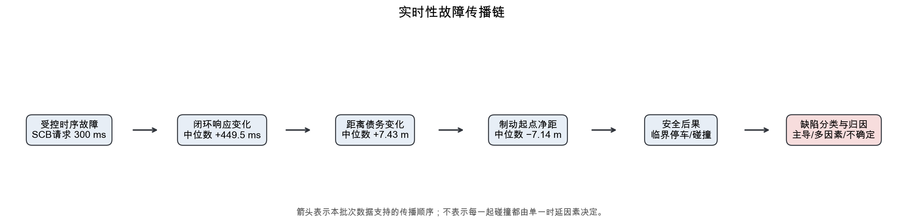

## 1. 研究定位与方法借鉴

本文不是 Apollo 性能优化报告，不提出调度器、在线控制器或新的制动算法。研究对象是已经暴露的时序缺陷及其后果链：受控故障注入是否真实进入执行链，闭环响应是否改变，改变是否被系统传播或放大，车辆是否在等待期间继续行驶，距离债务是否推迟有效制动位置，最终是否压缩安全余量并导致临界停车、功能退化或碰撞。

方法上仅借鉴任务说明中给出的四类思路：用 DriveFI 式受控故障注入保持干预可复现；用 R-TOD 式端到端时序视角避免只看单模块平均耗时；用 FADE 式“时间质量退化—功能表现退化”链审查数据新鲜度和输出连续性；用 D3 式距离预算把毫秒翻译为车辆继续行驶的米数。本文不复现这些工作的模型或算法，也不把它们当作本实验的直接证据；本实验结论仍只由本地原始数据支撑。

## 2. 系统、样本与证据层级

实验部署为 CARLA 0.9.15 服务器端、Apollo 10.0.0 Orin 端，Bridge 位于服务器侧，双方经网线连接。当前部署中 Bridge 直接读取 Control 命令，Guardian 虽有 Trace，但不在车辆命令的实际执行链内，因此不把 Guardian 输出时间加入主 `T_e2e`。这一点来自工作区部署说明，属于 A 类配置证据。

递归盘点找到 454 个文件、7 个 baseline run 和 5 个 300 ms run。原始日志、Trace、SCB、CollisionSensor 和 actor history 为最高优先级；本报告脚本从它们复算；旧 CSV/JSON 只用于差异检查，旧报告文字不参与主结果生成。配置、实测和模型严格分层：约 560k 点云、名义注入量和队列设定属于 A 类实验设定；逐 run 时刻、距离、制动和碰撞属于 B 类直接观测；恢复 baseline 响应的结果属于 C 类模型。对点云数和配置队列长度，必须保留以下边界：该项来源于实验设定，当前归档中缺少独立配置文件快照。

证据盘点还揭示了物理真值不对称。12个run都有主要的Localization、Perception、Prediction、Planning、Control Trace和SCB证据，但只有`1131`、`1643`归档了CollisionSensor事件与actor history。对这两个碰撞run，可以把Apollo目标与CARLA碰撞对象进行跨系统身份核验；对停车run，只能证明功能链输出了同一静态目标的STOP、车辆随后减速并且没有归档到碰撞事件，不能假装拥有同等级别的CARLA多帧真值。报告因此把“无碰撞事件”“投影最终净距”“完整停车端点”三项合在一起描述停车结局，并把证据置信度写成中高而不是绝对物理真值。

Control和Guardian也必须区分。当前Bridge执行的是Control命令，Guardian Trace仅说明另一个模块在系统中产生活动，不证明它的命令被Bridge采用。如果把Guardian时间加入执行链，不仅会改变端点定义，也会造成“日志中存在”被误读为“物理上生效”。本报告的响应链固定为目标源时间、Fusion、Prediction、Planning STOP、Control、SCB/Bridge和Localization有效减速；所有图表与逐run表都遵守同一链路。

## 3. 可复现指标与时钟边界

`t1` 定义为目标首次连续 3 个稳定 Fusion 周期中第一帧的传感器源时间；`t2` 定义为 Localization 中首次满足“连续两个区间减速度至少 0.5 m/s²，并在后续 0.3 s 内下降至少 0.3 m/s”的第一个合格区间终点。端到端响应为 `T_e2e=t2−t1`。`D1_clear` 是 `t1` 时车辆前缘到障碍物近表面的纵向净距，按中心距减 5.3074 m 组合偏移得到。

主响应距离严格按墙钟速度梯形积分：

`D_delay = ∫[t1,t2] v(t) dt_wall`，`D2 = D1_clear − D_delay`。

不同 run 不混用 CARLA 仿真帧数、sim time 或 Localization 空间位移。完整停车 run 的 `D_brake,data` 采用 `t2` 后达到低速条件的统一最小速度端点，并保留近停、严格持续停车和墙钟路程积分诊断。碰撞 run 没有完整停车端点，所以其完整 `D_brake`、0 m/6 m观测余量和观测 deadline 一律为 NA，只报告 `t2→碰撞` 的截断制动时间、截断距离、撞击前速度及投影净距诊断。

这些定义专门避免三类常见错位。其一，`t1`取传感器源时间而不是Fusion输出时间，否则感知生命周期会被从端到端响应中删除；连续三帧条件用于排除一次性误检。其二，`t2`不取第一条Control制动命令，因为命令产生、Bridge延迟、车辆执行和Localization确认之间仍有真实闭环时间；持续减速条件可避免速度噪声把单点下降误判为有效制动。其三，主`D_delay`不取`t1`与`t2`两点位置之差，因为不同run的CARLA推进帧数和实时因子不一致，位置差与墙钟等待距离混用会破坏组间可比性。

最终净距和碰撞余量也不是同一个字段的两个名字。最终投影净距使用统一停车端点处的稳定目标几何；`M0`使用`D1−D_delay−D_brake,data`的预算链。两者接近说明距离链自洽，出现小差异则来自端点、三维位移和纵向投影定义。对于碰撞run，两者都不能替代不存在的完整停车距离。模型即使可以估计“若继续以等效减速度制动需要多远”，也必须留在预测表，不能回填为观测`D_brake`。

## 4. 干预是否真实生效，以及为何增量超过300 ms

SCB 的配置加载、初始化、触发和应用记录在 12 个 run 中均存在。300 ms 主分析组实测墙钟延迟中位数 300.124 ms，范围 300.047–300.318 ms；baseline 中位数 0.070 ms，其中 `1031` 首次有效命令为 19.282 ms，其余约 0.067–0.091 ms。因此干预有效性来自 SCB 日志，不是从目录名反推。

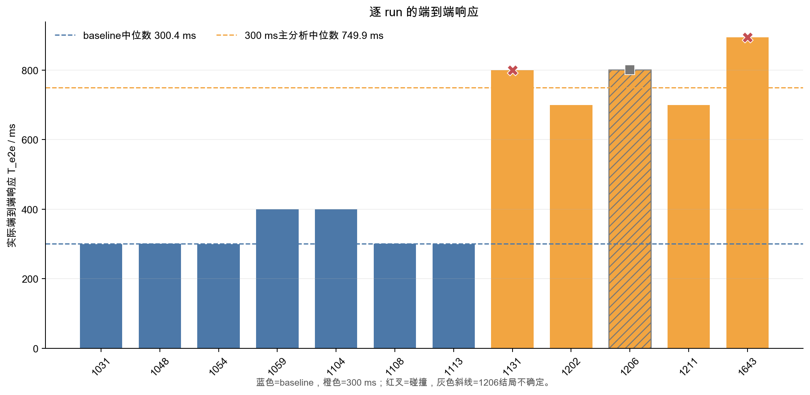

baseline 的 `T_e2e` 中位数 300.358 ms、范围 299.655–399.750 ms；300 ms 主分析组中位数 749.901 ms、范围 699.155–893.870 ms。中位增量 449.543 ms 大于名义 300 ms。这里的额外约 149.543 ms 不应被强行归入某一个 Apollo 模块：`t2` 还包含消息相位、模块周期、SCB/Bridge行为、车辆动力学以及减速端点识别窗口。可复现且审慎的结论是“闭环端点出现约 1.50 倍的延迟放大”，不是“某模块额外阻塞149.5 ms”。

阶段统计进一步限定了放大发生在哪里。sensor→Control的组中位数从 265.401 ms变为 303.100 ms，只增加约 37.699 ms；Control→t2的组中位数则从 38.224 ms变为 447.421 ms。这说明名义干预主要进入Control之后的执行与物理响应段，符合Bridge延迟注入位置。但是Control→t2并不是“纯Bridge耗时”：它同时包含实测SCB等待、命令到车辆、执行器/车辆动力学变化以及有效减速识别。因此报告只把它定位为传播区段，不把整段贴成Bridge内部处理延迟。

另外，300 ms干预并未使上游功能链停止。各run都有Planning STOP和Control目标Trace，未观察到empty trajectory；日志中的速度优化不可行与fallback表明系统仍能生成停车轨迹。这个证据很重要：本实验暴露的不是简单的“功能没有输出”，而是输出存在但在有限距离预算内到达得太晚。实时性缺陷与功能缺失的测试判据因此必须分开。

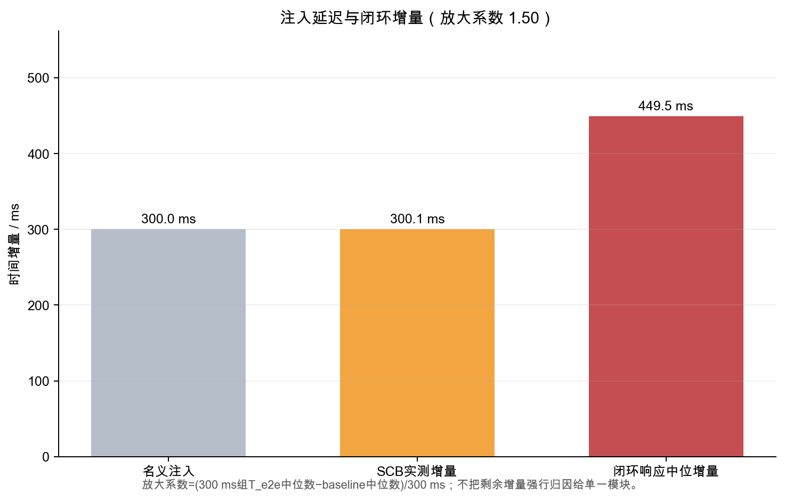

## 5. 时间缺陷如何传播为空间后果

baseline `D_delay` 中位数 5.284 m，300 ms 主分析组为 12.716 m，中位增加 7.431 m；`D2` 中位数从 33.490 m 降至 26.347 m，减少 7.143 m。两个变化不是严格相等，因为不同 run 的 `D1` 和速度也在波动。这正说明时延必须被放入“起始距离—响应距离—制动距离”的共同预算，而不是单独拿毫秒判断安全。

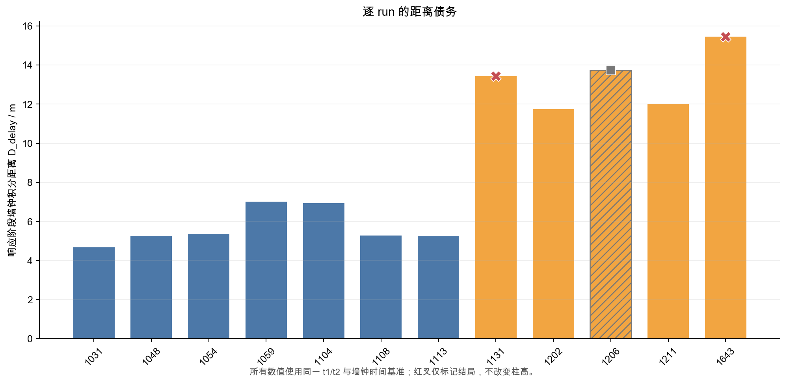

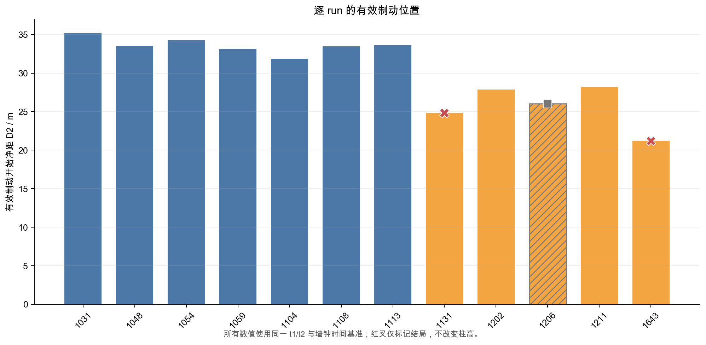

baseline 7 个 run 均完整停车、无碰撞事件。它们最终距障碍物的投影净距如下，范围 2.735–5.331 m；按统一制动端点计算的 0 m碰撞余量范围 2.740–5.338 m，中位数 3.471 m。两列只存在厘米级端点/计算差异，不应与 6 m工程安全余量混为一谈。

| baseline run | 最终投影净距/m | 0 m碰撞余量M0/m | 说明 |
|---|---:|---:|---|
| 202607271031 | 5.331 | 5.338 | 完整停车、无碰撞事件 |
| 202607271048 | 3.471 | 3.471 | 完整停车、无碰撞事件 |
| 202607271054 | 2.738 | 2.740 | 完整停车、无碰撞事件 |
| 202607271059 | 2.735 | 2.746 | 完整停车、无碰撞事件 |
| 202607271104 | 3.955 | 3.968 | 完整停车、无碰撞事件 |
| 202607271108 | 3.520 | 3.512 | 完整停车、无碰撞事件 |
| 202607271113 | 3.341 | 3.351 | 完整停车、无碰撞事件 |

300 ms 组的可靠安全 run `1202`、`1211` 只剩 0.548 m 和 1.018 m 观测余量，中位数 0.783 m；`1131`、`1643` 分别以 7.988 m/s 和 11.728 m/s 撞击。由此可见，受控时序故障没有让功能链完全消失，而是把原有数米余量压缩为临界停车或碰撞。

这里还存在一个看似矛盾、实际非常关键的结果：baseline虽然全部无碰撞，但其6 m工程余量均为负。0 m边界回答“是否与障碍物几何接触”，6 m边界回答“停车后是否仍保留指定工程空间”；两者不能混写成“安全/不安全”一个词。baseline的M0中位数为3.471 m，只支持“本批次能在接触前停下”，不支持“满足6 m安全目标”。如果后续把6 m设为硬要求，那么问题不仅是300 ms干预，当前速度与起始距离本身也需要重新设计。

距离预算还解释了为什么相近时延可以出现不同结局。`1202`与`1211`约699–700 ms仍停车，而`1131`约800 ms碰撞；但`1131`相对`1211`不仅晚99.469 ms，起始净距还小1.944 m，且Fusion连续性不同。`1643`比`1211`晚193.703 ms，同时D1小3.551 m。因此时延是重要轴，却不是唯一状态变量；所谓“安全陡峭”是当前D1、速度、制动能力共同形成的转换带。

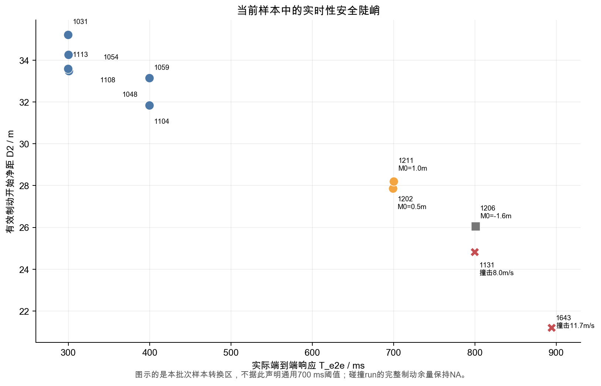

## 6. 感知模块是否存在时延过长

答案必须区分三种量。第一，`t1` 对应稳定目标的 sensor→Fusion 首次输出时延在全部12个 run 中为 208.315–319.285 ms，没有 run 超过归档分析配置中的 500 ms degraded threshold，因此没有证据支持“12组普遍存在单帧感知处理超过500 ms”。第二，输出间隔代表连续性；第三，Fusion 输出时目标源时间到当前输出/碰撞端点的年龄代表数据新鲜度。后两者可能异常，即使单次 sensor→Fusion 看起来正常。

ground detection→lidar detection 的 Trace 队列中位数在两组约 0.13–0.14 ms，处理段中位数约 92.18–92.40 ms，完成率中位数约 0.971–0.976。SCB 的 `queue_depth_at_trigger=1` 则是另一条命令延迟队列。两套队列已按 trace_id 和数据来源分别计算，不能把 lidar检测输入队列与 SCB命令队列合并解释；配置长度1仍属于实验设定，而非从配置快照重新验证的事实。

`1131` 是明确异常：Fusion 目标生命周期最大值 705.892 ms，最大输出间隔 507.439 ms；碰撞时最后目标源数据年龄 1006.892 ms，而 `1211` 在相同相对时刻为 406.729 ms。`1643` 的最大生命周期 322.269 ms、最大输出间隔 115.906 ms，不呈现 `1131` 式长空档；但碰撞时源数据年龄 599.668 ms，相同相对时刻的 `1211` 为 290.383 ms。故 `1131` 可归入“数据新鲜度/输出连续性退化”，`1643` 只能说碰撞端可用目标偏老，不能说单帧感知处理超过阈值。

结局端源数据年龄需要特别防止误读。停车完成可能发生在目标停止更新之后很久，因而某些安全run在最终端点也出现较大的年龄，例如`1048`约2.8 s；这并不自动意味着接近障碍物的关键响应阶段发生了2.8 s处理超时。判断感知实时性至少需要同时查看首次稳定响应、相邻输出间隔、每次输出生命周期，以及与碰撞或同相对时刻对照的源数据年龄。只有这些信号在关键窗口相互印证时，才把它归类为数据新鲜度或连续性缺陷。

从这一判据看，`1131`的证据最完整：输出间隔越过500 ms，生命周期也越过500 ms，碰撞端源年龄又显著高于匹配时刻的安全对照。`1643`只满足最后一项，其输出间隔和生命周期均未越过配置阈值，所以应保留为次要风险信号。`1206`最终源年龄约2.4 s，但其结局本身冲突，而且前段单帧时延与输出间隔正常，故不把它升级为“感知处理超时”。

## 7. 案例1131：实时性主导候选，而非纯时延唯一致撞

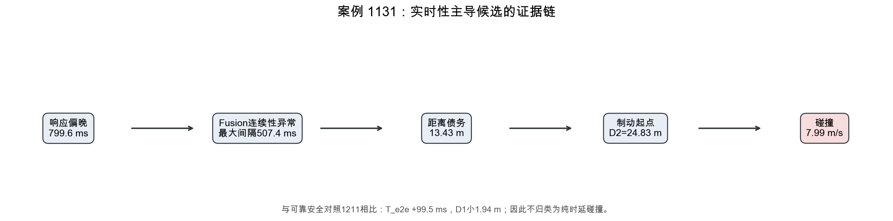

`1131` 的 `T_e2e=799.636 ms`，比可靠同设置安全对照 `1211` 慢 99.469 ms；`D_delay=13.432 m`，多 1.433 m；`D2=24.826 m`，少 3.376 m。`t2` 后到碰撞持续 2.107 s，截断制动距离 27.148 m，撞击前速度 7.988 m/s。固定几何墙钟投影在碰撞端为 -2.322 m，只是穿透方向的诊断量；CollisionSensor事件才是碰撞结局的主要证据。

`1131` 同时具有 507.439 ms Fusion 长空档和 705.892 ms 生命周期峰值，而且 `D1` 比 `1211` 小 1.944 m。反事实模型把响应恢复到 baseline 中位数时，预测回收 8.565 m，余量 +5.495 m并避碰；但这是 C 类模型，不是观测事实。综合直接链和混杂因素，分类为 `RT_DOMINATED_COLLISION`，置信度中高；边界是“实时性为主要候选机制”，不能写成 `RT_ONLY_COLLISION`。

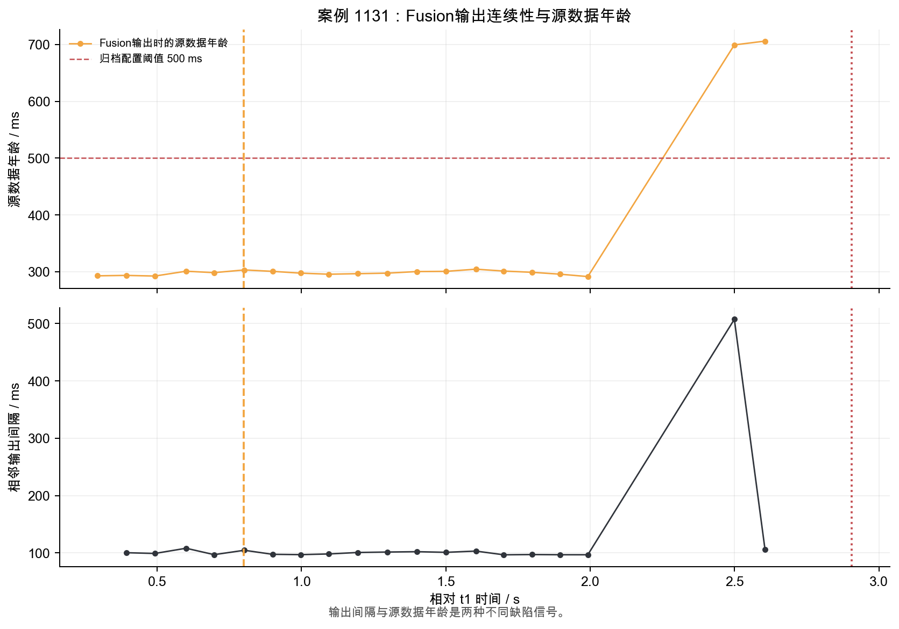

## 8. 案例1643：实时性放大风险的多因素碰撞

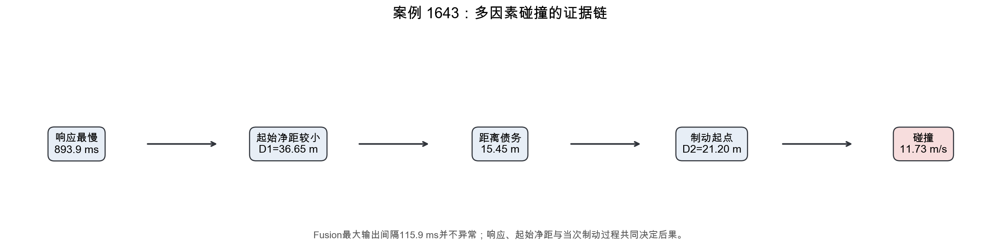

`1643` 的 `T_e2e=893.870 ms`，比 `1211` 慢 193.703 ms；`D1=36.651 m`，比对照小 3.551 m；`D_delay=15.451 m`，多 3.451 m；`D2=21.201 m`，少 7.002 m。`t2` 后到碰撞仅 1.599 s，截断制动距离 23.378 m，撞击前速度 11.728 m/s，碰撞端几何投影诊断为 -2.177 m。

`1643` 没有 `1131` 式输出长空档，所以不能复制同一根因标签。反事实恢复 baseline 响应可回收 10.519 m，但预测余量仍为 -2.000 m、预测撞击速度 3.980 m/s。故分类为 `MULTI_FACTOR_COLLISION`：实时性缺陷明确增加距离债务并放大碰撞严重度，但更小起始净距和当次制动能力差异同样不可忽略。

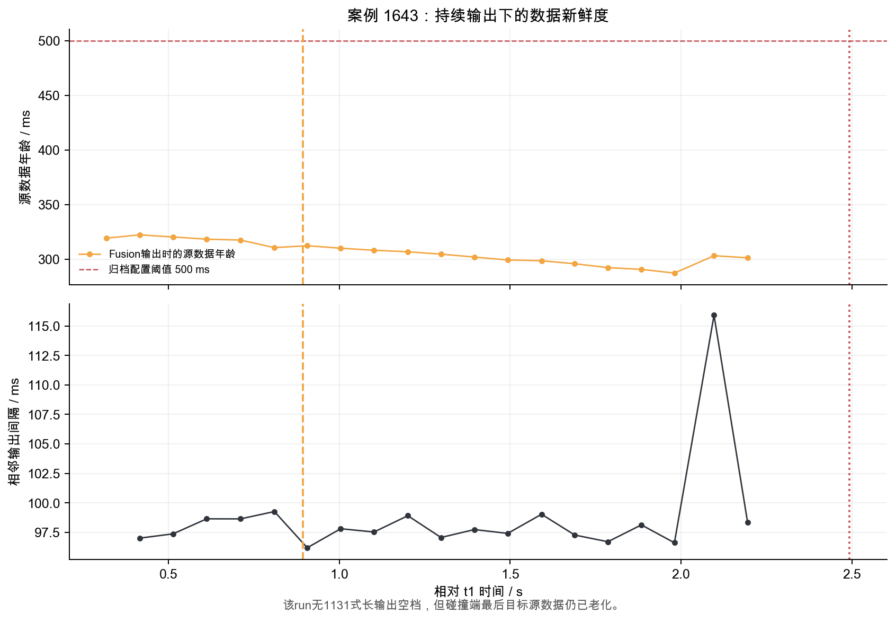

## 9. 1206：为什么必须排除，而不是称为“坏数据”

`1206` 的 t1/t2、Localization、Fusion、Prediction、Planning、Control Trace 与 SCB 均完整：`T_e2e=800.753 ms`，`D_delay=13.741 m`，`D2=26.049 m`。问题出在结局：归档没有 CollisionSensor 事件和 actor history，但固定目标几何与停车端点给出最终投影净距 -1.627 m、M0=-1.636 m，明显越过约 ±0.52 m的接触偏移不确定性范围。

因此它不是“无法解析”，而是 `OUTCOME_UNCERTAIN_COLLISION_EVENT_ABSENT_BUT_FIXED_GEOMETRY_IMPLIES_OVERLAP`。它的时延和距离指标仍进入质量诊断，但不进入11-run主结局比较；这项排除基于证据冲突，不基于结果方向。`1206` 的响应比 `1211`更接近`1131`，但它不能被当作安全对照，这也是选择`1211`进行碰撞案例比较的原因。

## 10. 缺陷分类、身份链与结论边界

缺陷分类表把直接证据、反证/混杂和置信度放在同一行：`1131=RT_DOMINATED_COLLISION`；`1643=MULTI_FACTOR_COLLISION`；`1206=INDETERMINATE`；`1202`与`1211`是非碰撞的 `REALTIME_MARGIN_EXHAUSTION` 观测。分类描述的是本次证据链，不是对Apollo模块的永久标签。

分类判据如下。`RESPONSE_TOO_LONG`要求统一`t1/t2`下响应相对基线显著右移，并能用墙钟积分观察到额外距离债务；`DATA_FRESHNESS/OUTPUT_CONTINUITY_DEGRADATION`要求关键窗口出现生命周期、输出间隔或匹配端源年龄异常；`TIMING_INDUCED_FUNCTIONAL_DEGRADATION`只有在时间异常先发生、随后功能输出质量退化且替代解释被排除时才成立；`MULTI_FACTOR_COLLISION`用于时延链明确存在，但起始距离、制动或其他功能信号也足以改变结局解释；`INDETERMINATE`用于关键结局证据相互冲突。当前数据没有足够证据把任何碰撞写成严格`RT_ONLY_COLLISION`。

对照run的选择也遵守这一判据。`1206`的响应更接近`1131`，表面上可能是更好的时延匹配，但它没有可信安全结局，不能作为“未碰撞”反证。`1202`和`1211`均为可靠停车run，其中`1211`在速度、起始距离和阶段响应上更适合作为共同对照。即使如此，案例比较仍是准配对而非随机对照，所以报告使用“候选”“共同作用”“放大风险”等措辞，不把差值直接等同于因果效应。

两个碰撞 run 的 Planning STOP ID 与稳定 Fusion 目标一致，并与 CARLA actor history 中的 `other` 车辆按墙钟对齐。`1131` 匹配 20 帧，位置误差中位数 1.689 m；`1643` 匹配 20 帧，中位数 1.602 m。两者都对应 actor 155、`vehicle.lincoln.mkz_2020`。这支持“被规划停车的目标就是碰撞对象”，但 Fusion中心与actor origin存在定义偏移，不宣称亚米级几何一致。

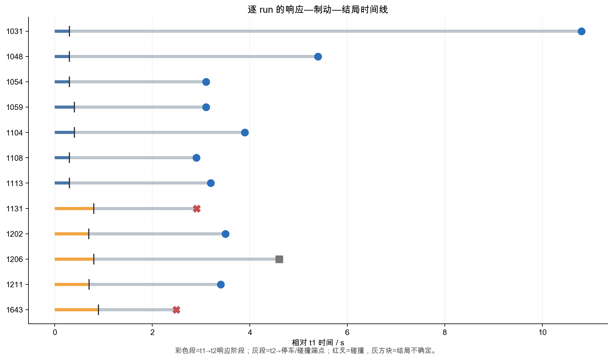

本实验的最强结论是：受控300 ms命令时序故障在闭环端被传播并放大，形成约7.43 m额外距离债务，使有效制动位置整体后移，并在当前场景预算下把原有数米停车余量压缩为临界停车或碰撞。最强归因边界是：`1131`可称实时性主导候选，`1643`必须称多因素，`1206`必须保持不确定；“小于700 ms必安全”“两起碰撞都是感知计算超时”“300 ms以外的全部增量来自某单一模块”都不被当前证据支持。

## 11. 局限与下一轮最小验证

样本只有11个主分析run，速度、D1与制动能力未完全配对，当前转换区不能外推为通用deadline。无碰撞run缺少actor history，物理真值完整性弱于碰撞run；SCB未归档每一帧延迟后Control载荷；点云和队列配置缺少独立快照；碰撞run没有完整停车端点，反事实只能使用局部等效制动模型。

下一轮最小验证应优先补证据而非改系统：固定D1和初速度，在600–900 ms区间增加重复点；所有run都归档CollisionSensor、actor history与完整SCB载荷；保存感知与Bridge配置快照；对Fusion输出间隔、源数据年龄和端到端响应设置独立打点。这样才能区分响应过长、数据新鲜度和时序诱发功能退化，并把“候选归因”推进到可重复的机制归因。

建议把下一轮实验拆成三组最小矩阵。第一组只扫描Bridge延迟，保持D1、速度和车辆控制参数固定，用于估计响应增量到距离债务的稳定映射；第二组固定Bridge延迟，独立改变Fusion输出间隔或源数据年龄，用于判断新鲜度退化是否会改变Planning STOP与Control到达；第三组在碰撞转换区做重复实验，所有run保留同等CARLA真值，用于估计同条件下的结局概率。只有把三个因素拆开，才能把本报告的多因素链转化为可识别的机制模型。

验证时还应预先声明排除标准和主端点。排除只允许基于证据缺失或冲突，不能根据是否碰撞决定；主端点仍应是统一墙钟`t1/t2/D_delay/D2`，感知新鲜度和sim frame只作为独立诊断。报告模板也应固定“观测结果”和“模型预测”两栏，防止后续为了填满表格而用反事实补观测缺口。

## 逐run主结果

| run | 组别 | 主分析 | T_e2e/ms | D1/m | D_delay/m | D2/m | D_brake,data/m | M0/m | 结局 |
|---|---|---:|---:|---:|---:|---:|---:|---:|---|
| 202607271031 | baseline | 是 | 299.655 | 39.891 | 4.673 | 35.218 | 29.880 | 5.338 | 停车/无碰撞事件 |
| 202607271048 | baseline | 是 | 300.358 | 38.744 | 5.254 | 33.490 | 30.019 | 3.471 | 停车/无碰撞事件 |
| 202607271054 | baseline | 是 | 299.977 | 39.632 | 5.367 | 34.264 | 31.525 | 2.740 | 停车/无碰撞事件 |
| 202607271059 | baseline | 是 | 399.750 | 40.155 | 7.006 | 33.149 | 30.403 | 2.746 | 停车/无碰撞事件 |
| 202607271104 | baseline | 是 | 399.646 | 38.784 | 6.936 | 31.848 | 27.880 | 3.968 | 停车/无碰撞事件 |
| 202607271108 | baseline | 是 | 300.641 | 38.759 | 5.284 | 33.475 | 29.963 | 3.512 | 停车/无碰撞事件 |
| 202607271113 | baseline | 是 | 299.796 | 38.817 | 5.231 | 33.586 | 30.236 | 3.351 | 停车/无碰撞事件 |
| 202607271131 | 300 ms | 是 | 799.636 | 38.258 | 13.432 | 24.826 | NA | NA | 碰撞，撞击前7.988 m/s |
| 202607271202 | 300 ms | 是 | 699.155 | 39.616 | 11.749 | 27.867 | 27.319 | 0.548 | 停车/无碰撞事件 |
| 202607271206 | 300 ms | 否 | 800.753 | 39.790 | 13.741 | 26.049 | 27.685 | -1.636 | 结局不确定 |
| 202607271211 | 300 ms | 是 | 700.167 | 40.202 | 11.999 | 28.203 | 27.185 | 1.018 | 停车/无碰撞事件 |
| 202607271643 | 300 ms | 是 | 893.870 | 36.651 | 15.451 | 21.201 | NA | NA | 碰撞，撞击前11.728 m/s |

> 完整证据、字段定义、逐run感知表、反事实与文件来源见 [evidence_appendix.md](evidence_appendix.md)。
