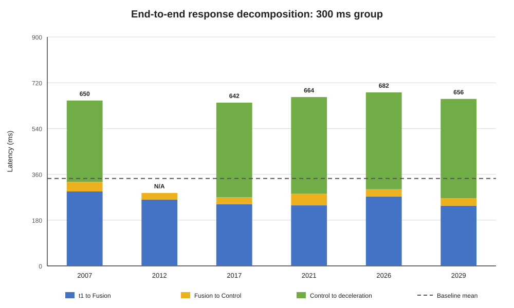
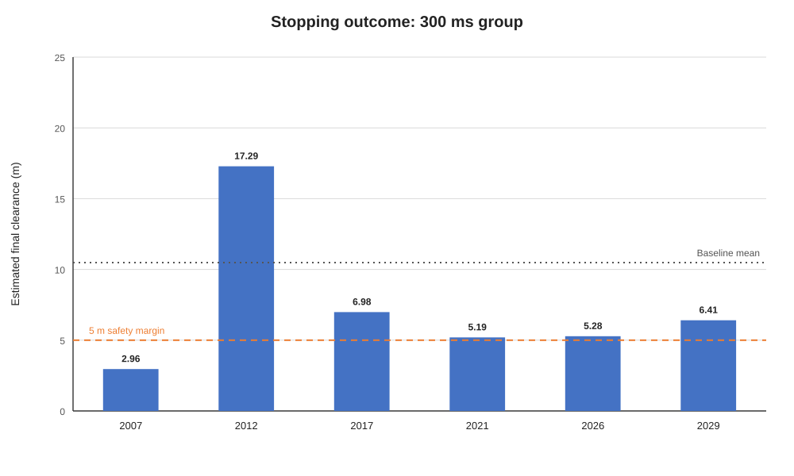
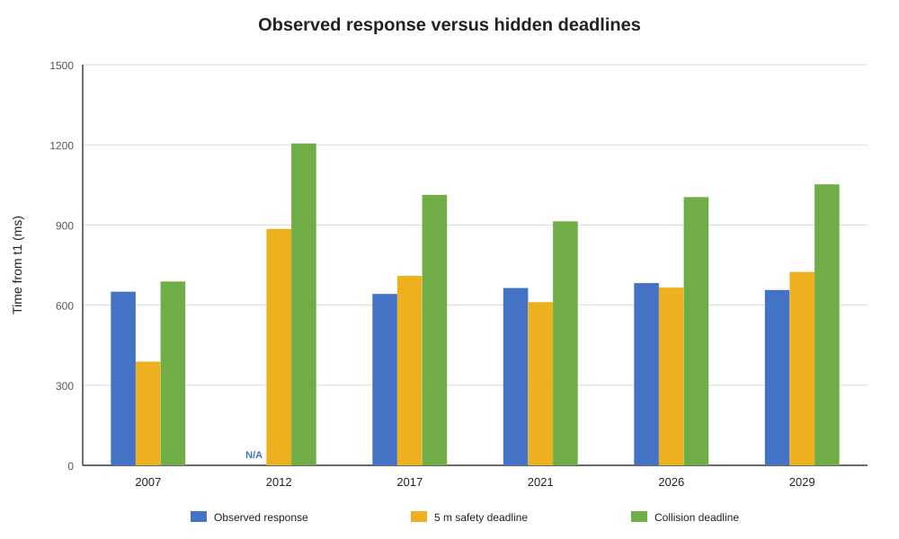

# 300 ms时延注入下的车速隐形Deadline分析报告

> 数据目录：`D:/data/300ms/`  
> 对照组：`D:/data/baseline/VEHICLE_SPEED_HIDDEN_DEADLINE_BASELINE.md`  
> 场景数：6组  
> 用户记录结果：6组均未发生碰撞

## 1. 核心结论

1. 六组中有 **5/6** 组能够分离出目标Control之后新开始的持续减速段；这5组从障碍物稳定可观测时刻 $t_1$ 到目标相关持续减速时刻 $t_2$ 的平均响应时间为 **658.917 ms**，相比baseline的 343.657 ms增加 **315.260 ms**。
2. 在这5组可归因场景中，Control发布到持续减速阶段的平均时间为 **368.671 ms**，相比baseline的 77.028 ms增加 **291.643 ms**。这是注入位置之后最直接的闭环变化。
3. 六组最终净距估计均大于0；全部六组平均为 **7.352 m**，5组可归因场景平均为 **5.364 m**，最小值为 **2.957 m**，与“均未碰撞”的实验记录一致。
4. 5组可归因场景的平均碰撞Deadline为 **934.060 ms**；观测响应之后仍剩余 **275.143 ms** 的平均碰撞时间预算，因此300 ms注入未把场景推过碰撞边界。
5. 用户确认六组运行时均生成了SCB注入日志，但当前归档目录仅 **1/6** 组成功复制。`202607182012`证实请求300 ms、实际仿真时延300 ms、跨3个CARLA帧；其余5组在补拷SCB文件前不能逐场景核验实际执行值。
6. 当前注入仍在障碍物稳定识别前触发并持续作用于弯道控制，因此六组不能被解释为严格的“只增加300 ms”对照实验；它们适合作为300 ms实验组和机制验证数据，但因果结论必须附带该限制。
7. `2007`最接近碰撞边界：最终净距估计仅2.957 m，碰撞时间预算仅37.712 ms；它可作为下一轮收紧场景的重点参考，但仍需要先修正提前触发问题。

### 1.1 Baseline与300 ms组的关键物理量变化

为避免`2012`在$t_1$时已经减速造成的归因偏差，下表的300 ms响应、制动和停车均值采用其余5组可归因场景；baseline采用原六组均值。

| 指标 | baseline | 300 ms组 | 绝对变化 | 相对变化 | 判断 |
|---|---:|---:|---:|---:|---|
| $t_1$车速 | 15.689 m/s | 15.948 m/s | +0.259 m/s | +1.7% | 变化较小 |
| $D_1$净距 | 39.975 m | 40.241 m | +0.266 m | +0.7% | 变化较小 |
| 等效减速度 | 4.957 m/s² | 5.029 m/s² | +0.072 m/s² | +1.5% | 变化较小 |
| 实际制动距离 | 24.876 m | 25.409 m | +0.533 m | +2.1% | 变化较小 |
| $t_1$到持续减速 | 343.657 ms | 658.917 ms | +315.260 ms | +91.7% | 明显增加 |
| 制动开始前行驶距离估计 | 4.619 m | 9.479 m | +4.860 m | +105.2% | 明显增加 |
| $t_1$到停车总行驶距离估计 | 29.495 m | 34.888 m | +5.393 m | +18.3% | 明显增加 |
| 最终净距估计 | 10.480 m | 5.364 m | -5.116 m | -48.8% | 明显减少 |

最重要的物理变化是制动起点向后移动，而不是车辆制动能力明显下降：

$$
\Delta D_{\mathrm{delay}}\approx v\Delta T
$$

将实测均值代入，$15.948\times0.315\approx5.02$ m；实际计算得到制动开始前行驶距离增加4.860 m，两者基本一致。随后等效减速度只变化+1.5%，因此新增距离几乎没有在制动阶段被补偿，最终净距平均减少5.116 m。

## 2. 指标定义与公式

### 2.1 稳定感知时刻

$t_1$定义为目标障碍物连续至少3帧稳定出现时的第一帧源观测时间。采用`obs_time`，不采用Fusion发布时刻。

### 2.2 持续减速起点

由Localization相邻速度帧计算：

$$
a_i=\frac{v_i-v_{i-1}}{t_i-t_{i-1}}
$$

当连续两个区间满足 $a_i\leq-0.5\ \mathrm{m/s^2}$ 时，将第一个区间的结束时刻记为 $t_2$。响应时间为：

$$
T_{\mathrm{response}}=t_2-t_1
$$

### 2.3 净距、等效减速度和Deadline

$$
D_{1,\mathrm{clear}}=D_{1,\mathrm{center}}-5.3074
$$

$$
a_{\mathrm{eq}}=\frac{v_{t_1}^2}{2D_{\mathrm{brake,actual}}}
$$

$$
T_{\mathrm{collision}}=\frac{D_{1,\mathrm{clear}}-D_{\mathrm{brake,actual}}}{v_{t_1}}
$$

$$
T_{\mathrm{safety}}=\frac{D_{1,\mathrm{clear}}-D_{\mathrm{brake,actual}}-5}{v_{t_1}}
$$

相对于本次实际响应仍可增加的时间预算为：

$$
T_{\mathrm{injectable}}=T_{\mathrm{deadline}}-T_{\mathrm{response}}
$$

## 3. 六组逐场景结果

### 3.1 场景状态与停车结果

| 场景 | 目标ID | $t_1$车速 (m/s) | $D_1$中心距离 (m) | $D_1$净距 (m) | 等效减速度 (m/s²) | 制动距离 (m) | 最终净距估计 (m) |
|---|---:|---:|---:|---:|---:|---:|---:|
| 2007 | 40 | 16.697 | 44.524 | 39.217 | 5.027 | 27.730 | 2.957 |
| 2012 | 14 | 15.634 | 45.931 | 40.624 | 5.611 | 21.783 | 17.290 |
| 2017 | 19 | 16.487 | 45.516 | 40.209 | 5.781 | 23.512 | 6.982 |
| 2021 | 34 | 16.538 | 45.630 | 40.323 | 5.423 | 25.216 | 5.195 |
| 2026 | 19 | 14.769 | 45.797 | 40.490 | 4.250 | 25.659 | 5.281 |
| 2029 | 21 | 15.249 | 46.276 | 40.968 | 4.665 | 24.927 | 6.406 |

### 3.2 端到端响应分解

| 场景 | $t_1$到Fusion (ms) | $t_1$到Control (ms) | Fusion到Control (ms) | Control到持续减速 (ms) | $t_1$到持续减速 (ms) |
|---|---:|---:|---:|---:|---:|
| 2007 | 292.655 | 330.412 | 37.757 | 319.845 | 650.257 |
| 2012 | 260.690 | 286.664 | 25.974 | — | 原始阈值=112.214* |
| 2017 | 242.101 | 269.261 | 27.160 | 372.588 | 641.849 |
| 2021 | 238.003 | 284.258 | 46.255 | 379.502 | 663.760 |
| 2026 | 273.052 | 301.190 | 28.138 | 381.075 | 682.265 |
| 2029 | 236.732 | 266.111 | 29.379 | 390.344 | 656.455 |

\* `2012`在$t_1$时已经处于连续减速段，原始阈值时间早于目标Control输出，无法归因为障碍物响应，因此不纳入响应和Deadline汇总统计。`2017`在$t_1$附近也有一段普通轻微减速，表中采用目标Control之后重新开始的强制动段。

### 3.3 Deadline及剩余预算

| 场景 | 5 m安全Deadline (ms) | 碰撞Deadline (ms) | 观测响应 (ms) | 剩余安全预算 (ms) | 剩余碰撞预算 (ms) |
|---|---:|---:|---:|---:|---:|
| 2007 | 388.522 | 687.969 | 650.257 | -261.734 | 37.712 |
| 2012 | — | — | — | — | — |
| 2017 | 709.453 | 1012.715 | 641.849 | 67.604 | 370.866 |
| 2021 | 611.105 | 913.447 | 663.760 | -52.654 | 249.687 |
| 2026 | 665.667 | 1004.225 | 682.265 | -16.598 | 321.960 |
| 2029 | 724.064 | 1051.947 | 656.455 | 67.609 | 395.492 |

## 4. 汇总统计

| 指标 | 均值 | 中位数 | 范围 | P90 | baseline均值 |
|---|---:|---:|---:|---:|---:|
| $t_1$车速 (m/s) | 15.896 | 16.061 | 14.769–16.697 | 16.618 | 15.689 |
| $D_1$净距 (m) | 40.305 | 40.406 | 39.217–40.968 | 40.796 | 39.975 |
| $t_1$到Fusion (ms) | 257.205 | 251.395 | 236.732–292.655 | 282.853 | 236.519 |
| $t_1$到Control (ms) | 289.649 | 285.461 | 266.111–330.412 | 315.801 | 266.629 |
| Control到持续减速 (ms) | 368.671 | 379.502 | 319.845–390.344 | 386.636 | 77.028 |
| $t_1$到持续减速 (ms) | 658.917 | 656.455 | 641.849–682.265 | 674.863 | 343.657 |
| 等效减速度 (m/s²) | 5.029 | 5.027 | 4.250–5.781 | 5.638 | 4.957 |
| 最终净距估计 (m) | 7.352 | 5.844 | 2.957–17.290 | 12.136 | 10.480 |
| 碰撞Deadline (ms) | 934.060 | 1004.225 | 687.969–1051.947 | 1036.254 | 958.485 |
| 剩余碰撞预算 (ms) | 275.143 | 321.960 | 37.712–395.492 | 385.641 | 614.828 |

## 5. 图形化分析

*图5-1　六组300 ms实验的响应阶段分解。`2012`因$t_1$时已经处于减速状态而标为N/A；虚线为baseline总响应均值343.7 ms。*

*图5-2　最终净距估计。红色实线为碰撞边界，橙色虚线为5 m安全余量，灰色点线为baseline最终净距均值。*

*图5-3　每组实际响应时间与5 m安全Deadline、碰撞Deadline的比较。`2012`响应归因为N/A；其余可归因场景的实际响应均低于碰撞Deadline。*

## 6. 300 ms没有导致碰撞的原因

### 6.1 当前场景原本具有较大的碰撞预算

baseline平均碰撞Deadline为958.485 ms，baseline实际响应为343.657 ms，因此原始碰撞预算约为614.828 ms。300 ms小于该预算，从理论上本来就不应稳定导致碰撞。

### 6.2 实际状态并未做到严格配对

300 ms组在$t_1$处的速度范围为14.769–16.697 m/s，净距范围为39.217–40.968 m。即使场景配置一致，实际进入Deadline计算的速度和距离仍有明显波动。

### 6.3 弯道提前触发改变了障碍物出现前的车辆状态

已保存SCB日志的`2012`场景在障碍物稳定识别前即触发注入。注入器触发后继续延迟所有Control命令，因此弯道和后续加速阶段也受到300 ms影响。这会改变$t_1$速度、位置以及制动初始状态。

### 6.4 最接近碰撞的是`2007`

`2007`的$t_1$车速为16.697 m/s、净距为39.217 m，总响应为650.257 ms。其最终净距估计仅2.957 m，已经低于5 m安全余量；按Deadline模型计算，距离碰撞边界只剩37.712 ms。该场景说明300 ms已经明显压缩停车余量，但还没有越过碰撞边界。

## 7. 注入证据与数据完整性

| 场景 | SCB日志 | 请求时延 (ms) | 墙钟实际时延 (ms) | 仿真时延 (ms) | 帧延迟 | 相对$t_1$触发时间 |
|---|---|---:|---:|---:|---:|---:|
| 2007 | 无 | — | — | — | — | 无法直接核验 |
| 2012 | 有 | 300.000 | 309.970 | 300.000 | 3 | 提前37.290 s |
| 2017 | 无 | — | — | — | — | 无法直接核验 |
| 2021 | 无 | — | — | — | — | 无法直接核验 |
| 2026 | 无 | — | — | — | — | 无法直接核验 |
| 2029 | 无 | — | — | — | — | 无法直接核验 |

六组目录中CollisionSensor或actor history真值文件数量为0/6。本文的“未碰撞”采用用户实验记录，并由最终净距估计进行交叉检查；正式报告若要把碰撞作为因变量，应补充CARLA CollisionSensor事件。

## 8. 对后续车速隐形Deadline实验的意义

这六组数据证明300 ms量级的注入可以显著改变闭环响应，但当前约15–16 m/s、约40 m稳定识别净距的场景仍没有被推到碰撞边界。下一阶段不应继续只增加同一条件下的重复次数，而应：

1. 将注入器改为过弯后或障碍物生成时才允许进入armed状态，保证弯道轨迹不受实验时延影响；
2. 修复采集脚本并将每组已生成的SCB日志完整复制到归档目录，核验`actual_sim_delay_ms`、`actual_frame_delay`和队列丢弃状态；
3. 使用成对的0 ms与300 ms实验，预先规定$t_1$速度和净距接收窗口；
4. 若目标是构造100 ms差异即可改变碰撞结果，应把场景收紧到理论临界区，而不是依赖300 ms实验自然发生碰撞；
5. 同时报告碰撞概率、最终净距、碰撞速度和端到端响应，而不只报告单次是否碰撞。

## 9. 可直接引用的实验结论

> 在六组300 ms时延注入实验中，障碍物稳定识别时的平均车速为15.896 m/s，平均车头净距为40.305 m。其中5组能够分离出目标Control之后新开始的持续减速段，其平均响应时间为658.917 ms，相比六组baseline均值343.657 ms增加315.260 ms；另1组在$t_1$时已经处于减速状态，未纳入响应归因统计。5组可归因场景的最终净距平均为5.364 m，六组最小最终净距为2.957 m，均未进入碰撞区。5组可归因场景的平均碰撞Deadline为934.060 ms，实际响应后仍保留275.143 ms的平均碰撞预算，因此300 ms注入不足以在当前速度和感知距离条件下稳定导致碰撞。其中`2007`只剩37.712 ms碰撞预算，是最接近临界状态的场景。用户确认六组均生成SCB日志，但当前归档仅成功复制1组；同时该组显示注入在弯道阶段提前触发。因此结果可作为300 ms预实验和机制验证，正式因果结论应在补齐SCB记录并修正触发时机后给出。

## 10. 复现文件

- 逐场景计算结果：`deadline_300ms_metrics.csv`
- 报告与图表生成脚本：`generate_300ms_deadline_report.py`
- 图表目录：`figures/`
