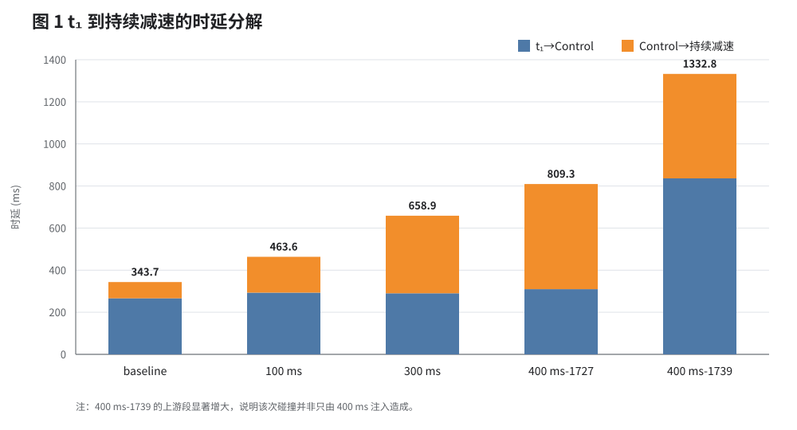
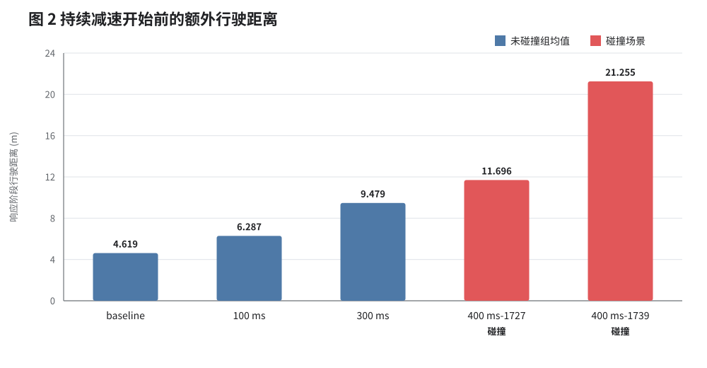
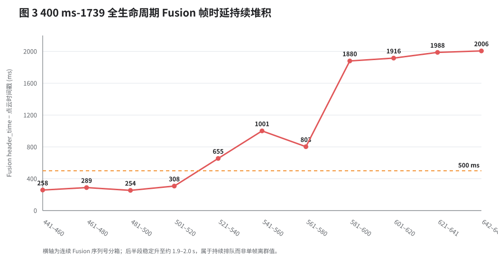

# 400 ms 时延注入与跨组车速隐形 Deadline 对比报告

> 400 ms 数据目录：`D:/data/400ms/`  
> 对照数据：baseline、100 ms 注入、300 ms 注入  
> 400 ms 场景数：3 组  
> 事件链：障碍物稳定可见 $t_1$ → Fusion → Control → Localization 检测到持续减速 $t_2$

## 1. 核心结论

1. 400 ms 三组实验中，`202607191727` 和 `202607191739` 均有 CARLA CollisionSensor 真值，碰撞速度分别为 **4.026 m/s** 和 **12.837 m/s**；`202607191734` 没有碰撞。因此原始口径为 **2/3 碰撞**。
2. `1734` 在 $t_1$ 前约 **114.6 ms** 已经进入持续减速，不能把其停车结果归因于障碍物出现后的 400 ms 延迟。剔除后，可归因样本为 **2 组，2/2 均碰撞**。这不能等价为总体碰撞率 100%，但说明 400 ms 已经能够把当前约 40 m 净距离场景推入碰撞区。
3. `1727` 是最有价值的“正常感知 + 400 ms 注入”证据：$t_1$ 到 Fusion 为 **283.272 ms**，与前面各组正常水平接近；Control 到持续减速为 **499.444 ms**；总闭环响应为 **809.268 ms**，最终以 **4.026 m/s** 低速碰撞。它说明即使没有显著感知异常，400 ms 注入也可能越过隐形 Deadline。
4. `1739` 是“400 ms 注入 + 感知实时性失稳”的复合故障：$t_1$ 到 Fusion 已达到 **814.085 ms**，其中 Ground Detection 输出到 LiDAR Detection `proc_enter` 之间出现 **532.593 ms** 空档；再叠加 Control 后约 **496.592 ms**，总响应达到 **1332.801 ms**，以 **12.837 m/s** 碰撞。
5. Control 后时延随注入量近似线性增加：baseline 为 **77.028 ms**，100 ms 组为 **170.416 ms**，300 ms 组为 **368.671 ms**，400 ms 两个可归因场景平均为 **498.018 ms**。相对 baseline 的增量依次为 **93.388 ms、291.643 ms、420.990 ms**，说明注入器确实改变了制动闭环响应。
6. 不能把 400 ms 组的全部后果都归结为“固定增加 400 ms”。`1739` 相比 baseline 多出的 **989.144 ms** 总响应中，约 **577.566 ms** 已发生在 $t_1$ 到 Fusion 的上游，约 **419.564 ms** 来自 Control 后段；它暴露了注入之外的感知排队和尾时延问题。
7. 300 ms 的最危险场景 `2007` 距离碰撞 Deadline 只剩 **37.712 ms**；若其他状态保持不变，线性外推得到临界请求时延约为 **338 ms**。400 ms 碰撞与该趋势一致，但由于车速、制动力、提前触发及感知状态没有严格配对，当前只能把 **约 340–400 ms** 视为本场景的初步碰撞边界，不能宣称精确阈值。

## 2. 指标定义与解释边界

### 2.1 稳定可见时刻

$t_1$ 定义为目标障碍物连续至少 3 帧稳定出现时的第一帧源观测时间 `obs_time`，不是 Fusion 发布时刻。

### 2.2 闭环响应分解

本报告将仿真闭环响应写成：

$$
T_{\mathrm{closed\ loop}}
=T_{t_1\rightarrow \mathrm{Control}}
+T_{\mathrm{Control}\rightarrow t_2}
$$

其中：

- $T_{t_1\rightarrow \mathrm{Control}}$ 是 Apollo 从稳定感知到 Control 输出的系统链路时间；
- $T_{\mathrm{Control}\rightarrow t_2}$ 包含注入器等待、Bridge 锁存、CARLA 0.1 s 离散 tick、车辆动力学响应和 Localization 采样；
- $t_2$ 是 Localization 中连续两个区间满足 $a_i\leq-0.5\ \mathrm{m/s^2}$ 的持续减速起点。

因此，$T_{\mathrm{closed\ loop}}$ 是判断仿真中是否会碰撞的有效量，但不应被直接称为 Apollo 软件本身的端到端时延。

### 2.3 距离模型

障碍物稳定可见时的车头净距离为：

$$
D_{1,\mathrm{clear}}=D_{1,\mathrm{center}}-5.3074
$$

响应阶段的实际前进距离由定位轨迹积分得到，记为 $D_{\mathrm{response}}$。持续制动开始时的剩余距离为：

$$
D_{\mathrm{remain}}=D_{1,\mathrm{clear}}-D_{\mathrm{response}}
$$

对已经发生碰撞的场景，使用 $t_2$ 到碰撞前的轨迹反推等效减速度：

$$
a_{\mathrm{preimpact}}
=\frac{v_{t_2}^{2}-v_{\mathrm{impact}}^{2}}
{2D_{t_2\rightarrow\mathrm{impact}}}
$$

按该次实际制动能力后验估算的所需制动距离为：

$$
D_{\mathrm{brake,required}}
=\frac{v_{t_2}^{2}}{2a_{\mathrm{preimpact}}}
$$

后验经验碰撞 Deadline 为：

$$
T_{\mathrm{deadline,post}}
=\frac{D_{1,\mathrm{clear}}-D_{\mathrm{brake,required}}}{v_{t_1}}
$$

该值用于解释“为什么这次撞了”，不能替代由严格匹配 baseline 得到的前验 Deadline。

## 3. 400 ms 三组逐场景结果

| 场景 | $t_1$ 车速 (m/s) | $D_1$ 净距 (m) | $t_1\to$Fusion (ms) | $t_1\to$Control (ms) | Control$\to t_2$ (ms) | $t_1\to t_2$ (ms) | 响应行驶距离 (m) | 结果 | 碰撞速度 (m/s) |
|---|---:|---:|---:|---:|---:|---:|---:|---|---:|
| 1727 | 15.665 | 39.439 | 283.272 | 309.824 | 499.444 | 809.268 | 11.696 | 碰撞 | 4.026 |
| 1734 | 15.164 | 40.209 | 263.722 | 289.160 | N/A | N/A | N/A | 未碰撞；不可归因 | — |
| 1739 | 17.336 | 38.856 | 814.085 | 836.209 | 496.592 | 1332.801 | 21.255 | 碰撞 | 12.837 |

`1734` 的 $t_1$ 发生在既有持续减速段内，因此不能使用脚本搜索到的后续减速段代替目标响应，否则会得到虚假的 2.4 s 级响应时间。

### 3.1 碰撞前距离闭合

| 场景 | $t_2$ 车速 (m/s) | 碰撞前等效减速度 (m/s²) | $t_2$ 时剩余距离 (m) | 所需制动距离 (m) | 距离缺口 (m) | 后验经验 Deadline (ms) | 实际响应超限 (ms) |
|---|---:|---:|---:|---:|---:|---:|---:|
| 1727 | 17.021 | 4.591 | 27.744 | 31.555 | 3.811 | 503.339 | 305.929 |
| 1739 | 17.768 | 4.064 | 17.600 | 38.836 | 21.236 | 1.112 | 1331.689 |

`1727` 在制动真正形成时只缺约 3.81 m，因此是低速碰撞；`1739` 在响应阶段已经消耗 21.255 m，持续制动形成时存在约 21.24 m 制动距离缺口，因此仍以较高速度碰撞。按常减速度反推，`1739` 的预测碰撞速度为 13.139 m/s，与 CollisionSensor 的 12.837 m/s 接近，说明距离闭合解释基本自洽。

## 4. baseline、100 ms、300 ms、400 ms 对比

下表中 baseline、100 ms 为各 6 组可归因均值；300 ms 为剔除 `2012` 后 5 组均值；400 ms 为 `1727` 与 `1739` 两个可归因碰撞场景均值。碰撞后的场景没有“最终停车净距”，所以 400 ms 不填写该项。

| 指标 | baseline | 100 ms | 300 ms | 400 ms 可归因场景 |
|---|---:|---:|---:|---:|
| 总场景数 / 可归因数 | 6 / 6 | 6 / 6 | 6 / 5 | 3 / 2 |
| 总碰撞数 / 可归因碰撞数 | 0 / 0 | 0 / 0 | 0 / 0 | 2 / 2 |
| $t_1$ 车速 (m/s) | 15.689 | 15.676 | 15.948 | 16.500 |
| $D_1$ 净距 (m) | 39.975 | 40.354 | 40.241 | 39.148 |
| $t_1\to$Fusion (ms) | 236.519 | 260.164 | 256.509 | 548.679 |
| $t_1\to$Control (ms) | 266.629 | 293.177 | 290.246 | 573.017 |
| Control$\to t_2$ (ms) | 77.028 | 170.416 | 368.671 | 498.018 |
| $t_1\to t_2$ (ms) | 343.657 | 463.594 | 658.917 | 1071.035 |
| 响应阶段行驶距离 (m) | 4.619 | 6.287 | 9.479 | 16.476 |
| 等效减速度 (m/s²) | 4.957 | 5.804 | 5.029 | 4.327* |
| 最终净距 (m) | 10.480 | 12.905 | 5.364 | — |
| 碰撞速度均值 (m/s) | — | — | — | 8.432 |

\* 400 ms 为碰撞前等效减速度，其定义与完整停车场景的等效减速度略有不同，只用于碰撞距离闭合。

图 1 说明注入后的 Control 后段近似随请求时延线性增长，而 `1739` 还额外出现了很大的上游时延。

图 2 说明真正推动场景进入碰撞区的是“制动形成前多走了多少米”。400 ms 两个碰撞场景分别在制动前行驶 11.696 m 和 21.255 m，后者受到高车速和感知排队的共同放大。

## 5. 可以得到的车速隐形 Deadline 数据

### 5.1 300–400 ms 之间出现初步碰撞边界

300 ms 组的 `2007`：

$$
T_{\mathrm{response}}=650.257\ \mathrm{ms}
$$

$$
T_{\mathrm{deadline}}=687.969\ \mathrm{ms}
$$

$$
T_{\mathrm{remaining}}=37.712\ \mathrm{ms}
$$

若只增加 Control 后的固定延迟且其他状态保持不变，则该次运行的临界请求时延近似为：

$$
T_{\mathrm{inject,critical}}
\approx 300+37.712
=337.712\ \mathrm{ms}
$$

400 ms 的 `1727` 在感知时延基本正常的情况下发生低速碰撞，与“临界点落在 300–400 ms 之间”一致。因此当前最稳妥的表述是：

> 在稳定识别净距离约 39–40 m、车速约 15.7–16.7 m/s、等效制动能力约 4.6–5.0 m/s²的当前仿真条件下，附加时延的初步碰撞边界约位于 340–400 ms；300 ms 已进入临界邻域，400 ms 已观察到碰撞。

这仍不是精确 Deadline 曲线，因为 300 ms 与 400 ms 没有逐次匹配同一车速、同一净距、同一制动能力及同一感知运行状态。

### 5.2 Deadline 随车速缩短，而且后果非线性增大

在相同净距下，车速提高会同时造成：

$$
D_{\mathrm{delay}}=vT_{\mathrm{response}}
$$

线性增加，以及：

$$
D_{\mathrm{brake}}=\frac{v^2}{2a}
$$

二次增加。`1739` 的车速为 17.336 m/s，比 `1727` 高 1.671 m/s，同时其响应又因感知排队延长，最终碰撞速度从 4.026 m/s 升到 12.837 m/s。这表明实时性故障的安全后果不是简单随时延线性增加，而会被车速平方项放大。

## 6. 暴露出的自动驾驶实时性问题

### 6.1 平均时延会掩盖持续排队

`1739` 目标帧的模块时间分解为：

| 阶段 | 时间 (ms) |
|---|---:|
| 点云进入到 Ground Detection 输出前的已观测处理 | 约 172.560 |
| Ground Detection 输出 → LiDAR Detection `proc_enter` | **532.593** |
| LiDAR Detection 执行 | **106.737** |
| 后续 Filter + Tracking + Fusion | 约 2.075 |
| $t_1\to$Fusion 总计 | **814.085** |

532.593 ms 空档不是算法计算时间，而更像调度等待或队列等待。仅凭现有日志无法区分是 GPU/CPU 资源竞争、线程调度还是消息队列阻塞，但可以确定它发生在模块边界之间。

更重要的是，这不是单帧异常。`1739` 全生命周期共有 208 个 Fusion 帧，均值 **976.410 ms**、P90 **2015.843 ms**、P99 **2077.345 ms**、最大值 **2090.605 ms**，其中 **122/208** 帧超过 500 ms。按连续序列号分箱后，后半段稳定上升到约 1.9–2.0 s。

LiDAR Detection 单帧执行约 106.737 ms，而输入周期约为 100 ms。当单帧服务时间接近或超过输入周期时，只要再发生少量资源抖动，就可能出现：

$$
T_{\mathrm{service}}\geq T_{\mathrm{arrival}}
\quad\Rightarrow\quad
\text{queue backlog}
$$

因此需要关注 P90、P99、连续超期帧数和队列增长斜率，而不能只报告全生命周期平均值。

### 6.2 注入时延与感知失稳发生在不同链路

注入器位于 Control 之后，理论上不会直接使 $t_1\to$Fusion 变慢。`1739` 的上游感知排队应被视为一个独立实时性问题，与 400 ms 注入在同一次运行中叠加。相对 baseline：

$$
\Delta T_{t_1\to\mathrm{Fusion}}
=814.085-236.519
=577.566\ \mathrm{ms}
$$

$$
\Delta T_{\mathrm{Control}\to t_2}
=496.592-77.028
=419.564\ \mathrm{ms}
$$

$$
\Delta T_{\mathrm{total}}
=1332.801-343.657
=989.144\ \mathrm{ms}
$$

这说明 `1739` 的严重碰撞不能写成“400 ms 注入导致 1333 ms 响应”，而应写成“约 400 ms Control 后延迟与约 578 ms 上游额外感知时延叠加，导致 1333 ms 闭环响应”。

### 6.3 CARLA tick 与墙钟计时存在量化和相位差

| 场景 | 请求时延 (ms) | 墙钟实际时延 (ms) | 仿真时延 (ms) | 跨 CARLA 帧数 |
|---|---:|---:|---:|---:|
| 1727 | 400.000 | 420.415 | 300.000 | 3 |
| 1734 | 400.000 | 401.336 | 400.000 | 4 |
| 1739 | 400.000 | 413.314 | 400.000 | 4 |
| 均值 | 400.000 | 411.688 | 366.667 | 3.667 |

当前 Bridge 固定步长为 0.1 s，而注入器按墙钟等待。请求 400 ms 不一定严格对应 4 个仿真 tick；`1727` 日志只记录到 3 帧仿真时间。这会使每次实验出现约一个 tick 的相位差，也是 Control 后段比请求值多出或少出几十毫秒的原因之一。

对于正式 Deadline 扫描，建议把延迟定义为 CARLA 帧数：100/200/300/400 ms 分别严格延迟 1/2/3/4 tick，同时继续保留墙钟时间作诊断。这样实验自变量才是确定的仿真时间。

### 6.4 提前触发污染了场景初始状态

SCB 首次触发相对 $t_1$ 的时间为：

| 场景 | SCB 首次触发相对 $t_1$ |
|---|---:|
| 1727 | 提前 173.660 s |
| 1734 | 提前 128.694 s |
| 1739 | 滞后 0.839 s |

`1727` 和 `1734` 的延迟早在过弯阶段就已作用于所有满足条件的 Control 命令，可能改变出弯速度、轨迹和后续制动力；`1739` 则更接近障碍物事件后才触发。三组并非严格单变量重复实验，这也是不能直接用 2/3 估计真实碰撞概率的主要原因。

### 6.5 各批次全生命周期感知状态差异很大

基于 Fusion 帧的点云时间戳到 Fusion `header_time`：baseline 和 100 ms 批次中已经存在大量长尾帧，300 ms 批次大部分运行较稳定，而 400 ms 的 `1739` 再次出现持续积压。由于注入点在 Control 之后，这种批次差异不能解释为“注入越大，感知越慢”，更可能反映运行时负载、资源竞争或队列状态不稳定。

| 批次 | Fusion 帧数 | 各场景均值的中位数 (ms) | 各场景 P99 的中位数 (ms) | 最差场景 P99 (ms) | 超过 500 ms 的帧数与比例 |
|---|---:|---:|---:|---:|---:|
| baseline | 3001 | 653.665 | 2101.810 | 3101.877 | 1129 / 3001，37.6% |
| 100 ms | 2460 | 656.428 | 2246.376 | 2456.077 | 800 / 2460，32.5% |
| 300 ms | 3154 | 249.479 | 280.980 | 1760.678 | 63 / 3154，2.0% |
| 400 ms | 2155 | 252.807 | 289.003 | 2077.345 | 122 / 2155，5.7% |

400 ms 的批次中位数看似正常，是因为 `1727`、`1734` 都稳定在约 251–253 ms；全部 122 个超过 500 ms 的帧均来自 `1739`，即该场景有 **58.7%** 的 Fusion 帧超过 500 ms。这正说明只看批次均值或中位数会隐藏单次运行中的灾难性实时失稳。

baseline 与 100 ms 批次的全生命周期统计虽然很差，但各报告中目标 $t_1$ 帧的均值仍只有约 237–260 ms，说明障碍物恰好可能出现在某个低时延窗口。隐形 Deadline 决定于危险事件附近的局部时延，系统实时性健康度则决定于全生命周期长尾；两者必须分别统计，不能用其中一个代替另一个。

因此正式报告必须同时给出两套数据：

1. 目标障碍物关键帧的 $t_1\to$Fusion、$t_1\to$Control 和碰撞结果，用于 Deadline 因果分析；
2. 全生命周期的均值、P90、P99、最大值和连续超期帧数，用于判断该次运行是否处于稳定实时状态。

## 7. 当前数据能够支持与不能支持的结论

### 7.1 能够支持

- 100、300、400 ms 注入在 Control 后闭环中基本按预期生效；
- 延迟主要通过推迟持续制动起点、增加制动前行驶距离来压缩最终净距；
- 当前约 40 m 净距离场景的碰撞边界已经落入 300–400 ms 附加时延区间；
- 400 ms 在一次感知正常运行中造成低速碰撞，在一次感知排队运行中造成高速碰撞；
- Apollo 感知链存在偶发但可持续增长的队列积压，P99 可能达到约 2 s，平均值不足以描述该风险；
- 车速升高、感知尾时延和控制后延迟会复合放大碰撞严重度。

### 7.2 不能支持

- 不能用 3 次运行宣称“400 ms 的碰撞概率为 66.7%”或“必然碰撞”；
- 不能把 `1739` 的 12.837 m/s 碰撞全部归因于 400 ms 注入；
- 不能根据四个批次均值拟合精确的时延—净距线性曲线，因为 100 ms 组制动能力明显更强，400 ms 组车速也更高；
- 不能把 Localization 中检测到持续减速的时间直接称为 Apollo 内部端到端时延；它是包含 Bridge、CARLA tick 和车辆动力学的仿真闭环响应。

## 8. 下一轮正式实验建议

1. **先修正触发时机**：只在过弯完成且障碍物生成后进入 armed 状态，禁止弯道控制提前触发注入。
2. **按仿真帧注入**：保持步长 0.1 s，使用 3、4 tick 表示 300、400 ms；临界区增加 3/4 tick 之间无法表达的 350 ms 时，可用交替 3/4 tick 并单独标记，或临时只做 300 与 400 ms 二元边界实验。
3. **收紧接收窗口**：建议 $v_{t_1}=15.8\pm0.2\ \mathrm{m/s}$，$D_{1,\mathrm{clear}}=39.8\pm0.3\ \mathrm{m}$；不满足则自动作废重跑。
4. **固定或分层制动能力**：至少报告 $a_{\mathrm{eq}}$，不要把减速度差异造成的净距变化算成时延效应。
5. **临界扫描**：在 300 ms 与 400 ms 各做不少于 10 次匹配重复；若允许更细时间基准，再在 340、360、380 ms 各做 10 次。用碰撞率、碰撞速度、最小净距和 $t_1\to$Control P99 共同确定 Deadline。
6. **实时状态门控**：若目标出现前连续帧 Fusion 时延已出现增长趋势，单独标记为“perception-overload”组，不与固定延迟因果组混合求均值。
7. **保留最小日志集**：目标事件 trace、SCB 每次实际应用记录、CollisionSensor、低频 Localization 即可；无需记录全部 100 Hz Control 原文，也能验证注入和碰撞链路。

## 9. 可直接用于总报告的结论

> 在稳定感知净距离约 39–40 m、车速约 15–17 m/s 的静止障碍物场景中，100 ms 与 300 ms 固定延迟均显著推迟了持续减速起点，但六组实验均未发生碰撞；其中 300 ms 最危险场景仅剩 37.712 ms 碰撞预算。400 ms 三组实验记录到两次 CollisionSensor 碰撞，另一组在障碍物稳定可见前已开始持续减速而不能用于目标响应归因；两组可归因场景均发生碰撞，碰撞速度分别为 4.026 m/s 和 12.837 m/s。正常感知场景 `1727` 的闭环响应为 809.268 ms，说明 400 ms Control 后延迟本身已可把当前场景推过碰撞边界；`1739` 则同时出现 532.593 ms 模块间排队空档和约 2 s 的持续 Fusion 长尾，最终闭环响应达到 1332.801 ms，表明控制后延迟与感知实时性失稳能够复合放大碰撞严重度。综合 300 ms 临界样本与 400 ms 碰撞样本，当前场景的附加时延碰撞边界可初步定位在约 340–400 ms，但精确阈值仍需在统一车速、净距、制动力、触发时机和仿真帧延迟条件下重复验证。

## 10. 数据与复现文件

- `deadline_400ms_case_metrics.csv`：400 ms 三组逐场景指标；
- `cross_delay_group_summary.csv`：baseline、100 ms、300 ms、400 ms 统一口径汇总；
- `generate_cross_delay_figures.py`：本报告图形生成脚本；
- `figures/`：SVG 科研图。
