# 第二次车速隐形Deadline实验结果分析

> 当前版本包含第一章至第七章。数学公式采用与既有实验报告一致的Markdown LaTeX格式。主实验结果全部使用本次run的实际测量数据，并保证baseline组和300 ms组采用相同端点、相同时间基准和相同计算方法。第七章的时延恢复结果单独标记为模型计算，不与实际观测结果混入同一列。

## 第一章 实验设置

### 1.1 实验目的

本实验研究固定车辆与静止障碍物场景中，Apollo–Bridge–CARLA闭环响应时间对停车空间和碰撞结局的影响，重点回答：

1. 点云配置数量为56万、Apollo 10的`lidar_detection` DAG输入队列长度为1时，从目标稳定感知到车辆持续有效减速需要多长时间。
2. Bridge固定时延如何影响实际闭环响应和制动前额外行驶距离。
3. baseline与300 ms组在感知排队、闭环响应、制动过程、停车净距和碰撞结局上有何差异。
4. 碰撞run与相同设置下未碰撞run相比，碰撞主要由闭环响应变长、感知时序退化、初始车速或距离差异、制动能力差异，还是其他实际因素引起。

这里的“隐形Deadline”是实际车速、稳定感知时的可用净距、响应阶段行驶距离及后续实际制动距离共同形成的物理约束，不是软件模块预先配置的固定超时阈值。

### 1.2 实验平台

| 项目 | 实验设置 |
|---|---|
| 仿真器 | CARLA 0.9.15 |
| 自动驾驶系统 | Apollo 10.0.0 |
| CARLA部署位置 | 服务器侧 |
| Apollo部署位置 | Orin侧 |
| Bridge部署位置 | 服务器侧 |
| 通信方式 | 服务器与Orin通过网线连接 |
| 地图 | Town04 |
| CARLA模式 | 同步模式 |
| CARLA固定步长 | 0.1 s |
| 控制命令来源 | Bridge直接读取`/apollo/control` |
| Guardian | 未接入实际控制执行链 |

Apollo Trace中虽然保留了Guardian相关CSV，但Bridge实际读取ControlCommand，因此Guardian不计入本实验的主控制因果链。

### 1.3 车辆和障碍物场景

实验场景为自车接近前方静止车辆：

- 自车：`vehicle.lincoln.mkz_2017`，角色名`hero`。
- 障碍车辆：`vehicle.lincoln.mkz_2020`。
- 障碍车辆状态：静止。
- 名义传感器范围：约50 m。
- 每个run的实际稳定感知距离和实际车速均从日志重新测量。

碰撞event直接记录的地图为`Carla/Maps/Town04`，目标车辆碰撞时速度为0。非碰撞run仍需要通过Fusion、Prediction和Planning日志确认分析的是同一静止障碍物。

### 1.4 点云和感知队列设置

| 项目 | 设置 |
|---|---:|
| 激光雷达 | Velodyne 64线，Trace标识为`velodyne64` |
| 点云配置数量 | 560,000点 |
| `lidar_detection` DAG输入队列长度 | 1 |
| Fusion主传感器 | Lidar |
| 其他融合输入 | 前向Radar |

“560,000点”是本次实验的配置值。当前run目录没有逐帧原始点数统计，因此报告中写作“点云配置数量为56万”，不写成“逐帧实测恒为56万点”。

`lidar_detection` DAG队列长度为1可能同时影响：

- Detection开始前的排队时间；
- 高负载下输入帧的处理连续性；
- Detection和Fusion输出间隔；
- 目标形成连续稳定观测的时间。

因此，后续同时统计Detection排队时间、纯计算时间、Trace完成率和Fusion输出连续性，不能只比较Detection纯计算时间。

Apollo Detection DAG队列与Bridge控制时延队列是两套独立机制。SCB CSV中的`queue_depth`不能用来证明Detection DAG队列长度。

### 1.5 实验分组

本次报告纳入11个run：

| 实验组 | Bridge请求时延 | run数 | run编号 |
|---|---:|---:|---|
| baseline | 0 ms | 7 | 202607271031、202607271048、202607271054、202607271059、202607271104、202607271108、202607271113 |
| 300 ms组 | 300 ms | 4 | 202607271131、202607271202、202607271211、202607271643 |

所有逐run表、分组统计、图表和结论均只使用上述11个纳入分析的run，统计分母同步按7组和4组计算。

组目录中的0 ms和300 ms表示请求配置。逐run结果使用SCB记录的实际执行时间以及实际测得的响应时间，不把名义300 ms直接加到baseline响应上。

baseline请求0 ms，但命令仍经过复制、队列、worker调度和CARLA API调用，因此实际路径开销不必严格等于0。

### 1.6 Bridge时延注入设置

11个纳入分析的run均归档了`scb_control_delay_v3`格式的SCB CSV。CSV记录的统一配置为：

| 参数 | 设置 |
|---|---:|
| `activation_speed_mps` | 15.0 m/s |
| `brake_threshold_percentage` | 20.0% |
| `log_all_delayed_commands` | false |
| baseline `requested_delay_ms` | 0.0 ms |
| 300 ms组 `requested_delay_ms` | 300.0 ms |

注入器工作过程如下：

1. 车辆曾达到15.0 m/s后，注入器进入可触发状态。
2. 后续第一条制动比例不低于20%的ControlCommand触发固定时延。
3. 触发后，后续ControlCommand继续按照相同时延和原有顺序执行。
4. 因`log_all_delayed_commands=false`，CSV只保留启动证据和首条有效`APPLIED`，不逐条记录所有后续正常命令。

本次11个纳入分析的SCB文件均包含：

- `BRIDGE_CONFIG_LOADED`
- `INITIALIZED`
- `APPLIED`，且`first_effective_brake=1`

后续仍需逐run检查首条`APPLIED`与目标稳定感知时刻 $t_1$ 的先后关系。

### 1.7 归档数据

| 数据 | 主要用途 |
|---|---|
| `collect_time.txt` | 确认run采集窗口 |
| Perception日志 | 目标ID、Fusion稳定序列、源观测时间和目标几何 |
| Prediction日志 | 验证目标静态语义和功能链 |
| Planning日志 | 验证针对目标的STOP或制动决策 |
| Localization日志 | 计算实际速度、位置、持续减速时刻和制动过程 |
| Trace events | 计算模块排队时间和处理时间 |
| Trace message context | 关联Trace ID、输入输出通道和源数据时间 |
| Trace anchor | 计算点云源时间到Preprocess入口等待 |
| Fusion inputs | 关联Fusion输出与Lidar、Radar父Trace |
| SCB CSV | 验证Bridge配置、触发和实际执行 |
| CARLA碰撞event | 确认碰撞对象、碰撞时间和碰撞速度 |
| CARLA actor history | 碰撞目标真值匹配和碰撞前轨迹复核 |

碰撞event和actor history仅在碰撞记录被触发时存在。没有碰撞文件不能单独证明安全停车，还要检查Localization末端速度、停车状态和采集窗口。

### 1.8 统一计算要求

第二次实验的所有run必须采用完全相同的：

- 目标身份确认规则；
- $t_1$定义；
- $t_2$定义；
- Localization速度计算方法；
- 墙钟时间基准；
- $D_{\mathrm{delay}}$梯形积分方法；
- $D_1$中心距到车头净距的转换方法；
- 停车端点；
- 实际制动距离计算方法；
- 0 m碰撞余量和6 m安全余量公式；
- 碰撞run缺失值处理方法。

任何端点或公式发生修改时，必须对全部11个纳入分析的run统一重新计算，禁止只调整个别run后与其他旧口径结果比较。

第二次实验与第一次实验相比，点云配置数量和Detection DAG队列可能同时变化。因此跨轮差异只能先解释为两项配置共同变化后的实际效果，不能直接归因于其中单独一项。

当前目录没有独立归档点云配置文件、`lidar_detection.dag`或完整Bridge settings快照。56万点和队列1来自本次实验设置；SCB注入参数由逐run CSV直接验证。报告中会明确区分“实验设置”和“日志实际测量”。

## 第二章 指标定义与解释

### 2.1 统一分析链

每个run按照同一条实际因果链处理：

```text
目标源点云
→ Preprocess
→ ROI
→ Ground Detection
→ Lidar Detection
→ Detection Filter
→ Lidar Tracking
→ Multi Sensor Fusion
→ Prediction
→ Planning
→ Control
→ Bridge
→ CARLA执行
→ Localization观测到持续有效减速
→ 停车或碰撞
```

主分析端点为：

- $t_1$：目标稳定感知序列第一帧的源时间。
- $t_2$：Localization首次观测到持续有效减速的时间。

Planning、Control和Bridge时间用于定位链路差异，但不能替代 $t_2$。

### 2.2 目标身份和稳定感知时刻

碰撞run优先使用CARLA CollisionSensor记录的`other_actor_id`和actor history，与Apollo Fusion目标执行多帧位置、速度和类型匹配。非碰撞run使用Fusion连续轨迹、Prediction静态语义和Planning目标约束联合确认。

如果同一物理目标发生Apollo ID切换，保存`physical_target_id_chain`。碰撞后的感知输出不能反向作为碰撞前首次识别目标的证据。

$t_1$定义为目标连续至少3个Fusion周期稳定出现时，稳定序列第一帧对应的主Lidar源时间：

$$
t_1
=t_{\mathrm{sensor\ origin,\ first\ stable\ frame}}.
$$

$t_1$不使用Fusion发布时间、Planning时间、障碍物spawn时间或碰撞时间。

在 $t_1$ 同时保存：

- $v_1$：自车实际速度；
- $D_{1,\mathrm{center}}$：自车中心到目标中心的纵向距离；
- $D_{1,\mathrm{clear}}$：车头到目标近端的纵向净距；
- 目标ID和物理目标ID链。

### 2.3 自车速度

每个Localization样本的实际速度为：

$$
v_i
=
\sqrt{
v_{x,i}^{2}
+v_{y,i}^{2}
+v_{z,i}^{2}
}.
$$

当 $t_1$ 或 $t_2$ 位于两个Localization样本之间时，使用相同的线性插值方法：

$$
v(t)
=
v_i
+\frac{v_{i+1}-v_i}{t_{i+1}-t_i}
\left(t-t_i\right).
$$

由此得到：

$$
v_1=v(t_1),
\qquad
v_2=v(t_2).
$$

### 2.4 持续有效减速时刻

相邻Localization区间的制动减速度幅值定义为：

$$
b_i
=
\frac{v_{i-1}-v_i}
{t_i-t_{i-1}}.
$$

主判据固定为：

1. 连续两个相邻区间满足

   $$
   b_i\geq0.5\ \mathrm{m/s^2};
   $$

2. 随后0.3 s内累计降速满足

   $$
   v(t_2)-v(t_2+0.3\ \mathrm{s})
   \geq0.3\ \mathrm{m/s};
   $$

3. 确认减速持续后，将 $t_2$ 回记为第一个合格减速区间的结束时间。

第二个区间和0.3 s累计降速只负责确认减速具有持续性，不额外延后 $t_2$。

本报告不进行替代阈值、替代平滑方法或替代稳定帧数的敏感性分析。全部run使用上述唯一判据。

$t_2$表示“Localization可观测持续减速起点”，不表示真实制动器内部的精确机械起点。其精度受Localization实际采样周期限制。

### 2.5 实际闭环响应时间

主闭环响应定义为：

$$
T_{\mathrm{e2e,wall}}
=t_2-t_1,
$$

$$
L_{\mathrm{e2e,wall}}
=1000T_{\mathrm{e2e,wall}}\ \mathrm{ms}.
$$

该指标表示目标具备稳定感知条件后，车辆经过多久才出现持续有效减速。

同时保存以下实际阶段时间：

| 指标 | 定义 | 用途 |
|---|---|---|
| t1到Fusion | Fusion输出时间减$t_1$ | 完整感知响应 |
| t1到Prediction | Prediction有效输出时间减$t_1$ | Prediction模块诊断 |
| t1到Planning | 首次相关STOP或制动规划时间减$t_1$ | Planning响应诊断 |
| t1到Control | 首次相关持续制动Control时间减$t_1$ | Apollo软件命令响应 |
| Control到Bridge | Bridge接收时间减Control时间 | 控制消息传输诊断 |
| Bridge到apply | `apply_control()`完成时间减Bridge接收时间 | Bridge等待和API执行诊断 |
| Control到t2 | $t_2$减Control时间 | Bridge、CARLA、动力学和采样相位的组合 |

这些阶段指标用于定位响应差异来源，主物理响应仍使用 $T_{\mathrm{e2e,wall}}$。

### 2.6 感知排队、计算和连续性

为分析56万点云和Detection DAG队列长度1的实际效果，统一计算以下指标。

点云入口等待：

$$
T_{\mathrm{ingress}}
=
t_{\mathrm{Preprocess,\ enter}}
-t_{\mathrm{pointcloud,\ source}}.
$$

Lidar Detection排队时间：

$$
T_{\mathrm{det,\ queue}}
=
t_{\mathrm{Detection,\ proc\ enter}}
-t_{\mathrm{GroundDetection,\ output}}.
$$

Lidar Detection纯计算时间：

$$
T_{\mathrm{det,\ proc}}
=
t_{\mathrm{Detection,\ output}}
-t_{\mathrm{Detection,\ proc\ enter}}.
$$

Detection总驻留时间：

$$
T_{\mathrm{det,\ total}}
=
T_{\mathrm{det,\ queue}}
+T_{\mathrm{det,\ proc}}.
$$

Detection Trace完成率：

$$
R_{\mathrm{det,\ complete}}
=
\frac{
N_{\mathrm{Detection\ matched\ output}}
}{
N_{\mathrm{GroundDetection\ valid\ output}}
}.
$$

同时保存：

- Ground Detection有效输出Trace数；
- Detection匹配输出Trace数；
- 缺少Detection输出的Trace数；
- Fusion有效输出数；
- Fusion输出间隔的中位数、P90和最大值；
- 目标稳定序列是否出现异常中断。

Detection纯计算时间不能单独代表完整感知时延，也不能代替 $T_{\mathrm{e2e,wall}}$。

### 2.7 初始净距

$D_{1,\mathrm{center}}$表示 $t_1$ 时自车中心到目标中心沿自车前进方向的纵向投影距离。

主分析使用车头到目标近端的净距：

$$
D_{1,\mathrm{clear}}
=
D_{1,\mathrm{center}}
-5.3074\ \mathrm{m}.
$$

5.3074 m为当前自车与障碍车辆的组合几何偏移。中心距和净距必须分别保存，实际余量计算统一使用 $D_{1,\mathrm{clear}}$。

现有碰撞场景显示该几何修正约有 $\pm0.52\ \mathrm{m}$ 的不确定性，因此小于该量级的余量差异不解释为精确的保险杠边界。

### 2.8 响应阶段实际行驶距离

$D_{\mathrm{delay}}$统一采用自车实际速度对墙钟时间的梯形积分：

$$
D_{\mathrm{delay,wall}}
=
\int_{t_1}^{t_2}
v(t)\,\mathrm{d}t_{\mathrm{wall}}.
$$

离散计算为：

$$
D_{\mathrm{delay,wall}}
=
\sum_i
\frac{v_i+v_{i+1}}{2}
\left(
t_{i+1,\mathrm{wall}}
-t_{i,\mathrm{wall}}
\right),
\qquad
t_i\in[t_1,t_2].
$$

在 $t_1$ 和 $t_2$ 处使用线性插值得到端点速度，并纳入两个端点之间的全部Localization样本。

所有run的主 $D_{\mathrm{delay}}$ 只能使用墙钟速度积分。不能让一部分run使用墙钟积分、另一部分run使用CARLA空间位移，也不能只对某个run改变计算口径。

恒速估算：

$$
D_{\mathrm{delay,constant}}
\approx
v_1T_{\mathrm{e2e,wall}}.
$$

该估算只用于检查积分量级，不替代墙钟梯形积分结果。

### 2.9 实际制动距离和停车端点

停车端点统一定义为：

| 端点 | 判据 | 用途 |
|---|---|---|
| t_near_stop | 首个速度低于0.1 m/s的样本 | 判断车辆是否达到近零速度 |
| t_stop_strict | 速度低于0.1 m/s并持续至少0.5 s的起点 | 确认严格停车 |
| t_minimum_speed | $t_2$之后最低速度样本 | 与当前统一制动距离口径保持一致 |

对具有完整停车证据的run，实际制动位移定义为：

$$
D_{\mathrm{brake,data}}
=
\left\|
\mathbf p_{\mathrm{minimum\ speed}}
-\mathbf p(t_2)
\right\|_2.
$$

其中 $\mathbf p$ 为车辆水平位置。同时保存：

- `D_brake_to_strict_stop_m`：从 $t_2$ 到首次严格停车的位移；
- `D_creep_after_stop_m`：严格停车后继续接近目标的距离；
- `D_brake_legacy_min_speed_m`：从 $t_2$ 到最低速度样本的统一制动位移。

这些距离全部由该run实际Localization位置计算。

实际等效减速度定义为：

$$
a_{\mathrm{eff,data}}
=
\frac{v_2^2}
{2D_{\mathrm{brake,data}}}.
$$

该值只描述产生相同总制动距离的等效能力，不表示车辆始终以固定减速度制动。

### 2.10 实际数据余量

仅对具有完整停车过程的run计算实际数据余量：

$$
M_{\mathrm{collision,0m,data}}
=
D_{1,\mathrm{clear}}
-D_{\mathrm{delay,wall}}
-D_{\mathrm{brake,data}}.
$$

$$
M_{\mathrm{safety,6m,data}}
=
D_{1,\mathrm{clear}}
-D_{\mathrm{delay,wall}}
-D_{\mathrm{brake,data}}
-6.
$$

两者必须满足：

$$
M_{\mathrm{collision,0m,data}}
=
M_{\mathrm{safety,6m,data}}
+6.
$$

结果解释：

| 实际结果 | 含义 |
|---|---|
| 安全余量不小于0 | 按实际数据计算，停车后仍保留至少6 m |
| 碰撞余量不小于0，但安全余量小于0 | 能停车，但不足6 m主安全余量 |
| 碰撞余量小于0 | 实际响应距离和完整实际制动距离之和超过初始净距 |

0 m碰撞边界和6 m主安全边界是固定主指标。本报告不计算5 m、8 m或10 m等其他安全余量。

### 2.11 碰撞run的实际数据处理

碰撞run没有完整停车过程时，碰撞前制动距离属于右截断观测。因此：

- `D_brake_data_m`标记为不可用；
- `M_collision_0m_data_m`标记为不可用；
- `M_safety_6m_data_m`标记为不可用；
- 不使用其他run的制动距离填补为本run的实际结果；
- 不把碰撞前截断距离当作完整停车距离。

碰撞run保存以下实际观测值：

| 指标 | 含义 |
|---|---|
| collision | 目标碰撞event是否成立 |
| impact_speed_mps | 碰撞event记录的自车实际速度 |
| t_impact | 实际碰撞墙钟时间 |
| t2_to_impact_ms | 从持续有效减速到碰撞的时间 |
| D_brake_truncated_m | 从$t_2$到碰撞前的已观测位移 |
| delta_v_t2_to_impact_mps | $v_2-v_{\mathrm{impact}}$ |
| clearance_preimpact_min_m | 碰撞前实际最小净距 |

碰撞前截断制动位移只描述已经发生的制动过程，不能与未碰撞run的完整 $D_{\mathrm{brake,data}}$ 当成同一种距离直接比较。

### 2.12 碰撞run与未碰撞run的对比方法

每个碰撞run在后续报告中单独成节，并使用两层实际数据对照。

第一层为相同设置组对照：与点云56万、Detection DAG队列1、相同请求时延、相同地图、相同车辆和Bridge设置下的全部未碰撞run比较。

第二层为最近条件run对照：在相同设置的未碰撞run中，选择 $v_1$ 和 $D_{1,\mathrm{clear}}$ 最接近的run进行逐项比较，同时公开原始差值和同组分布。

碰撞对比统一包含：

| 分析层级 | 实际数据指标 |
|---|---|
| 初始条件 | v1、D1净距、目标首次稳定距离 |
| 感知入口 | 点云入口等待、点云源帧间隔 |
| Detection | 排队时间、纯计算时间、总驻留时间、Trace完成率 |
| Fusion连续性 | 输出间隔、稳定目标序列是否中断 |
| 软件响应 | t1到Fusion、Prediction、Planning和Control的实际时间 |
| Bridge执行 | 请求时延、实际执行时延、执行状态 |
| 物理响应 | t1到t2、v2、墙钟D_delay |
| 制动过程 | 碰撞前降速、截断制动位移；未碰撞run的完整实际制动距离 |
| 最终结局 | 实际最小净距、碰撞event、碰撞速度 |

碰撞原因按照实际证据分类：

- `RT_ONLY_COLLISION`：目标碰撞成立；Bridge执行和功能链完整；相同设置下存在能够停车的未碰撞run；主要差异集中在实际闭环响应或响应阶段行驶距离。
- `TIMING_INDUCED_FUNCTIONAL_DEGRADATION`：出现Detection或Fusion输出中断、目标稳定序列退化、Planning目标约束异常等时序相关功能退化。
- `INITIAL_CONDITION_OR_BRAKING_DIFFERENCE`：碰撞run的实际初始车速更高、D1更小，或实际降速能力明显弱于同设置未碰撞run。
- `INDETERMINATE`：目标身份、配置、时间链、碰撞对象或关键日志不足，无法可靠判断原因。

Planning进入设计内fallback不自动判定为功能失败，必须结合实际日志语义和完整功能链判断。

所有纳入分析的run使用同一套端点、积分、距离和统计口径。碰撞、小净距和长响应属于实验结果，不能因为结果不利而删除；经数据质量复核后排除的run不得进入逐run表、分组统计、图表或结论。碰撞率分母使用该组全部结局已知、满足实验条件且纳入分析的run。

## 第三章 时延对制动位置和距离债务的影响

### 3.1 分析范围与统计口径

本章只分析目标稳定感知以后、车辆出现持续有效减速以前的实际响应阶段，回答两个问题：

1. Bridge设置300 ms固定时延后，实际闭环响应时间增加了多少；
2. 增加的响应时间转化为多少实际行驶距离，并使车辆开始有效减速的位置向障碍物方向移动了多少。

11个纳入分析的run均使用第二章规定的唯一判据重新计算。7个baseline run和4个300 ms run均成功定位到 $t_1$ 和 $t_2$，不存在因端点缺失而被排除的run。端点速度和位姿按Localization墙钟时间线性插值，响应阶段距离统一采用速度梯形积分。CARLA仿真帧数、仿真时间和空间位移不进入本章的主距离列。

组内描述统计统一报告均值、样本标准差、中位数、P90和范围。组间差异使用实际中位数差和观测范围描述，并保留全部逐run结果，不进行显著性检验。

### 3.2 Bridge实际时延执行核验

SCB日志显示，11个纳入分析的run均完成`BRIDGE_CONFIG_LOADED`、`INITIALIZED`和首次有效`APPLIED`。两组首次有效制动命令的实际墙钟执行时延如下。

| 组别 | 请求值/ms | run数 | 实际中位数/ms | 实际范围/ms |
|---|---:|---:|---:|---:|
| baseline | 0 | 7 | 0.070 | 0.067–19.282 |
| 300 ms组 | 300 | 4 | 300.124 | 300.047–300.318 |

baseline的202607271031 run首次`APPLIED`实际墙钟时延为19.282 ms，其余6个baseline run均小于0.1 ms。该run仍按统一规则保留，未因执行时延偏大而删除。300 ms组4个run的实际执行值均接近请求值，说明固定时延注入在本批数据中已经实际生效。

需要区分“Bridge实际执行时延”和“实际闭环响应时间”。前者只覆盖Bridge延迟队列内的一段，后者还包括目标稳定输出、Apollo软件链、命令传输、CARLA执行、车辆动力学以及Localization采样相位。因此，组间实际闭环响应差不要求严格等于300 ms。

### 3.3 实际闭环响应时间

主响应时间仍按第二章定义：

$$
L_{\mathrm{e2e,wall}}
=
1000\left(t_2-t_1\right)\ \mathrm{ms}.
$$

| 组别 | run数 | 均值±标准差/ms | 中位数/ms | P90/ms | 范围/ms | 碰撞 |
|---|---:|---:|---:|---:|---:|---:|
| baseline | 7 | 328.546±48.607 | 300.358 | 399.688 | 299.655–399.750 | 0/7 |
| 300 ms组 | 4 | 773.207±93.232 | 749.901 | 865.600 | 699.155–893.870 | 2/4 |

300 ms组的响应时间中位数比baseline高：

$$
\Delta \widetilde{L}_{\mathrm{e2e,wall}}
=
749.901-300.358
=
449.543\ \mathrm{ms}.
$$

300 ms组的4个观测值全部高于baseline的7个观测值，即本批11个实际run的两组闭环响应范围没有重叠。

组中位数增加449.543 ms大于Bridge请求增加的300 ms。该差值是端到端实测结果，不能把超出300 ms的部分直接归因于Bridge；后续时延链章节需要继续检查Apollo各模块响应、CARLA执行和Localization采样相位。

### 3.4 响应阶段距离债务

车辆在 $t_1$ 到 $t_2$ 之间仍继续行驶，因此响应时延会转化为实际空间消耗。本章的距离债务定义为：

$$
D_{\mathrm{delay,wall}}
=
\int_{t_1}^{t_2}
v(t)\,\mathrm{d}t_{\mathrm{wall}}.
$$

| 组别 | run数 | 均值±标准差/m | 中位数/m | P90/m | 范围/m |
|---|---:|---:|---:|---:|---:|
| baseline | 7 | 5.679±0.911 | 5.284 | 6.964 | 4.673–7.006 |
| 300 ms组 | 4 | 13.158±1.699 | 12.716 | 14.845 | 11.749–15.451 |

300 ms组的距离债务中位数比baseline增加：

$$
\Delta \widetilde{D}_{\mathrm{delay,wall}}
=
12.716-5.284
=
7.432\ \mathrm{m}.
$$

300 ms组的4个距离债务也全部高于baseline的7个观测值，两组实际观测范围没有重叠。

进一步对每个run直接计算响应阶段平均速度：

$$
\bar v_{\mathrm{response}}
=
\frac{D_{\mathrm{delay,wall}}}
{T_{\mathrm{e2e,wall}}}.
$$

11个run的 $\bar v_{\mathrm{response}}$ 范围为15.596–17.892 m/s，与实验阶段的实际车速量级一致。这说明距离债务来自响应期间车辆继续前进。本章不对该关系建立预测模型，也不进行run外推。

### 3.5 有效制动位置

本章用 $t_2$ 时剩余的墙钟主口径净距表示有效制动位置：

$$
D_{2,\mathrm{clear,wall}}
=
D_{1,\mathrm{clear}}
-D_{\mathrm{delay,wall}}.
$$

$D_{2,\mathrm{clear,wall}}$ 越小，表示车辆出现持续有效减速时越接近障碍物。为避免把初始条件差异误写成时延效应，先列出两组的实际 $v_1$ 和 $D_{1,\mathrm{clear}}$。

| 组别 | v1均值±标准差/(m/s) | v1中位数/(m/s) | v1范围/(m/s) | D1均值±标准差/m | D1中位数/m | D1范围/m |
|---|---:|---:|---:|---:|---:|---:|
| baseline | 17.087±0.684 | 17.215 | 15.623–17.775 | 39.255±0.616 | 38.817 | 38.744–40.155 |
| 300 ms组 | 16.349±0.363 | 16.243 | 16.070–16.840 | 38.682±1.580 | 38.937 | 36.651–40.202 |

两组初始条件并非逐run配对：baseline的平均初始速度反而更高，300 ms组包含一条初始净距为36.651 m的run，但两组初始净距范围总体重叠。因此，本章以逐run实际积分和完整分布为主，不使用统一假定车速或统一假定初始距离代替实测值。

| 组别 | run数 | D1均值/m | D1中位数/m | D2均值±标准差/m | D2中位数/m | D2范围/m |
|---|---:|---:|---:|---:|---:|---:|
| baseline | 7 | 39.255 | 38.817 | 33.576±1.029 | 33.490 | 31.848–35.218 |
| 300 ms组 | 4 | 38.682 | 38.937 | 25.524±3.258 | 26.347 | 21.201–28.203 |

300 ms组有效制动时剩余净距的组中位数比baseline减少：

$$
\Delta \widetilde{D}_{2,\mathrm{clear,wall}}
=
26.347-33.490
=
-7.143\ \mathrm{m}.
$$

300 ms组的4个 $D_{2,\mathrm{clear,wall}}$ 全部小于baseline的7个观测值。也就是说，300 ms组每一个run开始有效减速时的剩余空间都小于任意一个baseline run。

作为独立诊断，本章还用 $t_2$ 插值位姿直接投影计算了净距，但不把该值混入主列。直接位姿投影与 $D_{1,\mathrm{clear}}-D_{\mathrm{delay,wall}}$ 的绝对差最大为0.112 m，明显小于当前组合几何修正约 $\pm0.52$ m的不确定度。这说明墙钟积分距离与Localization位姿变化在本批数据中量级一致。

### 3.6 逐run实际结果

下表列出本章全部11个纳入分析的run。响应、速度、初始净距、距离债务和有效制动位置均为该run的实际测量或由实际测量按统一公式计算的结果。

| 组别 | run | 响应/ms | v1/(m/s) | D1/m | 距离债务/m | D2/m | 结局 |
|---|---|---:|---:|---:|---:|---:|---|
| baseline | 202607271031 | 299.655 | 15.623 | 39.891 | 4.673 | 35.218 | 未碰撞 |
| baseline | 202607271048 | 300.358 | 17.291 | 38.744 | 5.254 | 33.490 | 未碰撞 |
| baseline | 202607271054 | 299.977 | 17.775 | 39.632 | 5.367 | 34.264 | 未碰撞 |
| baseline | 202607271059 | 399.750 | 17.212 | 40.155 | 7.006 | 33.149 | 未碰撞 |
| baseline | 202607271104 | 399.646 | 17.062 | 38.784 | 6.936 | 31.848 | 未碰撞 |
| baseline | 202607271108 | 300.641 | 17.431 | 38.759 | 5.284 | 33.475 | 未碰撞 |
| baseline | 202607271113 | 299.796 | 17.215 | 38.817 | 5.231 | 33.586 | 未碰撞 |
| 300 ms组 | 202607271131 | 799.636 | 16.080 | 38.258 | 13.432 | 24.826 | 碰撞，7.988 m/s |
| 300 ms组 | 202607271202 | 699.155 | 16.405 | 39.616 | 11.749 | 27.867 | 未碰撞 |
| 300 ms组 | 202607271211 | 700.167 | 16.840 | 40.202 | 11.999 | 28.203 | 未碰撞 |
| 300 ms组 | 202607271643 | 893.870 | 16.070 | 36.651 | 15.451 | 21.201 | 碰撞，11.728 m/s |

两个碰撞run均保留在响应时间、距离债务和有效制动位置统计中，因为这些量在碰撞前已经完整观测。碰撞run没有完整停车过程，其完整实际制动距离和停车余量仍按第二章规则记为不可用。本章只记录碰撞结局，不在这里根据单一距离指标判断碰撞原因。

### 3.7 本章结论

本批实际数据支持以下结论：

1. 300 ms固定时延在4个run中均按约300 ms实际执行，注入证据完整。
2. 300 ms组的实际闭环响应中位数为749.901 ms，比baseline增加449.543 ms；该增量是端到端实测差异，不应全部解释为Bridge自身时延。
3. 300 ms组的响应阶段距离债务中位数为12.716 m，比baseline增加7.432 m。
4. 300 ms组开始持续有效减速时的剩余净距中位数为26.347 m，比baseline减少7.143 m；两组该指标的观测值完全分离。
5. 300 ms组出现2次碰撞，baseline未发生碰撞。两个碰撞run同时具有较小的有效制动净距，但仅凭本章不能判断碰撞由闭环响应、初始净距、制动能力或功能链退化中的哪一项引发。后续碰撞专项章节必须分别将202607271131和202607271643与同设置未碰撞run进行完整数据对比后再作结论。

## 第四章 安全余量计算

### 4.1 计算方法与缺失值规则

本章使用第二章定义的实际数据余量：

$$
M_{\mathrm{collision,0m,data}}
=
D_{1,\mathrm{clear}}
-D_{\mathrm{delay,wall}}
-D_{\mathrm{brake,data}},
$$

$$
M_{\mathrm{safety,6m,data}}
=
M_{\mathrm{collision,0m,data}}
-6\ \mathrm{m}.
$$

其中 $D_{\mathrm{brake,data}}$ 使用该run从 $t_2$ 到制动完成端点的实际Localization位移。只有在碰撞前达到近零速度并具备完整制动端点的run才能计算两个余量。

两个碰撞run在完成停车前已经与目标发生接触，其碰撞前制动距离属于右截断观测。因此，202607271131和202607271643的 $D_{\mathrm{brake,data}}$、0 m碰撞余量和6 m安全余量均保持不可用，不使用其他run的制动距离或预测模型补值。

余量的符号按以下方式解释：

| 余量 | 计算含义 |
|---|---|
| 0 m余量大于等于0 | 按当前纵向距离和实际制动位移口径，初始空间能够容纳响应距离和完整制动位移 |
| 0 m余量小于0 | 两段计算距离之和超过初始纵向净距 |
| 6 m余量大于等于0 | 在0 m余量基础上还能保留至少6 m |
| 6 m余量小于0 | 按当前计算口径未保留6 m |

这里的余量是统一公式得到的纵向计算量，不直接替代CARLA CollisionSensor给出的碰撞结局。

### 4.2 baseline组逐run余量

| run | v1 m/s | D1净距/m | 响应/ms | D_delay/m | M_safety_6m/m | M_collision_0m/m | 碰撞 | 碰撞速度/m/s |
|---|---:|---:|---:|---:|---:|---:|---|---:|
| 202607271031 | 15.623 | 39.891 | 299.655 | 4.673 | -0.662 | 5.338 | 否 | — |
| 202607271048 | 17.291 | 38.744 | 300.358 | 5.254 | -2.529 | 3.471 | 否 | — |
| 202607271054 | 17.775 | 39.632 | 299.977 | 5.367 | -3.260 | 2.740 | 否 | — |
| 202607271059 | 17.212 | 40.155 | 399.750 | 7.006 | -3.254 | 2.746 | 否 | — |
| 202607271104 | 17.062 | 38.784 | 399.646 | 6.936 | -2.032 | 3.968 | 否 | — |
| 202607271108 | 17.431 | 38.759 | 300.641 | 5.284 | -2.488 | 3.512 | 否 | — |
| 202607271113 | 17.215 | 38.817 | 299.796 | 5.231 | -2.649 | 3.351 | 否 | — |

baseline的7个run均未碰撞，0 m余量全部为正，范围为2.740–5.338 m，中位数为3.471 m。说明在当前纵向计算口径下，baseline的响应距离与完整制动位移均能放入初始净距。

但7个run的6 m余量全部为负，范围为-3.260至-0.662 m，中位数为-2.529 m。这表示baseline虽然能够形成正的0 m计算余量，但没有任何一个run按当前公式保留完整6 m。

### 4.3 300 ms组逐run余量

| run | v1 m/s | D1净距/m | 响应/ms | D_delay/m | M_safety_6m/m | M_collision_0m/m | 碰撞 | 碰撞速度/m/s |
|---|---:|---:|---:|---:|---:|---:|---|---:|
| 202607271131 | 16.080 | 38.258 | 799.636 | 13.432 | 不可用 | 不可用 | 是 | 7.988 |
| 202607271202 | 16.405 | 39.616 | 699.155 | 11.749 | -5.452 | 0.548 | 否 | — |
| 202607271211 | 16.840 | 40.202 | 700.167 | 11.999 | -4.982 | 1.018 | 否 | — |
| 202607271643 | 16.070 | 36.651 | 893.870 | 15.451 | 不可用 | 不可用 | 是 | 11.728 |

300 ms组的2个完整制动端点run中，0 m余量分别为0.548 m和1.018 m，中位数为0.783 m，均接近0 m计算边界。2个run的6 m余量均为负，范围为-5.452至-4.982 m，中位数为-5.217 m。

两个碰撞run的完整余量不可用。它们实际观测到的响应距离分别为13.432 m和15.451 m，碰撞速度分别为7.988 m/s和11.728 m/s。这些直接结果可以用于碰撞原因分析，但不能反推出缺失的完整制动距离。

### 4.4 组间实际余量对比

| 组别 | 可计算run数 | 0 m余量中位数/m | 0 m余量范围/m | 6 m余量中位数/m | 6 m余量范围/m |
|---|---:|---:|---:|---:|---:|
| baseline | 7 | 3.471 | 2.740–5.338 | -2.529 | -3.260至-0.662 |
| 300 ms组 | 2 | 0.783 | 0.548–1.018 | -5.217 | -5.452至-4.982 |

300 ms组完整制动端点run的0 m余量中位数比baseline减少2.688 m，6 m余量中位数同样减少2.688 m。由于两个余量严格相差6 m，这两个中位数差相同。

300 ms组的 $D_{\mathrm{delay}}$ 中位数比baseline增加7.432 m，而完整制动端点run的实际制动位移中位数由30.019 m降至27.252 m，初始净距也存在run间差异。余量先逐run计算，再取组中位数，因此不能把这些组中位数机械相加；最终实际得到的0 m余量中位数差为-2.688 m。该结果说明安全余量必须同时使用同一run的实际初始净距、响应距离和制动位移，不能只根据注入时延或 $D_{\mathrm{delay}}$ 单独判断。

### 4.5 使用实际数据回算车速隐形deadline

车速隐形deadline用于把空间预算换算成时间边界。按照既有实验方法，设计阶段使用该run在 $t_1$ 的实际速度 $v_1$ 近似响应阶段速度：

$$
D_{\mathrm{delay}}
\approx
v_1T.
$$

在保持该run实际制动位移不变的条件下，0 m碰撞边界对应的回算deadline为：

$$
T_{\mathrm{deadline,0m,data}}
=
\frac{
D_{1,\mathrm{clear}}
-D_{\mathrm{brake,data}}
}{
v_1
}.
$$

6 m安全边界对应的回算deadline为：

$$
T_{\mathrm{deadline,6m,data}}
=
\frac{
D_{1,\mathrm{clear}}
-D_{\mathrm{brake,data}}
-6\ \mathrm{m}
}{
v_1
}.
$$

deadline与本次实际响应之间的时间余量定义为：

$$
\Delta T_{\mathrm{deadline},m}
=
T_{\mathrm{deadline},m}
-T_{\mathrm{e2e,wall}}
$$

空间余量继续使用实际墙钟积分 $D_{\mathrm{delay,wall}}$，时间deadline才使用 $v_1T$ 恒速近似，因此不能要求 $\Delta T_{\mathrm{deadline},m}$ 与 $M_m/v_1$ 完全相等。该deadline使用同一run实际 $v_1$、实际净距和实际完整制动位移进行回算，不是对其他速度、距离或碰撞run的模型预测。

| 组别 | run | 6 m deadline/ms | 0 m deadline/ms | 实际响应/ms | 6 m时间余量/ms | 0 m时间余量/ms |
|---|---|---:|---:|---:|---:|---:|
| baseline | 202607271031 | 256.743 | 640.788 | 299.655 | -42.912 | 341.133 |
| baseline | 202607271048 | 157.613 | 504.624 | 300.358 | -142.745 | 204.265 |
| baseline | 202607271054 | 118.529 | 456.092 | 299.977 | -181.447 | 156.115 |
| baseline | 202607271059 | 217.967 | 566.557 | 399.750 | -181.783 | 166.807 |
| baseline | 202607271104 | 287.396 | 639.047 | 399.646 | -112.250 | 239.401 |
| baseline | 202607271108 | 160.447 | 504.656 | 300.641 | -140.194 | 204.015 |
| baseline | 202607271113 | 149.979 | 498.508 | 299.796 | -149.817 | 198.712 |
| 300 ms组 | 202607271202 | 383.843 | 749.580 | 699.155 | -315.312 | 50.425 |
| 300 ms组 | 202607271211 | 416.700 | 772.989 | 700.167 | -283.467 | 72.822 |

实际数据回算得到：

| 组别 | 6 m deadline中位数/ms | 6 m范围/ms | 0 m deadline中位数/ms | 0 m范围/ms |
|---|---:|---:|---:|---:|
| baseline | 160.447 | 118.529–287.396 | 504.656 | 456.092–640.788 |
| 300 ms组完整制动端点run | 400.272 | 383.843–416.700 | 761.284 | 749.580–772.989 |

在本批实际数据中，baseline响应均低于各自0 m deadline，因此0 m时间余量全部为正，中位数为204.015 ms；但baseline响应均超过各自6 m deadline，因此6 m时间余量全部为负。

300 ms组2个完整制动端点run的0 m时间余量分别为50.425 ms和72.822 ms，中位数为61.624 ms，说明实际响应已经接近按当前口径回算的0 m边界。其6 m时间余量全部为负，中位数为-299.389 ms。

两个碰撞run的实际响应分别为799.636 ms和893.870 ms，均高于300 ms组完整制动端点run的0 m deadline范围上限772.989 ms。这一现象与碰撞结局方向一致，但当前样本量较小，且碰撞run缺少完整实际制动距离，因此不能把该范围直接解释为充分或确定性的碰撞判据。

### 4.6 关于车速隐形deadline的结论

1. 车速隐形deadline不是固定的单一毫秒阈值，而是由实际车速、稳定感知时的初始净距、响应阶段平均速度、完整制动位移和安全距离要求共同决定。
2. 在本次约15.6–17.8 m/s、初始净距约38.7–40.2 m且具备完整制动端点的样本中，0 m回算deadline范围为456.092–772.989 ms，6 m回算deadline范围为118.529–416.700 ms。
3. baseline的实际响应仍位于0 m回算deadline以内，但已经超过6 m deadline；300 ms组完整制动端点run的实际响应进一步接近0 m回算边界。因此，300 ms组明显压缩了当前场景中的实际时间预算。
4. 两个碰撞run缺少完整实际制动距离，不能计算其自身0 m或6 m实际数据deadline。使用未碰撞run的deadline范围与其响应时间比较只能作为同设置对照，不能代替逐run碰撞原因分析。

## 第五章 碰撞_1131与未碰撞_1211碰撞差异分析

### 5.1 对照范围与分析思路

碰撞_1131和未碰撞_1211均属于300 ms组，使用相同的560,000点点云配置、lidar_detection DAG输入队列长度1、Town04场景、车辆类型、静止障碍车和Bridge时延设置。两组直接结局为：

- 碰撞_1131发生CARLA碰撞，碰撞速度为7.988 m/s；
- 未碰撞_1211未记录CARLA碰撞event，在 $t_2$ 后2.699 s达到最低速度0.001335 m/s，可以视为已经停车。

本章继续按照“显式时延—$t_2$状态—后续制动—ST轨迹—Fusion连续性—最终结局”的顺序进行实际数据对比。需要先说明：这组新对照的显式闭环响应不是近乎相同，分别为799.636 ms和700.167 ms，相差99.469 ms。因此，本章不能复用“相同时延形成不同结局”的旧解释，而应判断这99.469 ms显式差异如何与初始净距、速度变化、后续制动和Fusion输出连续性共同作用。

本章将两类时间区分如下：

1. **显式响应时延**：从目标稳定感知源时刻 $t_1$ 到Localization首次观测到持续有效减速时刻 $t_2$ 的墙钟时间，以及能够直接定位的Fusion、Prediction、Planning、Control和Bridge阶段时间。
2. **隐式时间预算**：由 $t_2$ 时的实际剩余净距和车速共同决定的可用物理时间，以及达到相同低速阈值所需时间。它不是新增的软件模块时延，而是车速隐形deadline在车辆状态上的表现。

### 5.2 Bridge时延接近，但闭环总响应相差99.469 ms

表中差值统一按“碰撞_1131减未碰撞_1211”计算。

| 显式阶段 | 碰撞_1131/ms | 未碰撞_1211/ms | 差值/ms |
|---|---:|---:|---:|
| 目标源时刻至Fusion输出 | 292.885 | 261.787 | 31.098 |
| Fusion至Prediction | 4.049 | 4.142 | -0.093 |
| Prediction至Planning STOP | 8.056 | 11.957 | -3.901 |
| Planning STOP至Control | 8.610 | 14.714 | -6.105 |
| t1至Control制动命令 | 313.599 | 292.600 | 20.999 |
| SCB实际首条执行时延 | 300.047 | 300.148 | -0.101 |
| Control制动命令至t2 | 486.037 | 407.567 | 78.470 |
| t1至t2实际闭环响应 | 799.636 | 700.167 | 99.469 |

SCB实际首条执行时延包含在Control制动命令至 $t_2$ 的时间中，不能重复相加。两组SCB执行值只差0.101 ms，说明碰撞run不是因为Bridge固定时延注入得更多。Fusion至Control的软件阶段总体也处于相同量级，但碰撞_1131的 $t_1$ 至Fusion阶段长31.098 ms，最终使 $t_1$ 至Control长20.999 ms。

更大的差异出现在Control至 $t_2$：碰撞_1131比未碰撞_1211多78.470 ms。因此总显式响应差为：

$$
\Delta T_{\mathrm{e2e}}
=
20.999+78.470
=
99.469\ \mathrm{ms}.
$$

这99.469 ms是实际闭环响应差，已经会转化为空间消耗，不能归入“隐藏”部分。但它也不能全部归因于SCB，因为两组SCB实际执行时延基本相同；Control传输、CARLA执行、车辆动力学和Localization采样共同包含在Control至 $t_2$ 段内。

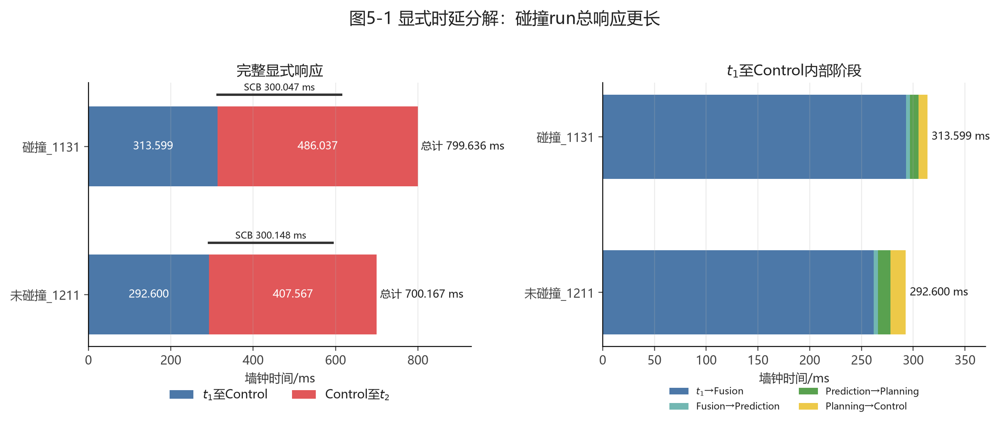

图5-1显示，碰撞_1131的前段和后段均更长，其中Control至 $t_2$ 是总响应差的主要组成部分。

### 5.3 显式时延差进一步形成不利的 $t_2$ 车辆状态

| 指标 | 碰撞_1131 | 未碰撞_1211 | 对碰撞风险的影响 |
|---|---:|---:|---|
| t1速度/(m/s) | 16.080 | 16.840 | 碰撞_1131初始速度低0.760 m/s |
| t1初始净距/m | 38.258 | 40.202 | 碰撞_1131初始净距少1.944 m |
| 响应阶段速度增量/(m/s) | 1.423 | 0.223 | 碰撞_1131响应阶段增速多1.200 m/s |
| 响应阶段行驶距离/m | 13.432 | 11.999 | 碰撞_1131响应阶段多行驶1.433 m |
| t2速度/(m/s) | 17.503 | 17.064 | 碰撞_1131开始有效减速时快0.439 m/s |
| t2剩余净距/m | 24.826 | 28.203 | 碰撞_1131开始有效减速时少3.376 m |

碰撞_1131虽然 $t_1$ 速度更低，但初始净距已经少1.944 m；其显式响应又长99.469 ms，响应阶段实际多行驶1.433 m。因此到 $t_2$ 时，两组剩余净距差扩大为：

$$
\begin{aligned}
\Delta D_{2}
&=
D_{2}^{1211}-D_{2}^{1131}\\
&=
28.203-24.826\\
&=
3.376\ \mathrm{m}.
\end{aligned}
$$

同时，碰撞_1131在响应阶段增速更多，导致其 $t_2$ 速度反而高0.439 m/s。为了表示相同空间在当前速度下对应的时间预算，定义：

$$
T_{\mathrm{budget},2}
=
\frac{D_{2,\mathrm{clear,wall}}}{v_2}.
$$

该量只用于比较 $t_2$ 时的等效物理预算，不是恒速碰撞预测。两组实际结果为：

$$
T_{\mathrm{budget},2}^{1131}
=
\frac{24.826}{17.503}
=
1.418\ \mathrm{s},
$$

$$
T_{\mathrm{budget},2}^{1211}
=
\frac{28.203}{17.064}
=
1.653\ \mathrm{s}.
$$

因此，碰撞_1131到达 $t_2$ 时的等效剩余时间预算少：

$$
1.653-1.418
=
0.234\ \mathrm{s}.
$$

这约234.4 ms不是额外的软件计时段，而是“剩余净距更小、当前车速更高”共同形成的车速隐形deadline差异。

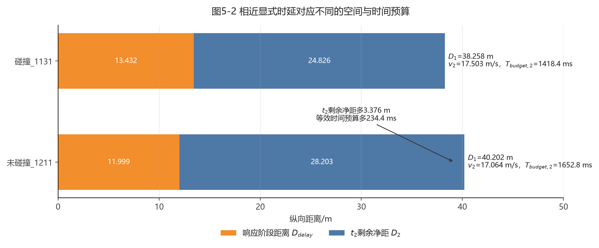

图5-2显示，碰撞_1131的初始净距更小，响应阶段又消耗更多距离，最终在 $t_2$ 时形成3.376 m的空间劣势和234.4 ms的等效时间预算劣势。

### 5.4 $t_2$ 后的实际降速过程继续拉开差距

达到车速阈值 $u$ 的时间定义为：

$$
T_{\leq u}
=
t\!\left(v\leq u\right)-t_2.
$$

该指标完全由Localization实际速度序列计算。

| 速度阈值 | 碰撞_1131/ms | 未碰撞_1211/ms | 碰撞_1131晚/ms |
|---|---:|---:|---:|
| 不高于15 m/s | 699.559 | 599.459 | 100.100 |
| 不高于12 m/s | 1399.698 | 1205.584 | 194.114 |
| 不高于10 m/s | 1699.762 | 1600.197 | 99.565 |
| 不高于8 m/s | 2018.780 | 1899.618 | 119.162 |

碰撞_1131达到四个共同速度阈值均更晚，说明首次持续有效减速以后，其降到相同车速仍需更多墙钟时间。固定比较 $t_2$ 后相同时间点，可得到：

| t2后时间/s | 1131速度/(m/s) | 1211速度/(m/s) | 1131累计行驶/m | 1211累计行驶/m |
|---:|---:|---:|---:|---:|
| 0.5 | 15.645 | 15.145 | 8.305 | 8.058 |
| 1.0 | 13.479 | 12.803 | 15.651 | 15.113 |
| 1.5 | 11.233 | 10.679 | 21.796 | 20.970 |
| 2.0 | 8.075 | 7.374 | 26.636 | 25.357 |

到 $t_2$ 后2.0 s，碰撞_1131速度仍高0.702 m/s，并多行驶1.279 m。加上 $t_2$ 时已有的3.376 m剩余净距差，两组相对空间预算差达到：

$$
\Delta D_{\mathrm{relative},2\mathrm{s}}
=
3.376+1.279
=
4.655\ \mathrm{m}.
$$

在碰撞_1131发生碰撞的 $t_2+2.107$ s时，未碰撞_1211实际速度为6.941 m/s，按同一墙钟积分口径仍有2.073 m剩余距离；碰撞_1131则以7.988 m/s发生碰撞。

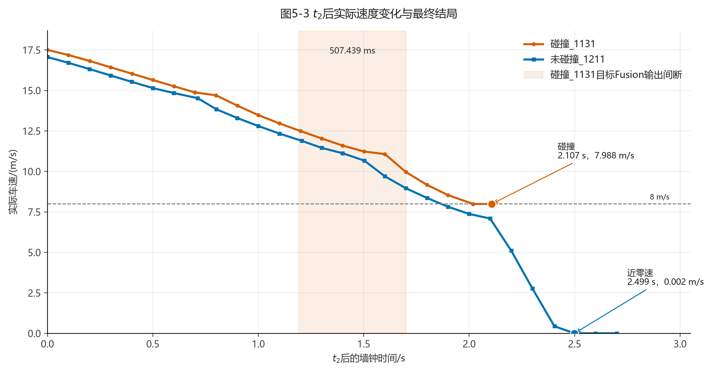

图5-3显示未碰撞_1211的速度曲线总体位于碰撞_1131下方，并继续降至近零；阴影标出了碰撞_1131制动阶段的507.439 ms目标Fusion输出间断。

### 5.5 统一空间中的ST轨迹

为将两组run放入同一空间中比较，把各自基于稳定Fusion目标和固定几何偏移得到的障碍物分析参考边界平移到：

$$
S_{\mathrm{obs}}=0.
$$

各组以自己的 $t_1$ 为时间零点，纵向位置定义为：

$$
S_r(t)
=
-D_{1,r}
+
\int_{t_{1,r}}^{t}
v_r(\tau)\,\mathrm{d}\tau_{\mathrm{wall}}.
$$

其中 $S_r(t)<0$ 表示尚未到达分析参考边界，$S_r(t)>0$ 表示越过分析参考边界，但不等同于CARLA已经发生物理碰撞。ST曲线斜率满足：

$$
\frac{\mathrm{d}S_r}{\mathrm{d}t}=v_r(t).
$$

| ST关键点 | 碰撞_1131 | 未碰撞_1211 |
|---|---:|---:|
| t1位置 | 0.000 s，-38.258 m | 0.000 s，-40.202 m |
| t2位置 | 0.800 s，-24.826 m | 0.700 s，-28.203 m |
| 1131碰撞的同一相对时刻 | 2.907 s，2.322 m，碰撞 | 2.907 s，-1.481 m，未碰撞 |
| 最终端点 | 2.907 s，2.322 m，碰撞 | 3.400 s，-0.932 m，近零速 |

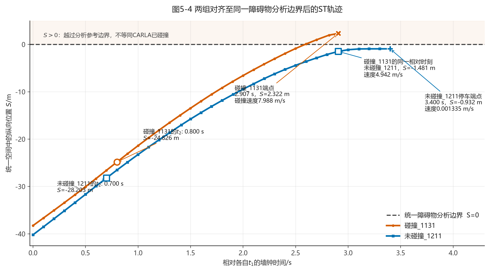

图5-4给出三条直接证据：

1. 碰撞_1131在 $t_1$ 时已经比未碰撞_1211靠近统一分析边界1.944 m。
2. 到各自 $t_2$ 时，碰撞_1131的空间劣势扩大到3.376 m。
3. 在碰撞_1131碰撞的同一相对 $t_1$ 时刻，两组位置相差：

   $$
   2.322-(-1.481)
   =
   3.803\ \mathrm{m}.
   $$

   此时碰撞_1131碰撞速度为7.988 m/s，未碰撞_1211仍位于分析边界前1.481 m，速度已经降到4.942 m/s。随后未碰撞_1211继续减速，并在3.400 s时以0.001335 m/s达到近零速端点。

$S=0$由Apollo Fusion目标中心、纵向投影和固定几何偏移构造，只用于两组相对位置与斜率比较，不是CARLA物理包围盒的精确接触平面。因此，1131端点的 $S=2.322$ m不能解释为真实穿透深度；碰撞结局仍以CARLA CollisionSensor为准。

### 5.6 制动阶段目标Fusion输出连续性

| 连续性证据 | 碰撞_1131 | 未碰撞_1211 |
|---|---:|---:|
| 目标ID切换次数 | 0 | 0 |
| 目标Fusion输出最大间隔/ms | 507.439 | 188.254 |
| 超过500 ms的目标输出间断次数 | 1 | 0 |
| Fusion生命周期最大值/ms | 705.892 | 453.313 |
| Fusion生命周期超过500 ms次数 | 2 | 0 |
| 最大输出间隔内车辆实际行驶/m | 5.810 | 1.159 |

碰撞_1131的507.439 ms目标输出间断发生在 $t_2$ 后1.192–1.700 s之间。该区间内车辆实际继续行驶5.810 m，间断结束后约0.407 s发生碰撞。未碰撞_1211也存在188.254 ms的最大间隔，但明显短于1131，且没有超过500 ms的目标输出间断或Fusion生命周期事件。

这说明碰撞_1131在制动关键段存在更严重的目标更新连续性退化。它没有使车辆完全停止减速，因此不能把507.439 ms直接解释为“控制失效”；但车辆以较高速度接近障碍物时，较长的Fusion输出空窗减少了获得新目标状态并更新后续规划的机会，是碰撞风险的实际贡献因素。

Planning fallback计数不支持“fallback更多导致碰撞”的解释：碰撞_1131的速度fallback和primal infeasible计数分别为20次和30次，未碰撞_1211反而分别为27次和44次，但后者完成停车。因此，fallback计数本身不是两组结局差异的决定因素。

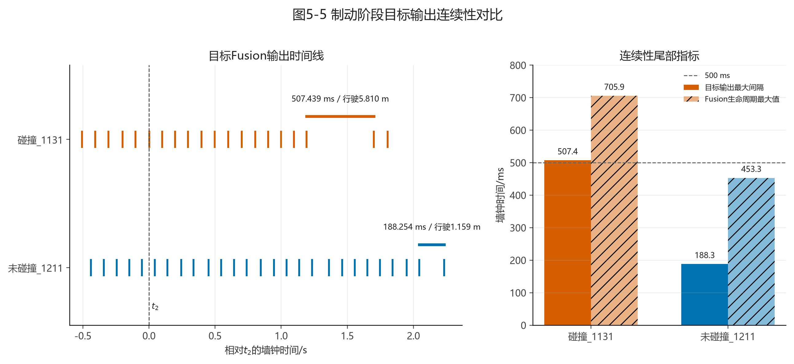

### 5.7 最终结局与碰撞原因

| 事件 | 碰撞_1131 | 未碰撞_1211 |
|---|---:|---:|
| t2速度 | 17.503 m/s | 17.064 m/s |
| 降到8 m/s附近 | t2后2.019 s | t2后1.900 s |
| 降到5 m/s以下 | 碰撞前未达到 | t2后2.300 s |
| 首次低于0.1 m/s | 碰撞前未达到 | t2后2.499 s |
| 最终端点 | t2后2.107 s发生碰撞 | t2后2.699 s达到最低速度 |
| 最终速度 | 碰撞速度7.988 m/s | 0.001335 m/s，近似为0 |

证据链可归纳为：

1. 两组SCB实际执行时延只差0.101 ms，碰撞不能归因于碰撞_1131被注入了更长的Bridge固定时延。
2. 碰撞_1131的总显式响应实际长99.469 ms，其中 $t_1$ 至Control长20.999 ms、Control至 $t_2$ 长78.470 ms。该显式差异使车辆在开始有效减速前多消耗距离。
3. 碰撞_1131初始净距已经少1.944 m，响应阶段又多行驶1.433 m并增速更多；到 $t_2$ 时形成“剩余净距少3.376 m、速度高0.439 m/s”的不利状态，等效时间预算少234.4 ms。
4. 在 $t_2$ 后，碰撞_1131降到相同速度阈值普遍更晚。到碰撞同一相对时刻，未碰撞_1211仍位于ST分析边界前1.481 m且速度已降到4.942 m/s。
5. 碰撞_1131在制动关键段还出现507.439 ms目标Fusion输出间断，明显长于未碰撞_1211的188.254 ms。该退化不是制动完全中断的证据，但进一步削弱了临近目标阶段的闭环更新连续性。
6. 最终碰撞_1131在尚有7.988 m/s速度时到达CARLA物理碰撞边界；未碰撞_1211凭借更早的有效减速、更大的空间和时间预算以及更连续的目标更新，继续减速至近似零速。

因此，本组对照支持的碰撞原因是多因素叠加：碰撞_1131并非Bridge注入时延更长，而是初始净距更小、实际闭环响应更长、到 $t_2$ 时的车速隐形deadline预算更少、后续降速更慢，并伴随更严重的Fusion输出间断。Fusion连续性退化是有时间和距离证据支持的风险贡献项，但不能单独认定为唯一碰撞原因。


## 第六章 碰撞_1643与未碰撞_1211碰撞差异分析

### 6.1 对照范围与结局

碰撞_1643和未碰撞_1211均属于300 ms组，使用相同的560,000点点云配置、`lidar_detection` DAG输入队列长度1、Town04场景、车辆类型、静止障碍车和Bridge时延设置。两组直接结局为：

- 碰撞_1643发生CARLA碰撞，碰撞速度为11.728 m/s；
- 未碰撞_1211未记录CARLA碰撞event，在 $t_2$ 后2.699 s达到最低速度0.001335 m/s，可以视为已经停车。

本章按照第五章的分析顺序，依次比较显式响应时延、$t_2$ 时的车辆状态和空间预算、$t_2$ 后的实际速度下降过程、统一空间中的ST轨迹、目标Fusion输出连续性与数据新鲜度，最后给出碰撞因果链。全部距离和速度均由实际记录计算，不使用制动模型预测值。

### 6.2 显式响应本身已经明显不同

两组显式时延分解如下，差值统一按“碰撞_1643减未碰撞_1211”计算。

| 显式阶段 | 碰撞_1643/ms | 未碰撞_1211/ms | 差值/ms |
|---|---:|---:|---:|
| 目标源时刻至Fusion输出 | 319.285 | 261.787 | 57.498 |
| Fusion至Prediction | 6.691 | 4.142 | 2.549 |
| Prediction至Planning STOP | 8.633 | 11.957 | -3.324 |
| Planning STOP至Control | 18.005 | 14.714 | 3.291 |
| t1至Control制动命令 | 352.614 | 292.600 | 60.014 |
| SCB实际首条执行时延 | 300.100 | 300.148 | -0.048 |
| Control制动命令至t2 | 541.256 | 407.567 | 133.689 |
| t1至t2实际闭环响应 | 893.870 | 700.167 | 193.703 |

碰撞_1643从 $t_1$ 到Control制动命令晚60.014 ms，从Control制动命令到 $t_2$ 又晚133.689 ms，因此总显式响应多：

$$
\Delta T_{\mathrm{e2e}}
=
60.014+133.689
=
193.703\ \mathrm{ms}.
$$

两组SCB实际首条执行时延只差0.048 ms，均完整执行3个仿真帧的300 ms设置；首条制动比例分别为20.281%和20.099%，也处于同一量级。因此，193.703 ms差异不能归因于Bridge固定时延配置不同。

将Control至 $t_2$ 的时间扣除SCB实际执行时延，只用于查看固定注入段以外的剩余时间：

$$
T_{\mathrm{control}\to t_2,\mathrm{res}}
=
T_{\mathrm{control}\to t_2}
-T_{\mathrm{SCB}}.
$$

两组分别为：

$$
\begin{aligned}
T_{\mathrm{control}\to t_2,\mathrm{res}}^{1643}
&=
541.256-300.100
=
241.156\ \mathrm{ms},\\
T_{\mathrm{control}\to t_2,\mathrm{res}}^{1211}
&=
407.567-300.148
=
107.419\ \mathrm{ms}.
\end{aligned}
$$

该剩余量同时包含命令作用、车辆动力学响应和Localization采样确认，不能再直接命名为某个软件模块时延。但它证明碰撞_1643的额外响应时间不仅出现在感知前段，也出现在Control命令发出后的有效减速形成阶段。

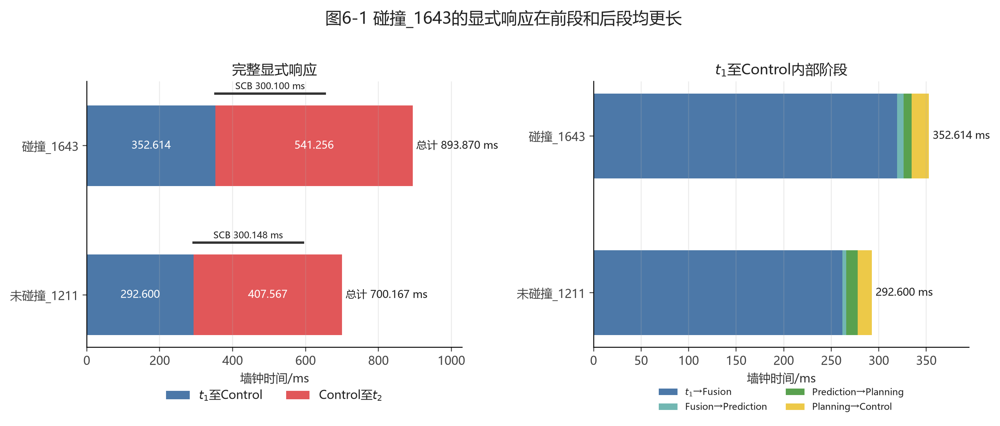

图6-1显示，碰撞_1643的 $t_1$ 至Control阶段和Control至 $t_2$ 阶段均更长，与第五章中两段差异相互抵消的情况不同。因此，本组碰撞首先具有明确的显式响应劣势。

### 6.3 更长响应形成了更不利的$t_2$车辆状态

| 指标 | 碰撞_1643 | 未碰撞_1211 | 对碰撞风险的影响 |
|---|---:|---:|---|
| t1速度/(m/s) | 16.070 | 16.840 | 碰撞_1643初始速度反而低0.770 m/s |
| t1初始净距/m | 36.651 | 40.202 | 碰撞_1643初始净距少3.551 m |
| t1至t2响应/ms | 893.870 | 700.167 | 碰撞_1643多193.703 ms |
| 响应阶段平均速度/(m/s) | 17.285 | 17.138 | 碰撞_1643平均速度高0.147 m/s |
| 响应阶段速度增量/(m/s) | 1.894 | 0.223 | 碰撞_1643增速多1.671 m/s |
| 响应阶段行驶距离/m | 15.451 | 11.999 | 碰撞_1643多行驶3.451 m |
| t2速度/(m/s) | 17.964 | 17.064 | 碰撞_1643开始有效减速时快0.901 m/s |
| t2剩余净距/m | 21.201 | 28.203 | 碰撞_1643开始有效减速时少7.002 m |

碰撞_1643在 $t_1$ 时已经少3.551 m初始净距，随后又因响应更长而多行驶3.451 m。因此，到 $t_2$ 时的剩余净距差扩大为：

$$
\begin{aligned}
D_2^{1211}-D_2^{1643}
&=
\left(D_1^{1211}-D_1^{1643}\right)
+
\left(D_{\mathrm{delay}}^{1643}-D_{\mathrm{delay}}^{1211}\right)\\
&=
3.551+3.451\\
&=
7.002\ \mathrm{m}.
\end{aligned}
$$

同时，碰撞_1643在响应阶段增加1.894 m/s，到 $t_2$ 时速度比未碰撞_1211高0.901 m/s。按第五章相同定义计算：

$$
T_{\mathrm{budget},2}
=
\frac{D_{2,\mathrm{clear,wall}}}{v_2}.
$$

两组结果为：

$$
\begin{aligned}
T_{\mathrm{budget},2}^{1643}
&=
\frac{21.201}{17.964}
=
1.180\ \mathrm{s},\\
T_{\mathrm{budget},2}^{1211}
&=
\frac{28.203}{17.064}
=
1.653\ \mathrm{s}.
\end{aligned}
$$

碰撞_1643到达 $t_2$ 时的等效剩余时间预算少：

$$
1.653-1.180
=
0.473\ \mathrm{s}.
$$

这472.6 ms不是新增的软件模块时延，而是“剩余距离更小且车速更高”形成的车速隐形deadline差异。它说明碰撞_1643在首次持续有效减速刚被观测到时，已经比未碰撞_1211更接近物理截止边界。

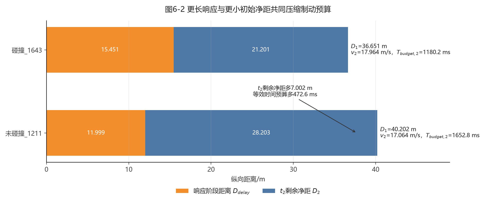

图6-2按统一口径将初始净距拆成响应阶段行驶距离和 $t_2$ 剩余净距。碰撞_1643同时受到初始净距较小和响应阶段行驶距离较大的双重压缩。

### 6.4 $t_2$后速度下降仍然更晚

采用与第五章相同的实际速度阈值定义：

$$
T_{\leq u}
=
t\!\left(v\leq u\right)-t_2.
$$

| 速度阈值 | 碰撞_1643/ms | 未碰撞_1211/ms | 碰撞_1643晚/ms |
|---|---:|---:|---:|
| 不高于15 m/s | 899.494 | 599.459 | 300.035 |
| 不高于12 m/s | 1499.784 | 1205.584 | 294.200 |
| 不高于10 m/s | 碰撞前未达到 | 1600.197 | 不可计算 |
| 不高于8 m/s | 碰撞前未达到 | 1899.618 | 不可计算 |

碰撞_1643达到15 m/s和12 m/s两个共同阈值均晚约0.30 s；发生碰撞前仍未降到10 m/s以下。固定比较 $t_2$ 后相同时间点，结果如下。

| t2后时间/s | 1643速度/(m/s) | 1211速度/(m/s) | 1643累计行驶/m | 1211累计行驶/m |
|---:|---:|---:|---:|---:|
| 0.5 | 16.249 | 15.145 | 8.631 | 8.058 |
| 1.0 | 14.256 | 12.803 | 16.263 | 15.113 |
| 1.5 | 11.706 | 10.679 | 22.718 | 20.970 |

到 $t_2$ 后1.5 s，碰撞_1643速度仍高1.027 m/s，并多行驶1.748 m。叠加其在 $t_2$ 时已经少7.002 m的剩余净距，两组相对空间预算差扩大为：

$$
\Delta D_{\mathrm{relative},1.5\mathrm{s}}
=
7.002+1.748
=
8.750\ \mathrm{m}.
$$

碰撞_1643在 $t_2$ 后1.599 s发生碰撞。到同一相对时刻：

| 同一相对时刻 | 碰撞_1643 | 未碰撞_1211 |
|---|---:|---:|
| 车辆状态 | 已发生碰撞 | 未发生碰撞 |
| 实际速度/(m/s) | 碰撞速度11.728 | 9.707 |
| t2后累计行驶/m | 23.378 | 21.983 |
| t2初始剩余净距/m | 21.201 | 28.203 |

按相同墙钟速度积分口径，碰撞_1643在该时刻的相对空间预算劣势为：

$$
\Delta D_{\mathrm{relative},1.599\mathrm{s}}
=
7.002
+
\left(23.378-21.983\right)
=
8.397\ \mathrm{m}.
$$

此时未碰撞_1211按同一纵向预算仍保留：

$$
28.203-21.983
=
6.219\ \mathrm{m}.
$$

其后实际还行驶：

$$
27.185-21.983
=
5.201\ \mathrm{m}
$$

便降到最低速度，最终留下第四章计算的1.018 m实际0 m余量。也就是说，未碰撞_1211在碰撞_1643发生碰撞的同一相对时刻仍有足够空间完成剩余制动，而碰撞_1643已经以11.728 m/s到达CARLA物理碰撞边界。

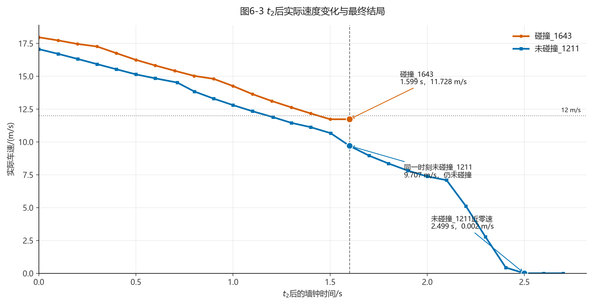

图6-3显示碰撞_1643从 $t_2$ 开始就具有更高速度，并在整个可比较区间保持更高车速；未碰撞_1211在相同1.599 s时刻尚未碰撞，随后继续降低到近零速。

### 6.5 统一空间中的ST轨迹

为将两组车辆轨迹放入同一个空间坐标中比较，本节把各自基于稳定Fusion目标和固定几何偏移得到的障碍物参考边界平移到同一位置：

$$
S_{\mathrm{obs}}=0.
$$

各run均以自己的 $t_1$ 为时间零点，车辆在统一空间中的纵向位置定义为：

$$
S_r(t)
=
-D_{1,r}
+
\int_{t_{1,r}}^{t}
v_r(\tau)\,\mathrm{d}\tau_{\mathrm{wall}}.
$$

其中：

- $S_r(t)<0$ 表示车辆尚未到达统一障碍物参考边界；
- $S_r(t)=0$ 表示车辆到达该分析边界；
- $S_r(t)>0$ 表示车辆已经越过该分析边界；
- ST曲线斜率满足

  $$
  \frac{\mathrm{d}S_r}{\mathrm{d}t}=v_r(t),
  $$

  因此曲线越陡表示实际车速越高，逐渐变平表示车辆正在减速。

该坐标对两组均使用实际Localization速度和墙钟时间梯形积分，不使用CARLA仿真帧数或模型预测距离。

| ST关键点 | 碰撞_1643 | 未碰撞_1211 |
|---|---:|---:|
| t1位置 | 0.000 s，-36.651 m | 0.000 s，-40.202 m |
| t2位置 | 0.894 s，-21.201 m | 0.700 s，-28.203 m |
| 最终端点 | 2.493 s，2.177 m，发生碰撞 | 3.400 s，-0.932 m，停车 |

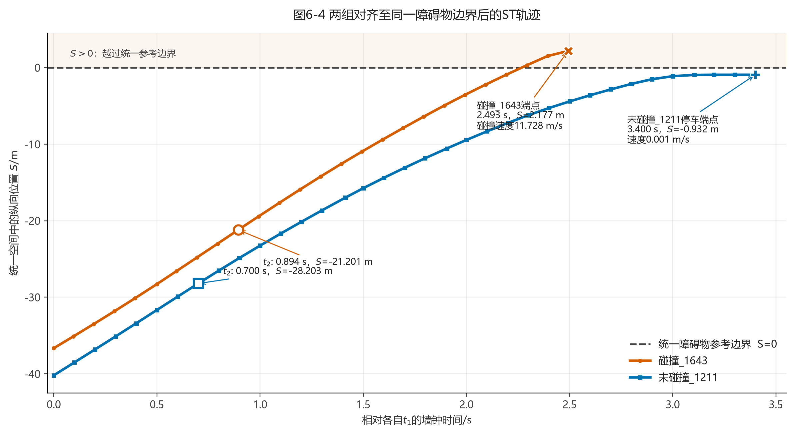

图6-4直观显示：

1. 碰撞_1643在 $t_1$ 时已经比未碰撞_1211靠近统一障碍物边界3.551 m。
2. 到 $t_2$ 时，两条曲线的空间差扩大到7.002 m；同时碰撞_1643的ST曲线斜率更大，对应其17.964 m/s的较高车速。
3. $t_2$ 后碰撞_1643仍保持更陡的轨迹，最终越过 $S=0$ 分析边界并发生碰撞。
4. 未碰撞_1211在接近 $S=0$ 前曲线逐渐变平，最终停止在 $S=-0.932$ m，没有越过统一参考边界。

这里的 $S=0$ 使用Apollo Fusion目标中心和固定5.3074 m组合几何偏移构造，是用于两组对齐的分析参考边界，不是CARLA物理包围盒的精确接触平面。因此，碰撞_1643碰撞端点显示为 $S=2.177$ m，不应解释为车辆发生了2.177 m的真实物理穿透。未碰撞_1211的ST停车位置为-0.932 m，而第四章0 m余量为1.018 m，两者相差0.086 m，是因为ST位置连续使用墙钟速度路径积分，第四章制动距离使用Localization纵向位移；图内两组始终采用同一ST口径。

### 6.6 Fusion没有出现第五章同类型长间断，但数据新鲜度更差

为避免把“输出间断”和“数据较旧”混为一谈，本节分别计算：

1. 相邻目标Fusion输出的墙钟间隔；
2. 单条目标输出从传感器观测时刻到Fusion输出时刻的生命周期；
3. 在碰撞_1643碰撞时刻，最近一次已输出目标所对应源观测的年龄。

目标Fusion生命周期定义为：

$$
T_{\mathrm{fusion,life}}
=
T_{\mathrm{Fusion,out}}
-T_{\mathrm{sensor,obs}}.
$$

两组使用相同的比较终点，即各自 $t_2$ 后1.599 s。

| Fusion时序证据 | 碰撞_1643 | 未碰撞_1211 |
|---|---:|---:|
| 目标ID切换次数 | 0 | 0 |
| 相同时间窗最大连续输出间隔/ms | 115.906 | 129.318 |
| 全run目标输出最大间隔/ms | 115.906 | 188.254 |
| 全run异常目标输出间断次数 | 0 | 1 |
| 相同时间窗目标生命周期中位数/ms | 305.700 | 245.832 |
| 相同时间窗目标生命周期P90/ms | 319.389 | 257.562 |
| 全run Fusion生命周期最大值/ms | 476.769 | 453.313 |
| 全run Fusion生命周期超过500 ms次数 | 0 | 0 |
| 时间窗末最近目标输出年龄/ms | 298.399 | 42.526 |
| 时间窗末最近源观测年龄/ms | 599.668 | 299.269 |
| 最近目标输出后车辆行驶/m | 3.083 | 0.422 |

从输出节拍看，碰撞_1643没有出现碰撞_1131中507.439 ms的相邻目标输出长间断；其全run最大连续输出间隔仅115.906 ms，甚至小于未碰撞的未碰撞_1211。因此，不能把本次碰撞解释为“Fusion输出发生了与前一碰撞run相同的长时间断流”。

但碰撞_1643的目标数据持续更旧。相同时间窗内，其目标生命周期中位数比未碰撞_1211多：

$$
305.700-245.832
=
59.868\ \mathrm{ms}.
$$

这与6.2节中目标源时刻至Fusion输出多57.498 ms的结果相互印证，说明碰撞_1643的Fusion目标输出虽然连续，但每条输出携带的传感器状态整体更滞后。

此外，碰撞_1643最后一次目标Fusion输出位于 $t_2$ 后1.301 s，之后298.399 ms发生碰撞；该输出对应的源观测时刻约为 $t_2$ 后1.000 s。因此碰撞时最近可用源观测的年龄为599.668 ms，期间车辆又行驶3.083 m。未碰撞_1211在相同相对时刻的最近源观测年龄为299.269 ms。

这里的599.668 ms是“碰撞时最近源数据的年龄”，不是一个已经由后续输出闭合确认的599.668 ms Fusion输出间隔。它证明末段目标数据新鲜度下降，可能减少临近碰撞阶段的闭环更新机会，但不能单独证明Fusion功能失效或制动命令中断。

Planning计数也不支持“碰撞_1643因fallback更多而碰撞”的解释：碰撞_1643的`primal infeasible`和速度fallback分别为40次和21次，而未碰撞的未碰撞_1211分别为44次和27次。

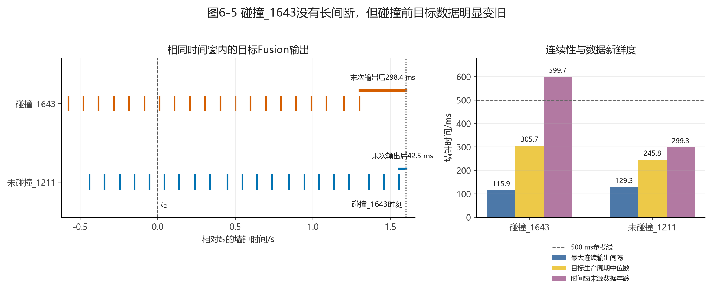

图6-5左侧显示两组在相同时间窗的大部分时段均保持规律目标输出，碰撞_1643主要问题是最后一次输出距离碰撞更久；右侧显示其目标生命周期和时间窗末源数据年龄明显更大。

### 6.7 最终碰撞原因的证据链

两组从 $t_1$ 到最终结局的关键证据可以整理为：

1. **显式响应更长。** 碰撞_1643的实际闭环响应为893.870 ms，比未碰撞_1211多193.703 ms；其中 $t_1$ 至Control多60.014 ms，Control至 $t_2$ 多133.689 ms。
2. **Bridge固定时延不是差异来源。** 两组SCB实际执行分别为300.100 ms和300.148 ms，均为3帧，差异只有0.048 ms。
3. **初始空间条件更差。** 碰撞_1643在 $t_1$ 时初始净距少3.551 m。
4. **响应阶段又消耗更多空间。** 碰撞_1643多行驶3.451 m，并从16.070 m/s增至17.964 m/s；到 $t_2$ 时已经形成“剩余净距少7.002 m、速度高0.901 m/s”的不利状态。
5. **车速隐形deadline明显更紧。** 碰撞_1643的 $t_2$ 等效剩余时间预算只有1.180 s，比未碰撞_1211少472.6 ms。
6. **后续速度下降仍更晚。** 碰撞_1643达到15 m/s和12 m/s均晚约0.30 s；到 $t_2$ 后1.5 s时，相对空间预算劣势已扩大到8.750 m。
7. **Fusion不是第五章同类型的长断流。** 碰撞_1643最大相邻目标输出间隔为115.906 ms，没有异常间断；但目标生命周期整体约多60 ms，碰撞时最近源观测已经约600 ms旧，构成次要的末段时序不利证据。
8. **最终物理预算不足。** 碰撞_1643在 $t_2$ 后1.599 s以11.728 m/s发生碰撞；同一时刻未碰撞_1211仍有约6.219 m纵向预算，并用其后5.201 m实际行驶距离完成停车。

因此，本对照支持的主要结论是：碰撞_1643的碰撞首先由更长的显式闭环响应和更小的初始净距共同造成，二者使车辆在 $t_2$ 时已经少7.002 m空间、快0.901 m/s，车速隐形deadline比未碰撞_1211紧约472.6 ms；随后更晚的速度下降继续扩大空间劣势，最终以11.728 m/s发生碰撞。Fusion没有出现碰撞_1131式的长时间输出间断，不能作为本次碰撞的首要单因，但持续较大的目标数据年龄及碰撞前末段新鲜度下降可能进一步放大了临近边界时的闭环风险。

## 第七章 Baseline与碰撞run的数据对比

### 7.1 分析目的与数据范围

本章将baseline组与两组碰撞run进行对比，分析端到端响应时间增加如何转化为现实车辆的速度变化、响应距离债务、有效制动位置和碰撞结局。

本章纳入：

- baseline组：7个未碰撞run；
- 碰撞run：碰撞_1131、碰撞_1643；
- 过渡对照：202607271202、未碰撞_1211；
- 202607271206的数据状态存在异常，继续排除。

分析按照以下证据链展开：

$$
\text{端到端响应时间}
\rightarrow
\text{响应阶段行驶距离}
\rightarrow
t_2\text{时速度与剩余空间}
\rightarrow
\text{制动过程}
\rightarrow
\text{停车或碰撞结局}.
$$

实际观测结果来自本次实验的Apollo日志、Localization日志和CARLA CollisionSensor记录。时延恢复后的碰撞判断单独标记为模型计算结果。

### 7.2 轨迹分析补充口径

#### 7.2.1 轨迹终点

本章VT和ST图采用统一的轨迹终点规则：

- 未碰撞run：$t_2$ 后首次满足 $v<0.1\ \mathrm{m/s}$ 的Localization样本；
- 碰撞run：CARLA CollisionSensor记录的碰撞时刻。

未碰撞轨迹在首次近零速端点结束，避免停车后的重新起步过程进入当前制动轨迹。

该终点用于本章轨迹截取。第四章的 $D_{\mathrm{brake,data}}$ 继续沿用其已经定义的实际制动位移端点，两个字段分别保存。

#### 7.2.2 ST坐标

将每个run在 $t_1$ 时的位置统一平移到：

$$
S(t_1)=-D_{1,\mathrm{clear}}.
$$

随后使用墙钟速度积分计算纵向位置：

$$
S(t)
=
-D_{1,\mathrm{clear}}
+
\int_{t_1}^{t}
v(\tau)\,\mathrm{d}\tau_{\mathrm{wall}}.
$$

其中 $S=0$ 为统一几何分析边界，实际碰撞结局由CARLA CollisionSensor确定。

### 7.3 Baseline与碰撞run的实际状态对比

#### 7.3.1 Baseline实际分布

7个baseline run全部未发生碰撞，其主要指标如下。

| Baseline指标 | 中位数 | 实际范围 |
|---|---:|---:|
| 实际响应时间/ms | 300.358 | 299.655–399.750 |
| t1速度/(m/s) | 17.215 | 15.623–17.775 |
| t2速度/(m/s) | 17.533 | 15.449–17.889 |
| t1初始净距/m | 38.817 | 38.744–40.155 |
| 响应距离/m | 5.284 | 4.673–7.006 |
| t2剩余净距/m | 33.490 | 31.848–35.218 |
| 首次近零速端点速度/(m/s) | 0.001541 | 0.000543–0.008093 |
| 碰撞次数 | 0 | 0/7 |

baseline实际响应集中在 $300\sim400\ \mathrm{ms}$。虽然各run的初始速度、初始净距和制动过程存在波动，7个run最终均降至 $0.1\ \mathrm{m/s}$ 以下。

#### 7.3.2 两组碰撞run

| 碰撞run | 响应/ms | t1速度/(m/s) | t2速度/(m/s) | t1初始净距/m | 响应距离/m | t2剩余净距/m | 碰撞速度/(m/s) |
|---|---:|---:|---:|---:|---:|---:|---:|
| 碰撞_1131 | 799.636 | 16.080 | 17.503 | 38.258 | 13.432 | 24.826 | 7.988 |
| 碰撞_1643 | 893.870 | 16.070 | 17.964 | 36.651 | 15.451 | 21.201 | 11.728 |

两组碰撞run在 $t_1$ 时的速度均低于baseline中位数。碰撞风险主要来自响应期间的速度增长和空间消耗。

碰撞_1643还具有更小的初始净距：

$$
36.651-38.817
=
-2.166\ \mathrm{m}.
$$

因此，该run从 $t_1$ 开始便比baseline中位状态少约2.166 m初始空间。

### 7.4 时延增加转化为响应距离债务

#### 7.4.1 相对baseline中位数的变化

| 对比指标 | 碰撞_1131相对baseline中位数 | 碰撞_1643相对baseline中位数 |
|---|---:|---:|
| 响应时间增加/ms | +499.278 | +593.512 |
| t1速度变化/(m/s) | -1.135 | -1.145 |
| t2速度变化/(m/s) | -0.030 | +0.431 |
| 初始净距变化/m | -0.559 | -2.166 |
| 响应距离增加/m | +8.148 | +10.166 |
| t2剩余净距变化/m | -8.663 | -12.289 |

碰撞_1131的响应时间比baseline中位数增加499.278 ms，响应阶段多行驶8.148 m。

碰撞_1643的响应时间比baseline中位数增加593.512 ms，响应阶段多行驶10.166 m。

时延增量对应的平均空间消耗分别为：

$$
\frac{8.148}{0.499278}
=
16.32\ \mathrm{m/s},
$$

$$
\frac{10.166}{0.593512}
=
17.13\ \mathrm{m/s}.
$$

这两个结果与车辆响应阶段的实际行驶速度一致，说明增加的数百毫秒响应时间已经直接转化为约 $8\sim10$ m的距离债务。

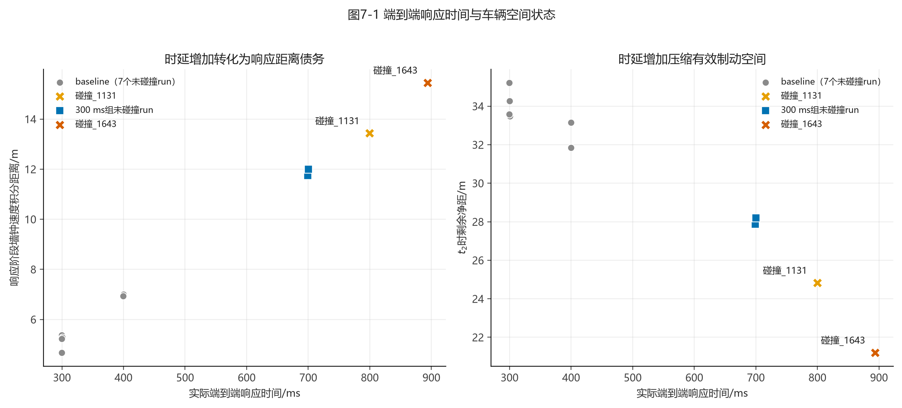

图7-1左图显示，baseline的响应距离集中在4.673–7.006 m，两组碰撞run分别达到13.432 m和15.451 m。

右图显示，baseline在 $t_2$ 时至少保留31.848 m净距，两组碰撞run只剩24.826 m和21.201 m。

#### 7.4.2 从baseline到碰撞的连续变化

| 数据类别 | 响应时间/ms | 响应距离/m | t2剩余净距/m | 实际0 m余量/m | 实际结局 |
|---|---:|---:|---:|---:|---|
| baseline范围 | 299.655–399.750 | 4.673–7.006 | 31.848–35.218 | 2.740–5.338 | 7/7未碰撞 |
| 202607271202 | 699.155 | 11.749 | 27.867 | 0.548 | 未碰撞 |
| 未碰撞_1211 | 700.167 | 11.999 | 28.203 | 1.018 | 未碰撞 |
| 碰撞_1131 | 799.636 | 13.432 | 24.826 | 不可用 | 7.988 m/s碰撞 |
| 碰撞_1643 | 893.870 | 15.451 | 21.201 | 不可用 | 11.728 m/s碰撞 |

实际数据呈现出连续的安全余量压缩过程：

1. baseline响应为300–400 ms，0 m余量为2.740–5.338 m；
2. 响应接近700 ms时，两组未碰撞run的0 m余量只剩0.548 m和1.018 m；
3. 响应增加到799.636 ms和893.870 ms后，两组run发生碰撞。

当前样本能够证明安全预算随响应时间增加持续收缩。具体碰撞边界还受到初始净距、$t_2$速度和后续制动能力共同影响。

### 7.5 VT轨迹：时延使速度下降整体后移

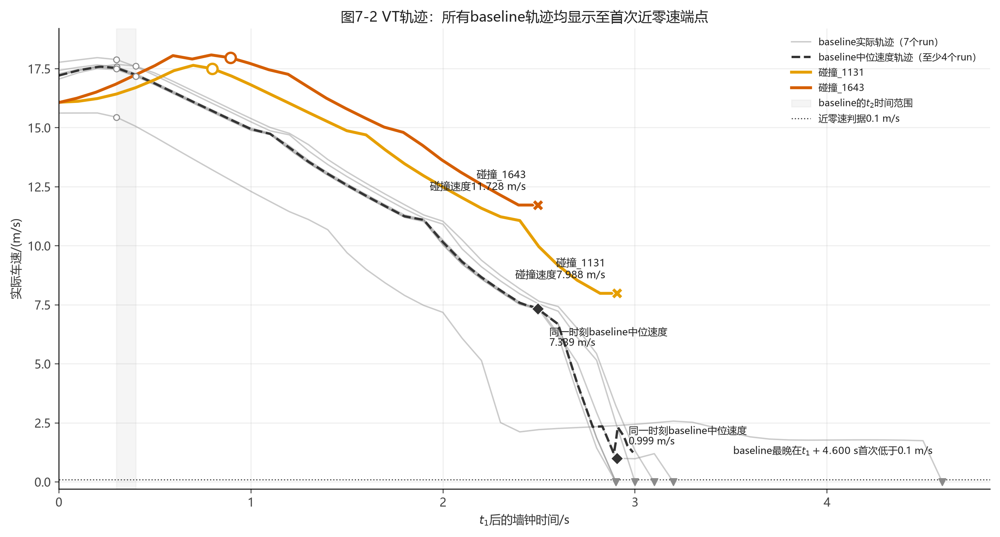

图7-2将所有run按照 $t_1$ 对齐。

baseline的 $t_2$ 位于 $t_1+0.300\sim0.400\ \mathrm{s}$，碰撞_1131和碰撞_1643的 $t_2$ 分别位于：

$$
t_1+0.800\ \mathrm{s},
$$

$$
t_1+0.894\ \mathrm{s}.
$$

两组碰撞run的整段速度下降过程向后移动约0.5–0.6 s。

#### 7.5.1 Baseline曲线终点说明

旧版图像将横轴截在 $t_1+3.65\ \mathrm{s}$。其中一条baseline曲线在该时刻仍为：

$$
v(t_1+3.65\ \mathrm{s})
=
1.863248\ \mathrm{m/s}.
$$

该曲线对应202607271031，其首次近零速端点实际发生在：

$$
t_{\mathrm{nearstop}}-t_1
=
4.599514\ \mathrm{s},
$$

端点实测速度为：

$$
v_{\mathrm{nearstop}}
=
0.008093\ \mathrm{m/s}.
$$

修正后的图像显示全部baseline轨迹直至首次近零速端点。7个baseline端点速度均低于 $0.1\ \mathrm{m/s}$。

#### 7.5.2 相同相对时刻的速度差异

| 碰撞事件时刻 | 碰撞run实际速度/(m/s) | 同一时刻baseline中位速度/(m/s) | 速度差/(m/s) |
|---|---:|---:|---:|
| 碰撞_1643：t1后2.493 s | 11.728 | 7.339 | +4.388 |
| 碰撞_1131：t1后2.907 s | 7.988 | 0.999 | +6.989 |

在碰撞_1643发生碰撞时，baseline车辆中位速度已经下降到7.339 m/s，碰撞_1643仍保持11.728 m/s。

在碰撞_1131发生碰撞时，baseline中位速度已经下降到0.999 m/s，碰撞_1131仍以7.988 m/s接触目标。

VT图说明，端到端响应时间增加使有效制动开始更晚，并使后续所有速度状态整体后移。

### 7.6 ST轨迹：距离债务压缩有效制动空间

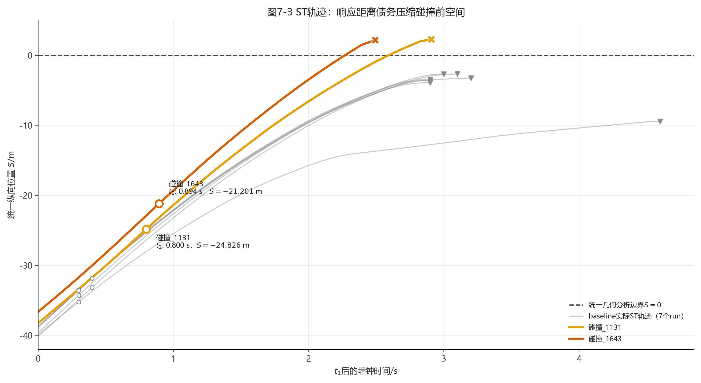

图7-3将所有run拉到统一空间中。每条轨迹在 $t_1$ 时从各自的实际初始净距开始，随后使用实际速度的墙钟积分向 $S=0$ 推进。

#### 7.6.1 $t_2$时的空间差异

| 空间指标 | Baseline中位数/m | 碰撞_1131/m | 碰撞_1643/m |
|---|---:|---:|---:|
| t1初始净距 | 38.817 | 38.258 | 36.651 |
| 响应距离 | 5.284 | 13.432 | 15.451 |
| t2剩余净距 | 33.490 | 24.826 | 21.201 |
| 相对baseline少保留空间 | 0 | 8.663 | 12.289 |

碰撞_1131在 $t_2$ 时比baseline中位状态少8.663 m有效制动空间。

碰撞_1643同时受到初始净距较小和响应距离较大的影响，在 $t_2$ 时比baseline中位状态少12.289 m有效制动空间。

#### 7.6.2 碰撞时刻的统一空间状态

| 碰撞事件 | 碰撞run位置S/m | 同一时刻baseline中位位置S/m | 碰撞run速度/(m/s) | Baseline中位速度/(m/s) |
|---|---:|---:|---:|---:|
| 碰撞_1643 | +2.177 | -5.398 | 11.728 | 7.339 |
| 碰撞_1131 | +2.322 | -3.495 | 7.988 | 0.999 |

碰撞run在CollisionSensor触发时的 $S$ 为正，来源是Fusion几何参考边界与CARLA实际接触位置之间的偏移。碰撞结局和碰撞速度继续以CollisionSensor记录为准。

在两个碰撞时刻，baseline中位轨迹仍位于统一分析边界前方，并且速度已经显著下降。

### 7.7 将碰撞run的响应恢复到baseline

#### 7.7.1 恢复方法

本节保留碰撞run实际采集到的初始状态和碰撞前制动能力，将端到端响应时间恢复到baseline水平。

baseline参考响应时间采用7个run的实际中位数：

$$
T_{\mathrm{base}}
=
300.358057\ \mathrm{ms}.
$$

恢复后的有效制动时刻定义为：

$$
t_2^*
=
t_1+T_{\mathrm{base}}.
$$

恢复时刻的速度直接读取碰撞run在该墙钟时刻实际记录的Localization速度：

$$
v_2^*
=
v_{\mathrm{obs}}(t_2^*).
$$

恢复后的响应距离为：

$$
D_{\mathrm{delay}}^*
=
\int_{t_1}^{t_2^*}
v_{\mathrm{obs}}(t)\,
\mathrm{d}t_{\mathrm{wall}}.
$$

收回的响应距离为：

$$
\Delta D_{\mathrm{recovered}}
=
D_{\mathrm{delay}}^{\mathrm{obs}}
-
D_{\mathrm{delay}}^*.
$$

#### 7.7.2 恢复后收回的响应距离

| 恢复输入与结果 | 碰撞_1131 | 碰撞_1643 |
|---|---:|---:|
| 实际响应时间/ms | 799.636 | 893.870 |
| Baseline参考响应/ms | 300.358 | 300.358 |
| 收回时间/ms | 499.278 | 593.512 |
| 恢复时刻实测速度/(m/s) | 16.431 | 16.862 |
| 实际响应距离/m | 13.432 | 15.451 |
| 恢复后响应距离/m | 4.867 | 4.932 |
| 收回响应距离/m | 8.565 | 10.519 |

碰撞_1131恢复到baseline中位响应后，响应距离由13.432 m降至4.867 m，收回：

$$
13.432-4.867
=
8.565\ \mathrm{m}.
$$

碰撞_1643恢复到baseline中位响应后，响应距离由15.451 m降至4.932 m，收回：

$$
15.451-4.932
=
10.519\ \mathrm{m}.
$$

这里的“相对baseline中位数多消耗距离”和“同一碰撞run恢复时延后收回距离”属于两个独立指标：

- 组间对比使用baseline组的实际距离中位数；
- 时延恢复使用碰撞run自身在前300.358 ms内的实际速度积分。

#### 7.7.3 制动能力标定与恢复结局

碰撞run从实际 $t_2$ 到实际接触位置的墙钟积分距离为：

$$
D_{2\rightarrow c}^{\mathrm{obs}}
=
\int_{t_2}^{t_c}
v_{\mathrm{obs}}(t)\,
\mathrm{d}t_{\mathrm{wall}}.
$$

使用实际 $v_2$、实际碰撞速度 $v_c$ 和实际制动距离计算等效减速度：

$$
a_{\mathrm{eq}}
=
\frac{v_2^2-v_c^2}
{2D_{2\rightarrow c}^{\mathrm{obs}}}.
$$

由于Fusion几何分析边界和CollisionSensor物理接触位置存在偏移，定义该run的实际接触修正量：

$$
C_{\mathrm{contact}}
=
D_{2\rightarrow c}^{\mathrm{obs}}
-
D_{2,\mathrm{clear}}^{\mathrm{obs}}.
$$

恢复后的实际接触位置可用距离为：

$$
D_{\mathrm{available}}^*
=
D_{1,\mathrm{clear}}
-
D_{\mathrm{delay}}^*
+
C_{\mathrm{contact}}.
$$

恢复时延后所需停车距离为：

$$
D_{\mathrm{stop}}^*
=
\frac{(v_2^*)^2}
{2a_{\mathrm{eq}}}.
$$

恢复后的接触余量为：

$$
M_{\mathrm{contact}}^*
=
D_{\mathrm{available}}^*
-
D_{\mathrm{stop}}^*.
$$

当

$$
M_{\mathrm{contact}}^*\geq0
$$

时，模型预测车辆能够在实际接触位置前停车。

当

$$
M_{\mathrm{contact}}^*<0
$$

时，模型预测车辆仍会发生碰撞。预测碰撞速度为：

$$
v_c^*
=
\sqrt{
(v_2^*)^2
-
2a_{\mathrm{eq}}
D_{\mathrm{available}}^*
}.
$$

| 恢复模型结果 | 碰撞_1131 | 碰撞_1643 |
|---|---:|---:|
| 接触位置修正量/m | 2.322 | 2.177 |
| 等效减速度/(m/s²) | 4.467 | 3.960 |
| 恢复后可用距离/m | 35.713 | 33.897 |
| 恢复后停车需求/m | 30.219 | 35.897 |
| 恢复后余量/m | +5.495 | -2.000 |
| 预测结局 | 不碰撞 | 碰撞 |
| 预测碰撞速度/(m/s) | 0 | 3.980 |

碰撞_1131恢复后具有：

$$
35.713-30.219
=
5.495\ \mathrm{m}
$$

接触余量。按照该run碰撞前实际制动能力计算，模型预测车辆能够避免碰撞。这说明响应阶段形成的距离债务对碰撞_1131的最终结局具有决定性作用。

碰撞_1643恢复后仍存在：

$$
33.897-35.897
=
-2.000\ \mathrm{m}
$$

接触余量。该run的初始净距只有36.651 m，等效减速度只有3.960 m/s²，恢复后的停车需求仍超过可用距离。模型预测其碰撞速度由实际11.728 m/s降至：

$$
v_c^*
=
3.980\ \mathrm{m/s}.
$$

因此，响应时延显著提高了碰撞_1643的碰撞风险和碰撞速度。该run初始净距较小，恢复后的可用距离仍未覆盖按照碰撞前有限区间标定得到的停车需求。

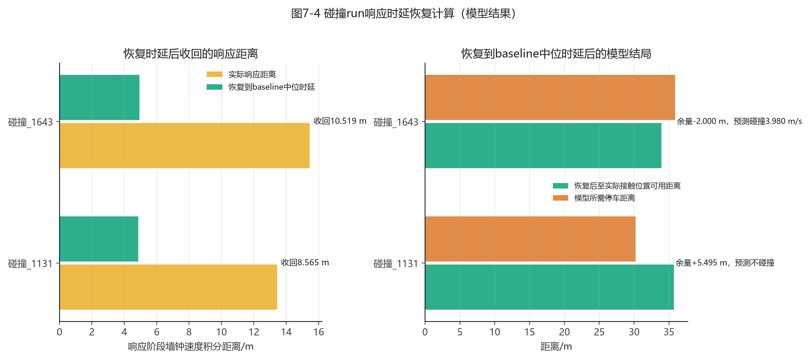

时延恢复属于反事实模型结果。其输入全部来自真实采集数据，最终结局仍需通过重新运行实验进行验证。

#### 7.7.4 统一截取$t_1$后前2 s的实际加速度复核

为避免baseline运行至近零速、碰撞run运行至碰撞事件造成统计终点不同，本节对全部9个run统一截取：

$$
\left[t_1,\ t_1+2.000\ \mathrm{s}\right].
$$

该窗口从目标稳定进入分析链的 $t_1$ 开始，包含响应形成阶段和随后已经发生的减速过程。所有run均具有完整的2.000 s实际Localization数据；碰撞_1131和碰撞_1643分别在 $t_1$ 后2.907 s和2.493 s发生碰撞，因此本节没有使用碰撞后的数据。

速度统一使用Localization三维速度模长：

$$
v_i
=
\sqrt{
v_{x,i}^2+v_{y,i}^2+v_{z,i}^2
}.
$$

相邻样本加速度直接按照墙钟时间差分，不进行平滑：

$$
a_i
=
\frac{v_{i+1}-v_i}
{t_{i+1}-t_i}.
$$

前2 s平均加速度按照相同端点定义计算：

$$
\bar a_{0\rightarrow2\mathrm{s}}
=
\frac{v(t_1+2.000\ \mathrm{s})-v(t_1)}
{2.000\ \mathrm{s}}.
$$

区间内最大加速度绝对值定义为：

$$
\left|a\right|_{\max,0\rightarrow2\mathrm{s}}
=
\max_i\left|a_i\right|.
$$

起点和终点速度均由相邻Localization样本按墙钟时间插值得到。下表全部使用上述统一口径。

| Run | t2相对t1/s | t1速度/(m/s) | t1后2 s速度/(m/s) | 2 s速度变化/(m/s) | 前2 s平均加速度/(m/s²) | 前2 s最大加速度绝对值/(m/s²) |
|---|---:|---:|---:|---:|---:|---:|
| baseline_1031 | 0.300 | 15.623 | 7.177 | -8.446 | -4.223 | 10.923 |
| baseline_1048 | 0.300 | 17.291 | 10.157 | -7.134 | -3.567 | 9.406 |
| baseline_1054 | 0.300 | 17.775 | 10.917 | -6.857 | -3.429 | 6.836 |
| baseline_1059 | 0.400 | 17.212 | 11.039 | -6.173 | -3.086 | 7.891 |
| baseline_1104 | 0.400 | 17.062 | 10.051 | -7.011 | -3.505 | 9.774 |
| baseline_1108 | 0.301 | 17.431 | 10.243 | -7.188 | -3.594 | 8.721 |
| baseline_1113 | 0.300 | 17.215 | 10.042 | -7.173 | -3.586 | 10.378 |
| 碰撞_1131 | 0.800 | 16.080 | 12.492 | -3.588 | -1.794 | 6.325 |
| 碰撞_1643 | 0.894 | 16.070 | 13.607 | -2.463 | -1.231 | 6.171 |

7个baseline在前2 s内的平均加速度中位数为：

$$
\operatorname{median}
\left(
\bar a_{0\rightarrow2\mathrm{s}}^{\mathrm{baseline}}
\right)
=
-3.567\ \mathrm{m/s^2},
$$

实际范围为 $-4.223$ 至 $-3.086\ \mathrm{m/s^2}$。碰撞_1131和碰撞_1643分别为 $-1.794$ 和 $-1.231\ \mathrm{m/s^2}$，其绝对值比baseline中位数分别小49.7%和65.5%。这表示从 $t_1$ 开始计时的相同2 s内，两组碰撞run完成的总体速度下降更少。

Baseline在 $t_1$ 后0.300–0.400 s到达 $t_2$；碰撞_1131和碰撞_1643分别到0.800 s和0.894 s才到达 $t_2$。因此，两组碰撞run在相同2 s窗口内分别少获得约0.499 s和0.594 s的持续有效减速时间。该时间差直接反映在速度端点上：

| 对比项 | Baseline中位数 | 碰撞_1131 | 碰撞_1643 |
|---|---:|---:|---:|
| t1速度/(m/s) | 17.215 | 16.080 | 16.070 |
| t1后2 s速度/(m/s) | 10.157 | 12.492 | 13.607 |
| 前2 s速度下降量/(m/s) | 7.134 | 3.588 | 2.463 |
| 前2 s平均加速度/(m/s²) | -3.567 | -1.794 | -1.231 |
| 前2 s最大加速度绝对值/(m/s²) | 9.406 | 6.325 | 6.171 |

两组碰撞run在 $t_1$ 时的速度均低于baseline中位数约1.14 m/s；到 $t_1+2.000$ s时，碰撞_1131和碰撞_1643的速度反而分别高出baseline中位数2.335 m/s和3.450 m/s。该反转说明响应形成较晚已经转化为可直接观测的速度债务。

最大加速度绝对值来自单个相邻Localization采样区间，对采样抖动较敏感。本节将其作为峰值诊断量；前2 s平均加速度和速度端点用于判断统一窗口内的总体减速结果。

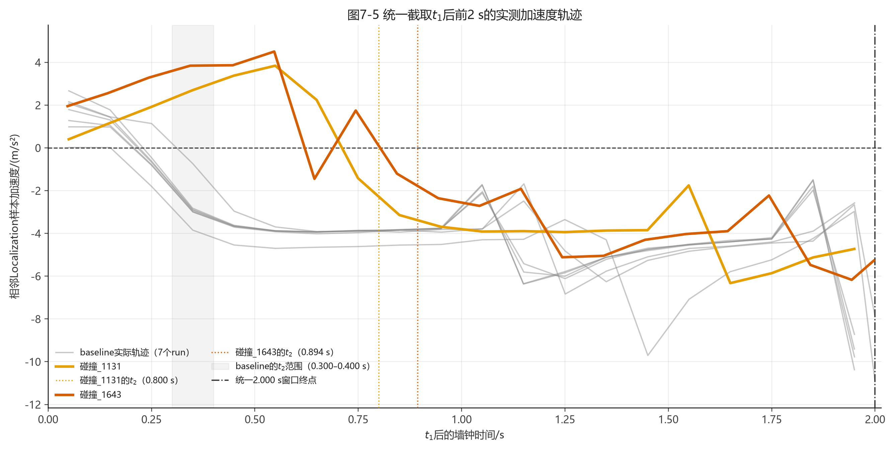

图7-5中的灰色阴影为baseline的 $t_2$ 范围，橙色和红色竖虚线分别为两组碰撞run的实际 $t_2$。Baseline曲线在约0.3–0.4 s后进入连续负加速度区间；两组碰撞曲线在更长时间内仍保持正加速度或接近零加速度，随后才进入持续减速。统一窗口统计表明，碰撞组较小的前2 s平均减速度主要由有效减速形成较晚造成，不能单独解释为制动执行机构在 $t_2$ 后的制动能力下降。

### 7.8 本章结论

1. baseline的实际响应时间为299.655–399.750 ms，7个run全部降至 $0.1\ \mathrm{m/s}$ 以下，未发生碰撞。
2. 碰撞_1131和碰撞_1643的实际响应时间分别增加到799.636 ms和893.870 ms。
3. 增加的响应时间分别形成13.432 m和15.451 m响应距离债务，比baseline中位数多消耗8.148 m和10.166 m。
4. 两组碰撞run在 $t_2$ 时只剩24.826 m和21.201 m净距，比baseline中位状态少8.663 m和12.289 m。
5. 在碰撞_1131发生碰撞的同一相对时刻，baseline中位速度已经下降到0.999 m/s，碰撞_1131仍以7.988 m/s接触目标。
6. 在碰撞_1643发生碰撞的同一相对时刻，baseline中位速度为7.339 m/s，碰撞_1643仍保持11.728 m/s。
7. 时延恢复模型预测，碰撞_1131恢复到baseline中位响应后可获得5.495 m接触余量，碰撞可以避免。
8. 碰撞_1643恢复到baseline中位响应后仍缺少2.000 m停车空间，预测碰撞速度由实际11.728 m/s降至约3.980 m/s；其较小的初始净距进一步限制了可用停车空间。
9. 统一截取 $t_1$ 后前2 s时，baseline平均加速度中位数为 $-3.567\ \mathrm{m/s^2}$，碰撞_1131和碰撞_1643分别为 $-1.794$ 和 $-1.231\ \mathrm{m/s^2}$。差异与两组碰撞run的 $t_2$ 晚约0.499 s和0.594 s一致，说明响应推迟已经转化为速度下降不足。
10. 本批数据表明，车速隐形deadline具有明确的物理含义：端到端响应每增加数百毫秒，车辆会以当前实际速度继续行驶，并将时间损失转换为数米级距离债务和速度债务。当剩余空间无法覆盖后续停车距离时，车辆进入碰撞状态。
